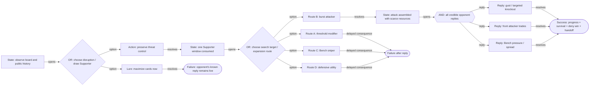
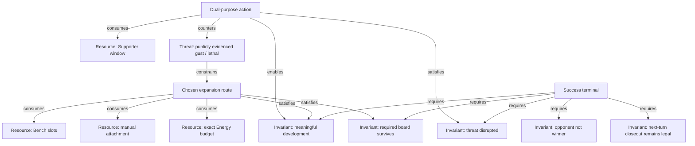

# Graph Engineering Model For PTCG Puzzle Upgrades

## Why This Is A Synthesis

“Graph Engineering” is not yet one stable, universally defined software
standard. This skill adopts the parts that are useful and testable for puzzle
design:

1. graph runtimes: explicit state, nodes, edges, conditional routing, compile
   checks, and bounded loops;
2. property-graph modeling: typed entities, typed directed relationships,
   properties, identity, and integrity constraints;
3. adversarial search: player choices are existential and opponent choices are
   universal.

The result is a graph that can be reviewed by a designer, statically compiled by
a script, and later mapped to production engine actions.

## The Three-Layer Model

### Layer A: Domain Dependency Graph

This layer explains *why* a choice matters.

Node types:

- `resource`: Bench slot, Supporter window, manual attachment, Energy, Tool,
  discard fodder, switch outlet, search quota, prize liability;
- `threat`: a public or fairly deduced opponent capability;
- `invariant`: a condition required for success.

Important relationships:

- `consumes`: an action spends a resource;
- `reserves`: an action preserves a resource for a later checkpoint;
- `enables`: an action or resource makes a later route legal;
- `counters`: an action reduces a threat;
- `exposes`: an action increases a threat or liability;
- `constrains`: a resource or threat narrows a decision;
- `satisfies` / `violates`: a state or action affects an invariant.

This layer prevents decorative cards and prose-only reasoning. If a Bench
occupant has no typed relationship to legality, resource ownership, threat,
damage, prize mapping, or a lure, remove it.

### Layer B: Executable State Graph

This layer explains *what can happen*.

Node types:

- `state`: a stable checkpoint with a reproducible fingerprint;
- `player_decision`: legal player commitment point;
- `action`: one production-legal action or atomic authored macro;
- `opponent_decision`: set of credible legal replies;
- `information`: deterministic reveal or exhaustive chance branch;
- `terminal`: `success` or `failure`.

Control relationships:

- `opens`: state to decision/information;
- `option`: player decision to action;
- `reply`: opponent decision to action;
- `outcome`: information to state/action;
- `resolves`: action to next state or terminal;
- `reaches`: state to terminal.

Every state needs a fingerprint that can later be computed from production
state: turn, phase, active/Bench identities, damage, attachments, hands, deck
epochs, discard, prizes, used-once flags, and relevant public history.

### Layer C: AND-OR Proof Graph

This layer explains *what is proven*.

Use the following value rules:

```text
Value(success terminal) = true
Value(failure terminal) = false
Value(player decision)  = OR(Value(option_i))
Value(opponent decision)= AND(Value(reply_i))
Value(random information)= AND(Value(outcome_i))
Value(deterministic node)= Value(only child)
```

Consequences:

- one passing witness establishes existence, not uniqueness;
- a correct route must survive every credible reply;
- a hidden random outcome cannot be ignored because it is inconvenient;
- a frozen production AI policy can establish `policy_replay_proven`, but not
  `adversarially_proven`;
- an unintended second passing player branch is not automatically bad, but it
  disproves a claimed unique solution and may weaken the intended lesson.

## Canonical Control Shape



The domain graph overlays this flow:



## Fair Threat Modeling

A threat is legal puzzle information only when one of these is true:

- `public`: the card or effect is visible now;
- `history`: the opponent publicly searched, revealed, recovered, or announced
  it earlier;
- `deduced`: the board and known rules make the threat logically inferable.

Every `threat` node must carry:

```json
{
  "visibility": "public | history | deduced",
  "evidence": "Specific player-observable fact",
  "deadline": "Opponent next turn",
  "impact": "What loses if unanswered"
}
```

Do not give the opponent a hidden Boss's Orders and require Iono as if the player
knew it. Instead, add public history that the opponent searched or revealed it,
or make the board itself advertise an equally concrete lethal line.

## Resource Slack

For each resource:

```text
slack = available before deadline - minimum required by the chosen route
```

Mark a resource scarce when `slack <= 1`. A strong deployment puzzle should
couple at least three scarce resources. Typical examples:

- one or two open Bench slots;
- one Supporter use;
- one manual attachment;
- exact Tool ownership;
- exact Psychic/Dark Energy division;
- one switch outlet;
- a two-prize liability the player cannot safely expose.

Abundance is acceptable only if it creates a meaningful decoy. Otherwise remove
it.

## Consequence Depth

Classify wrong branches by where failure becomes visible:

- depth 0: illegal immediately;
- depth 1: misses current attack;
- depth 2: attack succeeds, but opponent reply punishes it;
- depth 3: survives reply, but next-turn handoff is broken.

Deployment/composite puzzles need at least one attractive mistake at depth 2 or
3. This is more educational than a branch that simply cannot be clicked.

## Compilation Rules

The static compiler must reject:

- duplicate node IDs or dangling edges;
- unreachable control nodes;
- a state with ambiguous untyped routing;
- a player decision not marked `OR`;
- an opponent decision not marked `AND`, unless explicitly downgraded to frozen
  policy replay;
- hidden threats without fair evidence;
- success terminals lacking compound invariants;
- unbounded cycles;
- a root whose AND-OR value is false;
- a graph with no negative terminal;
- claimed negative axes that have no failing branch;
- deployment/composite graphs without enough root options, scarce resources,
  delayed consequences, Bench-space coupling, or reply coverage.

Compilation proves structural design coherence. It does not prove that card
effects, legality, AI behavior, or state transitions match the production
engine.

## Production Proof Status

Use exact labels:

- `graph_designed`: reviewable graph, not compiled;
- `graph_compiled`: static integrity and AND-OR checks pass;
- `playable`: production engine can execute the intended route;
- `policy_replay_proven`: route survives the one frozen AI policy tested;
- `adversarially_proven`: route survives all enumerated credible replies;
- `unique_under_enumerated_choices`: exactly one intended player equivalence
  class passes under the enumerated choices.

Never shorten these to “proven” without the qualifier.

## Sources Used For The Model

- LangGraph Graph API, for explicit state/nodes/edges, conditional routing,
  compilation, fan-out, and bounded recursion:
  <https://docs.langchain.com/oss/python/langgraph/graph-api>
- Microsoft AutoGen GraphFlow, for deterministic directed workflows with
  conditional branches, parallel paths, and bounded loops:
  <https://microsoft.github.io/autogen/dev/user-guide/agentchat-user-guide/graph-flow.html>
- Neo4j graph concepts and modeling principles, for labeled property graphs,
  typed relationships, identity, and integrity:
  <https://neo4j.com/docs/getting-started/appendix/graphdb-concepts/>
  and
  <https://neo4j.com/graphacademy/training-gdm-40/03-graph-data-modeling-core-principles/>
- Berkeley CS188 minimax notes, for treating an adversarial solution as a policy
  over opponent replies rather than a single move sequence:
  <https://inst.eecs.berkeley.edu/~cs188/textbook/games/minimax.html>
