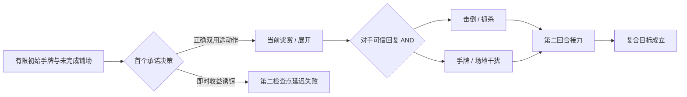

# 六套 18.0 卡组训练题 Graph Engineering 升级审阅包

> 状态：**DESIGN REVIEW ONLY**。本目录没有接入 `data/deck_training`，也没有修改游戏内题目。收到明确批准后才进入生产实现、负向探针与引擎证明阶段。

## 设计约束

- 每套固定 10 题，画像严格为 2 道 precision、5 道 deployment、3 道 composite。
- deployment/composite 的首个决策至少 3 个合法选项，并把备战位、支援者、手贴、能量或奖差设为零余量资源。
- composite 必须同时满足推进、打断、生存、阻止对手获胜和下一棒五类不变量。
- 对手回复使用 AND 语义；设计图覆盖至少两种题面可验证的高影响回复。
- 当前运行时只能对作者见证做 `policy_replay_proven`。图上的 AND 回复在接入生产前还需要补成状态工厂、冻结策略与负向探针，不能声称全局唯一解。

## 课程级关系

## 静态审计

- 图总数：60
- 通过：60
- 失败：0

## 多龙巴鲁托ex／黑夜魔灵

旧题缺陷：旧题多为多龙巴鲁托、能量与自爆线全部预装，玩家主要做伤害分配，缺少火能归属、备战位、奖差与支援者窗口的竞争。

| # | 画像 | 本局目标 | 正确承诺 | 两个主要诱饵 |
|---:|---|---|---|---|
| 1 | precision | 本回合发动幻影潜袭，并让第二只多龙奇保留下一回合所需的唯一火能。 | 先用侦察指令拿基本火能、把诱饵沉底，再使用高级球找多龙巴鲁托ex并把火能交给接力线。 | 先用高级球洗牌再侦察；侦察拿诱饵并把火能沉底 |
| 2 | deployment | 两回合拿4奖，同时保证第二回合仍有多龙巴鲁托ex可以攻击。 | 宝芬只铺多龙梅西亚与夜巡灵：多龙线负责接力，夜巡灵进化后用50点打开反击捕捉器与六豆奖赏图。 | 铺含羞苞与多龙梅西亚；铺两只多龙梅西亚 |
| 3 | deployment | 用10点入场与六枚伤害指示物在两回合内同时收掉70HP和130HP后排。 | 把最后空位给摔角鹰人，10点放到70HP目标，再用幻影潜袭六豆完成70并把另一目标推进下回合130线。 | 把最后空位给愿增猿；把最后空位给夜巡灵 |
| 4 | deployment | 不浪费130点黑夜魔灵，先送1奖打开反击捕捉器并形成200+60的三目标奖赏图。 | 用彷徨夜灵50点击倒单奖并送奖，随后反击捕捉器拉260HP目标，幻影潜袭把200与六豆分别落在两条有效奖赏线上。 | 升级黑夜魔灵打130；先尝试反击捕捉器 |
| 5 | deployment | 连续两个玩家回合都使用幻影潜袭，且第二只攻击手在对手击倒后无需顶抽火能。 | 把基本火能手贴给后排多龙奇，首攻者用夜光能补齐当前攻击；进化后形成确定接力。 | 把基本火能贴给首攻者；把夜光能交给愿增猿 |
| 6 | deployment | 用1奖换到物品封锁回合，并在第二回合完成多龙巴鲁托ex接力与三奖反击。 | 铺含羞苞和多龙梅西亚，含羞苞零撤退上前锁物品；保留支援者与第二格给接力，而非立刻堆满辅助。 | 直接铺两只多龙梅西亚；含羞苞后再铺愿增猿 |
| 7 | precision | 以最少资源精确击倒260HP前场，并保留六豆给后排70HP目标。 | 先搬30到前场，使200+30达到230，再把六豆中的30补前场、其余30放后排，形成当前击倒与下轮后排击倒。 | 把30全搬到后排；把六豆全放前场再搬伤 |
| 8 | composite | 两回合拿4奖，扛过奇树或老大，并让第二条龙在首攻倒下后继续攻击。 | 先化危为吉读取3张，再用奇树打掉公开老大并保留反击捕捉器，按新信息只铺一条接力龙。 | 先博士研究7张；先老大抓高价值目标 |
| 9 | composite | 本回合拿3奖并阻止对手下回合用老大结束比赛；第二回合仍有攻击手。 | 黑夜魔灵130击倒后排、送奖扩大落后；用奇树打掉公开老大，再以反击捕捉器拉260HP目标并用幻影潜袭完成三奖。 | 用老大直接抓终局目标；黑夜魔灵130打前场 |
| 10 | composite | 在牌组主线能量耗尽时用血月月月熊ex收掉三奖目标，并防止对手以反抓终局。 | 最后空位给月月熊并用夜光能完成血月；同时用奇树移除对手老大，保留现有多龙奇作为下一棒。 | 最后空位给新的多龙梅西亚；月月熊入场但用老大抓单奖 |

## 赛富豪ex

旧题缺陷：旧题已经覆盖抽牌与能量回收，但多数把能量、检索和攻击手全部交到手中，缺少回收弃牌成本、信息时序、八属性所有权与牌库耗尽风险的同局竞争。

| # | 画像 | 本局目标 | 正确承诺 | 两个主要诱饵 |
|---:|---|---|---|---|
| 1 | precision | 本回合精确打出250伤害，并保留第二回合的高级能量回收。 | 先完成巢穴球检索，再用暗码迷把高级能量回收与弃牌成本置顶，最后前场嘉奖硬币一次拿齐。 | 先暗码迷置顶再用巢穴球；先嘉奖硬币再暗码迷 |
| 2 | deployment | 用能量输送PRO拿到本回合300伤害，同时留下第二回合至少4种基本能量来源。 | 先把最后空位给索财灵，再使用能量输送PRO；本回合只弃6张达成300，保留至少2张稀有属性与回收路径。 | 先用大地容器取两种稀有能量；八张能量全部弃掉追求400 |
| 3 | deployment | 连续两回合分别打250与300，且第二回合仍能定点抓杀。 | 先消耗两张一次性物品，再把它们作为回收成本；最后空位留给索财灵，老大与钓竿留到第二回合。 | 弃老大与钓竿支付回收；最后空位给愿增猿 |
| 4 | deployment | 用单奖普通赛富豪取1奖，保留ex弹药，并让下一回合仍有300伤害接力。 | 把现有索财灵当回合进化为普通赛富豪并手贴钢能打120，最后空位预铺下一只索财灵。 | 进化为赛富豪ex弃3能量打150；先预铺辅助再决定进化 |
| 5 | deployment | 两回合拿3奖：先逼出单奖，再用老大抓回受伤两奖目标。 | 让铁包袱离场触发强力吹风并释放备战位，本回合攻击对手被迫推出的单奖；把老大留到第二回合抓回原两奖目标。 | 本回合直接用老大抓另一个两奖；保留铁包袱占场 |
| 6 | deployment | 以200伤害资源击倒230HP目标，并让第二只赛富豪拥有下一回合300伤害。 | 最后空位给愿增猿，恶能手贴后搬30到前场，只弃4能量打200；保留第5张能量与接力索财灵现有资源。 | 直接弃5能量打250；最后空位给第二只索财灵 |
| 7 | precision | 关闭对手勇气护符后，以最少能量击倒280HP基础宝可梦。 | 先放阻碍之塔把有效HP降回230，再弃5能量打250，保留第6张给第二回合。 | 先弃6能量按280HP攻击；攻击后再放阻碍之塔 |
| 8 | composite | 两回合拿4奖，同时经受奇树或前场击倒，且保留一只赛富豪ex。 | 首轮用反击捕捉器拉受伤目标，把支援者窗口给暗码迷/奇树保护资源；次轮再用老大抓第二只两奖。 | 首轮先用老大；首轮抓满血目标 |
| 9 | composite | 用单奖过渡换取抽3与反击捕捉窗口，随后连续击倒两只两奖宝可梦。 | 最后空位留给索财灵，普通赛富豪先取单奖并主动进入交换；被击倒后先化危为吉，再用反击捕捉器启动ex接力。 | 立即换赛富豪ex追求两奖；把最后空位给第二只吉雉鸡 |
| 10 | composite | 在牌库仅剩1张时完成两回合终结，任何对手回复后都不能因抽牌败北。 | 先厉害钓竿回填精确3张，再暗码迷置顶回收与老大，控制嘉奖硬币抽牌次数并只抽到所需组件。 | 先发动前场嘉奖硬币抽2；钓竿回填错误宝可梦 |

## 猛雷鼓ex／草椪

旧题缺陷：旧题把能量加速与攻击答案拆成静态步骤，未充分制造“场上能量既是当前伤害、下一回合资产、撤退费和月月熊降费”的所有权冲突。

| # | 画像 | 本局目标 | 正确承诺 | 两个主要诱饵 |
|---:|---|---|---|---|
| 1 | precision | 精确击倒350HP目标，并保留一张草能让草椪在下回合继续抽牌。 | 弃猛雷鼓上的3能与后排2能，共5张打350；保留草椪至少1草维持碧草之舞与撤退路线。 | 把草椪两张草能都弃掉；弃满6张追求420 |
| 2 | deployment | 本回合完成猛雷鼓ex攻击，并为第二回合留下草椪抽牌与故勒顿加速目标。 | 容器弃斗能取雷与草，把两个空位给草椪和古代攻击手；碧草之舞后由奥琳博士把弃牌斗能加速给古代目标。 | 容器弃草能；两个空位都铺草椪 |
| 3 | deployment | 用爬地翅的灼伤处理顽强之心目标，并保留ex主攻的五能爆发。 | 最后空位给爬地翅，以灼伤的非招式伤害完成击倒；不消耗猛雷鼓的五能爆发资源。 | 用猛雷鼓弃5能直接攻击；最后空位给第二只草椪 |
| 4 | deployment | 先拿1奖清掉残血吉雉鸡ex的支援，再让猛雷鼓ex在第二回合拿3奖。 | 最后空位保留给猛雷鼓ex接力，非ex猛雷鼓用落雷点名90HP吉雉鸡；支援者用奇树打断对手而非老大。 | 用老大抓吉雉鸡给ex击倒；最后空位给月月熊 |
| 5 | deployment | 利用大空洞把第八只宝可梦的入场与特性价值兑现，再安全收缩到5格。 | 先完成猫头夜鹰检索和草椪抽牌，再把无能量风扇洛托姆标记为收缩弃置；保留两只攻击手与能量载体。 | 优先丢弃无伤害的猫头夜鹰；优先丢弃带能草椪 |
| 6 | deployment | 本回合补齐草椪与猛雷鼓的不同属性，并让下一回合仍有一次手贴。 | 赤松把草能加入手牌并立即手贴草椪，把斗能直接附给猛雷鼓；最后空位给古代目标承接下一次奥琳博士。 | 把斗能加手、草能附猛雷鼓；最后空位给第二草椪 |
| 7 | precision | 换入猛雷鼓ex并精确形成350伤害，不额外消耗能量转移。 | 把喷射能量贴给猛雷鼓ex触发换入，使场上总能量达到5并全部用于350伤害；保留能量转移。 | 先支付草椪撤退再贴喷射能；先用能量转移再贴喷射能 |
| 8 | composite | 本回合拿2奖并在奇树或老大后仍准备好第二只猛雷鼓ex。 | 奥琳博士把斗能给当前猛雷鼓、雷能给接力猛雷鼓；最后空位给草椪并立刻用碧草之舞建立场上第五能。 | 两能都加速给当前攻击手；最后空位给月月熊 |
| 9 | composite | 两回合拿5奖：ACE SPEC抓三奖目标，第二回合老大抓两奖目标，并防止对手反抓终局。 | 顶尖捕捉器完成首轮非支援者抓杀，把支援者窗口给奥琳博士；拿奖后用奇树/后续资源处理公开老大，次轮再用老大。 | 首轮直接用老大抓三奖；顶尖捕捉器抓两奖目标 |
| 10 | composite | 在大空洞被替换后仍用月月熊完成终局，并留下不会因抓杀直接输的盘面。 | 先把月月熊放入第八格并附能，再主动替换场地；收缩时只弃无能辅助，保留月月熊、接力猛雷鼓与草椪能量。 | 收缩前不放月月熊；收缩时丢弃带2能草椪 |

## 玛俐的长毛巨魔ex

旧题缺陷：旧题覆盖泵能、搬伤和退化，但常把长毛巨魔与全部恶能预先放好，弱化了“从手牌进化才触发”“愿增猿必须手贴”“雪妖女也伤自己”的路线判断。

| # | 画像 | 本局目标 | 正确承诺 | 两个主要诱饵 |
|---:|---|---|---|---|
| 1 | precision | 本回合使用暗影子弹，并让第二只玛俐宝可梦下回合只差1能即可攻击。 | 进化触发庞克泵感，只给首攻者补2能，另外3能给后排诈唬魔。 | 5能全部给首攻者；把1能留给愿增猿 |
| 2 | deployment | 两回合拿3奖，并在对手老大抓杀后仍保有伤害校正。 | 最后空位给愿增猿，恶能手贴后搬30，使暗影子弹当前取奖并为第二回合后排30形成击倒。 | 找第二只捣蛋小妖；找谢米保护后排 |
| 3 | deployment | 用100点可搬伤预算完成本回合击倒，同时保留第二只愿增猿下回合可用。 | 本回合只用已带能愿增猿搬50到当前目标；手贴恶能给第二只愿增猿，保留剩余50自伤供下回合搬运。 | 本回合把100伤全搬完；手贴给长毛巨魔ex |
| 4 | deployment | 重新触发庞克泵感，建立两只能攻击的长毛巨魔线，而不是只恢复场面。 | 担架把长毛巨魔ex拿回手牌，糖果从手牌进化触发泵感；最后空位预铺第二只捣蛋小妖并分能。 | 担架把长毛巨魔直接放到场上；先铺雪童子占最后空位 |
| 5 | deployment | 两回合内先拿1奖，再用退化学习器同时击倒两只糖果进化宝可梦。 | 暗影子弹击倒前场并把30放到更难达到的后排；最后空位留给可带退化TM的接力者，第二回合补伤后退化双杀。 | 30伤放到已经满足退化线的目标；最后空位给雪妖女 |
| 6 | deployment | 利用两次检查把对手两只宝可梦推进暗影子弹线，同时保证己方愿增猿不先昏厥。 | 最后空位给谢米并先用愿增猿搬走30自伤，再保留现有雪妖女完成两次检查；让己方关键目标跨过生存线。 | 再铺第二只雪妖女；先把伤搬到长毛巨魔 |
| 7 | precision | 正确判断花之纱幔，只为可防的备战招式伤害分配场位。 | 本题面对焚身加农炮，把最后空位给谢米保护雪妖女；同时把幻影潜袭指示物计入下一题的HP预算，不把谢米视作万能盾。 | 认定谢米也能挡幻影潜袭；不铺谢米并保留空位 |
| 8 | composite | 让四只对手进化宝可梦同时进入下层HP击倒线，并在退化前保住己方引擎。 | 先用愿增猿搬走己方致死伤害并校正最厚目标，经历两轮检查后再用退化TM统一结算。 | 立即使用退化TM；把30搬伤给已经满足阈值的目标 |
| 9 | composite | 本回合完成第二只长毛巨魔进化、打断对手老大，并在两种回复后继续攻击。 | 用道馆找进化件，不占支援者；最后空位给第二只捣蛋小妖，用奇树打掉公开老大，再从手牌进化触发泵感。 | 用博士研究找进化件；用老大先拿当前奖 |
| 10 | composite | 用秘密箱同时完成进化、场地、接力与打断，不丢掉唯一恶能。 | 弃可由担架回收的宝可梦；秘密箱取糖果/进化桥、救援滑板、尖钉镇与奇树，让最后空位的接力线同时获得撤退与泵能。 | 弃唯一恶能；取博士研究代替奇树 |

## N的索罗亚克ex

旧题缺陷：旧题强调复制招式结果，却较少让复制源、双恶能、交易弃牌、PP提升剂目标和N的城堡撤退相互争夺；错误路线通常当回合就暴露，缺少下一回合断线。

| # | 画像 | 本局目标 | 正确承诺 | 两个主要诱饵 |
|---:|---|---|---|---|
| 1 | precision | 确定抽到PP提升剂与老大，同时保留双恶能和复制源。 | 先完成高级球检索，再暗码迷按PP提升剂、老大置顶；交易弃可回收诱饵一次拿齐。 | 暗码迷后再用高级球；交易弃第二张恶能 |
| 2 | deployment | 选择正确N宝可梦作为复制源，击倒当前目标并保留下一回合另一种攻击。 | 最后空位给受伤90的N的莱希拉姆，暗夜王牌复制力量愤怒打260；保留达摩狒狒给之后弃牌能量增长的回合。 | 放N的达摩狒狒；放吉雉鸡ex |
| 3 | deployment | 让本回合索罗亚克ex满足双恶，并给第二只N宝可梦准备下回合攻击。 | 最后空位给第二只N索罗亚，PP提升剂把恶能附给它；手贴第二恶给当前索罗亚克，建立双线。 | PP提升剂给N的莱希拉姆复制源；最后空位给非N吉雉鸡ex |
| 4 | deployment | 零成本换入索罗亚克ex并保留前场能量，为第二回合复制另一招式。 | 先放N的城堡，让N的莱希拉姆零撤退，保留火能与伤害状态；最后空位给达摩狒狒，索罗亚克复制当前最佳招式。 | 先支付莱希拉姆撤退费；把非N吉雉鸡推到前场再放城堡 |
| 5 | deployment | 允许首攻索罗亚克ex被击倒后，用担架与PP提升剂在一回合重建第二只。 | 担架把索罗亚克ex拿回手，正常进化第二只N索罗亚；PP提升剂给备战N宝可梦，手贴补双恶。 | 担架把索罗亚克ex直接放场；最后空位给血月月月熊 |
| 6 | deployment | 两次交易分别找到加速与终结抓杀，不丢掉复制源和双恶能。 | 暗码迷置顶后，第一次交易弃可回收复制源找PP提升剂，先加速并释放手牌；第二次交易弃空物品找老大。 | 第一次交易弃老大；把最后空位给第二辅助而非复制源 |
| 7 | precision | 让N的莱希拉姆保持90伤，用愿增猿搬40后复制力量愤怒精确击倒300HP目标。 | 先治疗10再由愿增猿搬30，使莱希拉姆保留90伤；力量愤怒造成260，再叠加不服输头带40档完成300。 | 把莱希拉姆伤害全搬走；不治疗直接搬30 |
| 8 | composite | 根据对手弃牌区正确计算复燃伤害，并防住回收或老大两种回复。 | 只按4张基本能量计算120，选择达摩狒狒完成当前断点；同时用钓竿准备被抓杀后的替代复制源。 | 把6张能量都算入复燃；最后空位给莱希拉姆 |
| 9 | composite | 用PP提升剂与奖赏区取回的能量建立两只索罗亚克接力，并保留城堡撤退。 | 最后空位给第二只N索罗亚，PP提升剂先附1恶；首攻取奖拿第二恶后，下回合手贴完成双恶并用城堡零撤退交棒。 | 最后空位给新复制源；PP提升剂给当前首攻 |
| 10 | composite | 用120复燃、30头带与40空手道王达到190，并移除对手终局老大。 | 保留达摩狒狒复制源，装不服输头带并用空手道王；支援者用奇树打掉公开老大，复制复燃得到120+30+40。 | 用老大抓更低HP目标；先拿奖再判断头带 |

## 喷火龙ex／多龙炸弹

旧题缺陷：旧10题高度复用同一盘面与长见证序列，只替换少量目标；糖果在喷火龙与大比鸟之间的竞争、锁特性、自爆改奖差和白蕾雅终局没有真正成为玩家决策。

| # | 画像 | 本局目标 | 正确承诺 | 两个主要诱饵 |
|---:|---|---|---|---|
| 1 | precision | 通过米立龙先找到白蕾雅，再用大比鸟补齐唯一攻击组件。 | 先让米立龙揽客拿白蕾雅，再用音速搜索找神奇糖果，最后按终局顺序执行。 | 先音速搜索找糖果；米立龙先拿博士研究 |
| 2 | deployment | 本回合完成攻击与音速搜索，并给第二回合保留一条进化接力。 | 第一颗糖果进化喷火龙触发烈焰支配，第二颗进化大比鸟取得接力组件；最后空位不再铺辅助，留给后续基础。 | 两颗糖果都给喷火龙线；先铺夜巡灵占最后空位 |
| 3 | deployment | 喷火龙本回合攻击，同时让古玉鱼或第二只喷火龙成为可用接力。 | 给当前喷火龙2火、给后排古玉鱼1火；最后空位保留给第二只小火龙，由后续手贴/回收建立第二条线。 | 3火全部给当前喷火龙；最后空位给钥圈儿 |
| 4 | deployment | 用最小自爆打开反击捕捉器并让燃烧黑暗正好跨过目标HP。 | 用彷徨夜灵50击倒后排并送奖，反击捕捉器拉320HP目标；燃烧黑暗在新增奖赏后达到正确档位。 | 升级黑夜魔灵打130；先用反击捕捉器 |
| 5 | deployment | 本回合抓杀两奖目标，并把老大留到白蕾雅终局回合。 | 最后空位给夜巡灵，完成自爆并结算送奖后用反击捕捉器；支援者窗口留给奇树/白蕾雅准备。 | 本回合直接用老大；最后空位给第二只小火龙 |
| 6 | deployment | 封锁对手一个回合后，解除自身基础特性锁并完成米立龙/吉雉鸡的翻盘抽牌。 | 首轮让钥圈儿留前封锁；对手回合后用喷射能量/撤退移走钥圈儿，再发动己方基础宝可梦特性并完成进化。 | 首轮提前移走钥圈儿；第二轮仍让钥圈儿在前 |
| 7 | precision | 不用随机7抽，靠音速搜索与现有手牌确定取得糖果、喷火龙和火能。 | 用宝可梦检索找喷火龙ex，音速搜索拿糖果；保留白蕾雅与回收，不使用博士研究。 | 先博士研究7张；音速搜索拿喷火龙ex |
| 8 | composite | 用不服输头带精确跨320，并在拿奖改变条件前处理对手老大。 | 先装不服输头带，再用奇树打掉公开老大，保持落后条件下攻击320HP目标。 | 先拿单奖再装头带；用老大抓290HP目标 |
| 9 | composite | 把对手奖赏推进到2张，移除公开老大，再由白蕾雅击倒太晶三奖目标结束比赛。 | 先黑夜魔灵自爆把对手推进2奖；通过大比鸟音速搜索准备白蕾雅，并先用奇树移除老大；下一回合白蕾雅终结太晶目标。 | 本回合立刻用白蕾雅；自爆后直接老大抓太晶目标 |
| 10 | composite | 钓竿精确回填进化线与火能，扛过奇树或抓杀后完成第二只喷火龙。 | 钓竿回填喷火龙ex、小火龙和1火能；先用大比鸟搜糖果，再用喷射能量换位并从手牌进化触发烈焰支配。 | 钓竿回填3火能；钓竿回填两只进化宝可梦不回基础 |

## 生产接入前必须补齐

1. 把每个初始状态翻译为具体 `GameState`：手牌、牌库顶序、弃牌、奖赏、伤害、能量、回合历史与冻结AI手牌。
2. 为每题作者路线写可执行 witness，并为每个诱饵写能到达 `consequence_depth >= 2` 的负向探针。
3. 为 AND 回复增加冻结策略/状态分支，不能只把文字写进图。
4. 逐题运行 admission、proof、shortcut、presentation 与运行时可玩性验证；任一题不能只靠跳过对手回合通过。
5. 六套各做盘面去重检查，尤其禁止喷火龙课程再次复用同一初始盘面。
