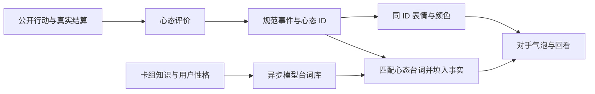

# AI 陪练的心态、台词与表情

2026-09-29。承接[对手互动文字首版](OPPONENT-TALK-2026-09-29.md)。目标是让对手对比赛产生连贯的情绪反应，每次开口都有一个明确心态、对应表情和合适的说话方式。

## 研究结论与设计取舍

游戏体验并不只有“赢了开心、输了难过”。TU/e 的 [Game Experience Questionnaire 原始报告](https://pure.tue.nl/ws/files/21666952/Fugad3.3.pdf.)分别讨论胜任感、紧张、挑战、正负情感等体验维度。它是体验测量工具，不是“打牌必然存在十二种心态”的证明。

[An Appraisal-Based Chain-Of-Emotion Architecture for Affective Language Model Game Agents](https://arxiv.org/abs/2309.05076)探索以情境评价驱动游戏 Agent 的情绪表达。借鉴其“先理解局势意味着什么，再表达情绪”的方向，本项目先由可核对的游戏事实确定心态，再让模型塑造性格与措辞；没有照搬论文架构，也不声称复现论文实验结论。

因此这里的十二类是产品设计：综合局势进展、压力、意外程度和恢复进攻的情况，使表情够用且容易分辨。它模拟的是 AI 角色，不推断玩家的真实心理。

## 十二种心态

| 心态 ID | 玩家看到的心态 | 事实条件/场合 | 视觉表情 |
| --- | --- | --- | --- |
| eager | 跃跃欲试 | 公开开局，准备陪练 | 星星眼、握小拳、期待笑容 |
| focused | 专注 | 正常宣布自己的招式；收声后回归对局 | 收眉、思考、平静嘴形 |
| confident | 自信 | 自己的 ex / VSTAR / VMAX 实际进化登场 | 挺胸、明亮微笑 |
| confused | 犯难 | 排除开局限制后，首次一回合无进攻、进化、下基础或附能 | 挠头、皱眉 |
| anxious | 紧张 | 玩家剩余奖赏不超过两张，自己剩得更多，此时进攻或停滞 | 汗滴、紧绷嘴角 |
| frustrated | 郁闷 | 连续两个自己的回合都无上述进展；非临近败北压力 | 鼓腮、撅嘴、肩膀下垂 |
| surprised | 意外 | 玩家实际连取至少两张奖赏 | 瞪眼、张嘴、摊手 |
| determined | 不服输 | 玩家取一奖后，或自己在高压下从受阻恢复进攻 | 握拳、坚毅眉眼 |
| proud | 小得意 | 自己实际连取多奖，此前并未在奖赏进度上落后 | 半眯眼、俏皮得意笑 |
| relieved | 松口气 | 落后时追回多奖；或普通压力下终于重新宣布攻击 | 闭眼呼气、抚额 |
| joyful | 开心 | 引擎已确认自己获胜 | 大笑、双拳庆祝 |
| respectful | 服气 | 引擎已确认自己落败 | 温和微笑、点头致意 |

同一个事实可以有不同评价：同样取两奖，领先时是得意，落后追回则是松口气；同样没进攻，首次是犯难，连续停滞才郁闷，临近输棋时更紧张。公开有发展动作就不算停滞，不偷看手牌来声称“无牌可打”。情绪不会改变实际出牌策略、合法动作或胜负。

## 台词与表情如何保持一致

`OpponentMood.gd` 定义唯一的 ID、中文标签、颜色、图集位置和允许的事件组合；共十二种心态、十五个“事件/心态”组合。Director 从公开事件与稳定奖赏差值产生组合，Session 将组合规范化后选句，Bubble 根据同一 ID 显示表情，回看保存相同 ID。

模型按这十五种组合提前准备短句，每组合两句。它不能自行决定表情或改写心态 ID。心态标签和图片路径也不接受任意模型文本。招式、主力名称、实际奖赏数仍由本地事实槽位绑定。自定义性格决定措辞，心态决定当下情绪：紧张的角色不能一边冒汗、一边用得意台词。

不等待网络，仍有本地三种风格与完整心态覆盖。模型每局最多三次准备请求、最短三十秒间隔，额度不因增加表情而增加；单次输出上限由 1600 调为 2400 tokens，以容纳十五组模板，预算仍为 45,000 tokens 的保守预留。所有本轮台词测试使用子 Agent 模拟，未调用付费 DeepSeek。

发言间隔、每回合上限、旧反应失效及终局优先规则继续生效。2026-09-30 按最新反馈，所有气泡八秒后自动隐藏，包括终局发言，不留下待机面板。表情采用很短的淡入，关闭游戏表现效果时直接切换，无新增操作阻塞。

## 美术资产

使用内置 image_gen 生成一位原创青蓝发、海军蓝配金边衣服的陪练角色，十二个表情共用身份和造型。generate2dsprite 仅负责拆分、透明背景、统一缩放和留白，没有用代码绘制替代美术。

- [运行图集](../../assets/ui/opponent_emotions/portraits.png)：1024×768，4 列×3 行。
- [顺序清单](../../assets/ui/opponent_emotions/manifest.json)：与运行心态 ID 一一对应。
- 每张表情 256×256 RGBA，最终图片四周均有透明安全边距。
- 原始生成图底行有预期的胸像下缘截断，处理后的所有单图都重新缩放置入安全区域；没有裁掉表情五官、手势或把邻格内容混入。

UI 使用一张图集和 AtlasTexture 区域，避免每次表达下载图片或生成表情。2026-09-30 的最终布局取消顶部占位及固定侧栏，保持场地完整宽高。发言时弹出小气泡，优先放在对手战斗宝可梦和牌库/弃牌区上方的空隙；上方空间不足时选用它们之间的空隙。逐一避开可见卡牌（含空备战槽）、牌堆及按钮；没有安全空间时暂时隐藏。头像 60×60，宽度按可用位置与长句在 280–360 逻辑像素之间选择。回看、静音按钮保留 44 像素触摸目标，注册到既有 ArenaTouchInput 按钮链路，避免场地先接收触摸。

## 验证与交付边界

新增先失败用例确认缺少心态模块后，再补齐行为测试。验证十二张图独立、透明边距与区域对应；首次/连续停滞、奖赏压力、相同取奖的不同心态、胜负确认；模型非法组合拒绝；台词/标签/图片/历史一致与收声复位。

新一盘继续使用 18.5 玛俐长毛巨魔（本地规则）对 18.5 开发者多龙，种子 20260930。132 个决策步骤、13 回合，玛俐获胜；开发者策略 79 次成功调用，0 错误、0 引擎拒绝、0 同窗回退。保留全部 91 个公开状态，录制前逐一核对恢复后公开投影的哈希，未挑选胜负或修改轨迹。

录像是新对局的完整行动顺序回放，压缩非关键等待、给发言保留阅读时间。开头/结尾有表情包展示，不会为展示全部表情而伪造比赛情节。私有引擎快照只在本机复现画面，不进入模型或网盘文件；视频显示玩家正常可见画面。

3D 平台门控与默认关闭不变；原始触摸在 Windows 输入事件层验证，不声称完成 Android/iOS 实机验收。此功能是显示侧情绪表现，不提高或改变 CABT 策略对齐等级。本轮没有提交、推送、改版本或发布安装包。关闭“AI 对手互动”即可停用；源码回退只撤销 OpponentMood、表情资源和本轮对话模块/测试改动，保留此前工作区改动。

## 实际交付与检查结果

- [观看 2 分 01 秒实战视频](https://drive.google.com/file/d/1ENKYeGlDwhaCzBjkJ_Hk5FSyGWGnBCYz/view?usp=drivesdk)：1600×900、30 fps，3637 帧，121.233 秒，包含文字气泡与背景音乐。
- [下载十二种透明心态表情](https://drive.google.com/file/d/1NbvZDbyFG3W18iDREPJ__9AizRLIxDTf/view?usp=drivesdk)：十二张 PNG、图集、顺序清单及使用说明。
- 这盘实际产生十次发言，触发跃跃欲试、专注、自信、不服输、意外、服气六种心态；十二种表情在片头和片尾一览中展示。
- OpponentEmotions 7/7、OpponentTalk 9/9、真实渲染与输入检查 29/29 通过；91 个公开回放状态逐一匹配。录像完整解码通过，气泡头像、心态标签及录像顶部提示一致。
- 两次模拟模型请求，零付费 API 请求。Google Drive 上传后已回读文件名、类型、大小与链接；视频为 49,512,208 字节，表情包为 1,844,616 字节。未变更网盘分享权限。

完整验收边界与可复现入口见[验收记录](../evidence/ptcgdap/opponent_emotions_20260929.md)。

2026-09-30 先完成右栏布局复验（85 项），随后按新反馈改为临时浮动气泡，最终验收记录见下文链接。[当前浮动布局截图](../../output/opponent-emotions-20260930-floating/landscape.png)。上述网盘视频保留 9 月 29 日录制时的旧布局，本次没有重新录制或打包发布。
