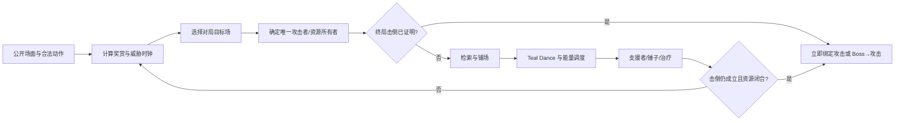
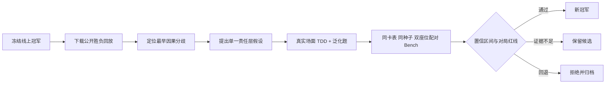

# 先增值，再挥击：可验证回合事务图驱动的厄诡椪 AI

## 从公开高手回放中学习“什么时候不该立刻攻击”

> **Strategy Category 中文第一稿**  
> 核心对象：Teal Mask Ogerpon ex / Dwebble / Crustle 固定 60 张卡组  
> 冻结线上冠军：v5.11b；后续候选：v5.14a

## 摘要

这项工作的起点是一个看似反直觉的失败：AI 已经能够攻击，甚至已经形成击倒，却仍然可能不该马上结束回合。Teal Mask Ogerpon ex 的伤害会随双方战斗宝可梦的能量持续增长；Teal Dance 同时完成填能和抽牌。因此，“满足三能攻击费用”与“本回合的资源事务已经完成”是两个不同问题。

我们把策略从逐卡打分器演进为一个**公开信息驱动、结果证书约束的回合事务 Graph**。它先确定奖赏路线和攻击者，再完整执行不会破坏该路线的检索、铺场、Teal Dance、手填、干扰和治疗，最后才允许攻击。Crustle、Energy Switch、Team Rocket's Articuno 等对策牌也不再依靠静态权重，而由对局目标、成型时钟和收益证明共同决定。

整个系统通过公开回放挖掘、回合能力题、同种子配对 Bench 和线上复验闭环演进。我们不仅记录成功候选，也保留被否决的版本，以避免把偶然胜局或特定对局收益误认为整体提升。

## 1. 卡组概念：高上限双奖打手 + 单奖防线

冻结冠军 v5.11b 的 60 张卡如下。

| 模块 | 卡牌与数量 | 战略作用 |
|---|---|---|
| 主引擎 | Teal Mask Ogerpon ex ×4 | Teal Dance 填能抽牌；Myriad Leaf Shower 按双方战斗区能量增长 |
| 单奖路线 | Dwebble ×2，Crustle ×2 | 对 Pokémon ex 的伤害免疫墙；迫使对手走非 ex 或 Boss 绕墙路线 |
| 特殊对策 | Team Rocket's Articuno ×1 | 对特定 Alakazam 控制路线建立不依赖攻击的拖牌终局 |
| 能量 | Basic Grass ×17，Grow Grass Energy ×1 | 高密度草能保证连续 Teal Dance；Grow Grass 同时提供生存阈值 |
| 检索 | Bug Catching Set ×4，Tera Orb ×4，Pokégear 3.0 ×3，Energy Search ×1 | 依次补齐宝可梦、草能和支援者依赖 |
| 能量调度 | Energy Switch ×2 | 只用于形成 Ogerpon 精确 +30 击倒，或把已进化 Crustle 从二能补到三能 |
| 控制与生存 | Crushing Hammer ×3，Jumbo Ice Cream ×2，Hero's Cape ×1 | 延后对方攻击时钟，保护已经投入大量能量的攻击手 |
| 支援者 | Judge ×4，Lillie's Determination ×3，Boss's Orders ×2，Xerosic's Machinations ×1 | 手牌恢复、干扰和精确抓杀；每回合由统一支援者求解器选择 |
| 场地 | Team Rocket's Watchtower ×2，Lively Stadium ×1 | 关闭关键无色特性、顶掉敌方场地，或跨过扩散伤害生存线 |

主攻伤害不是固定值，而是：

```text
Myriad 伤害 = (我方战斗宝可梦能量 + 对方战斗宝可梦能量 + 1) × 30
```

这决定了本卡组的核心资源观：三能只是“可攻击”，并不是“能量已经饱和”。如果再填一能能把 210 变成 240 并跨过击倒线，这颗能量的价值高于平均分给后排。

## 2. 从局部动作到完整回合事务

早期 r13 的决策近似为：铺一到两只 Ogerpon，使用 Teal Dance，一旦能攻击便立即攻击。我们下载了同一 60 张卡表的领先玩家公开回放，发现真正的差距并不在某一张卡的权重，而在**攻击之前是否完成了整个回合**。

| 高手胜局攻击状态 | 领先策略 | 我们早期策略 |
|---|---:|---:|
| 首次攻击回合中位数 | 4 | 3 |
| 场上 Ogerpon 数 | 3.00 | 2.21 |
| 战斗区 Ogerpon 能量 | 5.08 | 4.42 |
| Myriad 预计伤害 | 222.9 | 201.3 |
| 主动作语义一致率 | — | 55.0% |

早攻并没有换来更高质量的奖赏交换。AI 在高手使用 Lillie、Bug Catching Set、Pokégear、手填能量或 Crushing Hammer 时，分别大量选择了直接攻击。由此形成第一个核心假设：

> **锁定当前击倒后，不把“能够攻击”视为回合结束；先执行所有能证明不会破坏击倒、并能提升下一回合状态的动作。**



Graph 每执行一步便重新观察场面，旧动作位置和旧分数全部失效。终局、即将输掉、牌库危险等硬证书拥有最高权限；学习模型只能在同一安全层级内提出候选，不能覆盖合法性、最终奖赏或资源上限。

## 3. 四类关键求解器

### 3.1 精确伤害与奖赏求解器

求解器对每个可攻击或可被 Boss 拉出的目标分别计算 Myriad 实际伤害、效果免疫、剩余 HP 和奖赏值。普通 Pokémon ex 记两奖，Mega Pokémon ex 记三奖。若存在直接攻击、Boss→攻击或其他奖励加成的本回合终胜路线，它会成为不可被抽牌、铺场或干扰抢走的原子事务。

### 3.2 Fund-to-Ready 能量求解器

策略不再平均分配能量，而是先证明一条从 Fund 到 Ready 的完整链：战斗区 Teal Dance、手填、后排 Teal Dance 供体，以及公开可用的 Energy Switch。只有完整链能让某只 Ogerpon 本回合达到三能时，所有转移才会绑定给它；求解器绝不假设下一张牌一定是能量。

Crustle 则使用全局三能上限。手填、Energy Switch、特性和交互选择共享同一个预算；未进化 Dwebble、第二只未承诺的螃蟹或已经三能的 Crustle 都不能继续吸收能量。

### 3.3 对局目标场与攻击者所有权

对局识别只使用已经公开的宝可梦、攻击和场地，不读取对手隐藏卡表。不同公开证据激活不同目标：

| 对局 | 目标场与主要路线 |
|---|---|
| 常规奖赏赛 | 三只 Ogerpon；先做成第一只攻击手，再建设替补 |
| ex 主攻卡组 | 一条成型 Crustle 防线 + Ogerpon 奖赏压力；螃蟹未成型不得提前站前场 |
| Mega Lucario | 只有看到 Makuhita/Hariyama、Aura Jab 加速或明确 Boss 绕墙时，才升级为二 Ogerpon + 二螃蟹威胁路线 |
| Alakazam | 历史最多两只 Ogerpon，优先 Articuno/Watchtower 控制，保留一条可选 Crustle；Dudunsparce 本身不能误触发该限制 |
| Crustle 镜像 | Ogerpon 先抢后排奖赏，后排建设单一螃蟹所有者；避免向免疫墙做零伤害攻击 |

攻击者一旦取得事务所有权，撤退、能量转移和支援者都不能随意改变路线。例如成型 Crustle 在战斗区时，只有“撤退后的 Ogerpon 一次攻击拿完最后奖赏”才允许离场；否则继续供能并完成 Superb Scissors。

### 3.4 手牌与牌库时钟

Judge、Lillie、Xerosic 和 Boss 由统一所有者比较：先完成我方确定性发育，再比较双方操作后的手牌差、当前威胁和终局收益。影响手牌的支援者执行前后，都必须重新消耗安全资源，避免 Judge 把本可使用的 Hammer、Bug Catching Set 或治疗牌洗回牌库。

牌库进入尾局后，另一个时钟估算剩余有效攻击次数。如果当前场面资源已足够在牌库耗尽前结束比赛，抽牌和检索会被禁止。一次长局修复中，该时钟使候选少抽关键牌，攻击次数增加 8 次，并把同种子结果从负转胜。

## 4. 可复现的演进方法

我们的迭代单位不是“再加一个规则”，而是一个可证伪假设：找到回放中的最早因果分歧，将它归属到合法性、事务顺序、目标选择、对局识别、威胁时钟或同层排序中的一个责任层，然后只修改该层。



回合能力题不要求逐步动作顺序完全复制专家；只要使用的关键牌一致，并且回合结束时场上、手牌和弃牌达到相同或更优的结果即可。当前综合题库包含 317 个真实与泛化场面，v5.14a 得到 303/317（95.6%），且完整性错误和运行错误均为零。题库覆盖支援者前后资源闭合、螃蟹能量上限、撤退事务、免疫证明、牌库尾局时钟、T2 首攻成型和 Alakazam 目标场。

## 5. 实验结果与我们拒绝过的“提升”

| 阶段 | 受控结果 | 决策与主要发现 |
|---|---|---|
| 高手语义先验 | 800 局：88.50% vs 84.88%，+3.63pp；95% 区间 +1.93～+5.32pp | 整体显著提高，但两个低频卡表各回退 12.5pp，按预注册红线拒绝晋级 |
| 螃蟹 + Energy Switch 五轮 | 最终 173/200 vs 172/200，+0.5pp | 未成型螃蟹抢前场曾造成 -14.5pp；由此建立 Ready 证书和单一资源所有者 |
| 能力题架构阶段 | Bench v5 364/400，91.0%；人工反馈题 215/232 | 从逐局补丁转为资源闭合、撤退和攻击者所有权的整体约束 |
| v5.11b 终局奖赏事务 | 159/200 vs 157/200，+1.0pp；候选独占胜局 2，回退 0 | 终局节点在 112 局激活且 112 局获胜，但未达到预设 +2pp 晋级阈值，先保留 |
| v5.14a 三项线上修复 | 148/200 vs v5.11b 147/200，+0.5pp | 胡地和长毛巨魔改善，但纯 Crustle 回退 30pp，维持 v5.11b 为冠军 |

线上数据用于发现问题，不直接替代因果实验。v5.11b 两次完全相同的提交分别得到 940.3 和 866.3 分，93 场公开对局合计 52–41；同包不同走位已经说明排行榜存在明显方差。v5.14a 的 47 场为 25–22，虽然 Alakazam 从 v5.11b 样本的 50% 提升到 75%，总胜率和分数并未更高。因此我们的结论是“专项修复有效，但整体升级未被证明”，而不是挑选对自己最有利的一次分数。

## 6. 结论与局限

本项目最重要的结论不是某张卡应该加多少分，而是：**卡牌游戏 AI 的决策对象应当是带退出条件的事务，而不是孤立动作。** 搜索、铺场、填能、干扰、撤退和攻击共同服务于一个可验证的奖赏路线；只有当最终状态仍满足伤害、资源和生存证明时，动作序列才算正确。

固定 Graph 的优势是可解释、可复现、可用真实失败场面强约束；代价是对新对手结构的适应速度较慢。当前弱点仍集中在 Mega Lucario、多种 Crustle 变体和少量混合卡组。下一阶段不会继续堆叠逐局例外，而会把攻击者所有权、两回合对手响应和不确定性下界统一到同一个短视野规划器中；只有在配对 Bench 的总体、Top 对手和强策略锚点三条门禁都通过后，才替换线上冠军。

---

### 数据边界

- 所有在线分析只使用公开回放与行动时可见信息。
- 回放上的不同动作属于反事实线索，不等同于重新跑出的胜负证据。
- 聚合晋级使用同卡表、同种子、双座位的配对 Bench；在线胜率单独标记为观察样本。
- 策略源码不包含 replay ID、比赛 seed、题库答案或精确状态查表。
