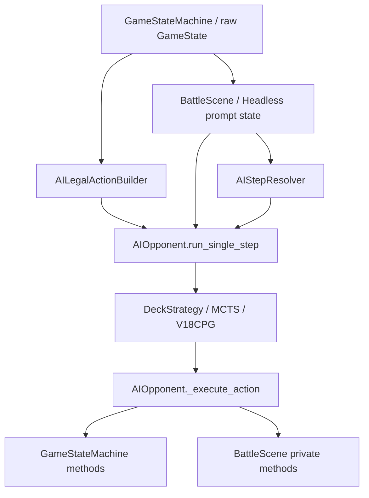

# 02 — 当前状态与差距分析

## 1. 架构判断

当前 PtcgDeckAgent 是 Godot 内部的有状态执行器，不是一个可独立调用或提交的
Kaggle agent。它要求调用者持有 `BattleScene + GameStateMachine`，把选择、等待、
fallback、prompt 处理和执行混在一条链中。

当前主链：



因此不能在 `AIOpponent` 外包一个 JSON adapter 就声称与 CABT 对齐。需要先倒置
宿主边界，再迁移策略能力。

## 2. 当前关键入口

| 文件/符号 | 当前职责 | 对齐阻断 |
|---|---|---|
| `scripts/ai/AIOpponent.gd:441 run_single_step` | prompt 路由、规划、选择、执行 | 接收 UI 和规则机对象，不是纯函数边界 |
| `AIOpponent.gd:1044 _execute_action` | 按字符串 kind 调引擎/UI | Policy 拥有执行权，部分依赖私有 `_try_*` |
| `scripts/ai/AILegalActionBuilder.gd:63 build_actions` | 枚举 MAIN action Dictionary | action 含 `CardInstance/PokemonSlot`；不是 CABT Option |
| `scripts/ai/DeckStrategyBase.gd:12+` | 大量策略 hook | duck typing 且参数为 raw state/object |
| `scripts/ai/AIStepResolver.gd` | 交互选择与提交 | context 带 raw state、卡牌、槽位和 UI 数据 |
| `scripts/ai/HeadlessMatchBridge.gd` | headless prompt 生命周期 | 与 live 有不同 owner 和 fallback |
| `scripts/ai/v18_cpg/observation/V18CPGObservationGateway.gd:19` | 自定义公共 observation | 有隐私基础，但 schema/identity 不是 CABT |
| `scripts/ai/v18_cpg/V18ConditionalPolicyStrategy.gd:219` | V18 聚合策略 | 入口仍接收 raw GameState，且混合联网/图/fallback |

## 3. 观察与隐藏信息

### 已有优点

V18CPG 已经具备：

- 己方手牌可见、对手隐藏区只给数量的公共观察思想；
- observation version/hash；
- stale response 拒绝；
- policy schema validator；
- route bundle、execution cursor、interaction policy 和 decision audit；
- 隐藏信息 sentinel 测试。

这些应作为迁移输入，而不是丢弃。

### 当前硬缺口

1. V18 strategy 入口仍接收 raw `GameState`。
2. `AIStepResolver` 构造的 context 中保留 raw 对象；后续 `duplicate(true)` 不会建立
   类型级隔离。
3. 规则 fallback、legacy strategy、MCTS 和部分 feature builder 仍直接读取私有状态。
4. 当前安全性依赖“某模块自觉不用”，而不是 policy API 根本拿不到。
5. 当前 battle replay 保存双方完整 hand/deck/prize；view filter 仍不等于官方 agent
   observation。私有 replay 不得继续作为公共策略输入。

结论：新架构必须建立 allow-list projector。任何需要 raw state 的代码只能位于
Godot Host 内。

## 4. 合法动作与交互窗口

`AILegalActionBuilder` 输出的是未版本化 Dictionary，例如：

```text
attach_energy(card, target_slot)
evolve(card, target_slot)
play_trainer(card, targets, requires_interaction)
use_ability(source_slot, ability_index, targets)
retreat(bench_target, energy_to_discard)
attack(source_slot, attack_index, targets)
end_turn
```

问题：

- 对象引用只能在当前 Godot 进程使用；
- 只覆盖 MAIN 风格动作，其他 prompt 由多套分支处理；
- Dictionary 没有 schema/version/capability；
- “生成合法动作”过程中存在写 `shared_turn_flags` 的副作用，观察不是纯读；
- 一个 main action 可能触发后续多个 interaction，旧路径会预先推断或自动解决，
  违反每次选择后重新观察。

CABT 要求每次只处理当前 `select.option`。目标不能把本地 `kind` 直接一一翻译为
固定 index，因为 option 集、顺序和后续窗口会随执行结果改变。

## 5. Live 与 headless 的所有权分裂

当前同一规则选择可能由不同组件决定：

| Prompt | live owner | headless owner/现状 |
|---|---|---|
| setup / mulligan | AIOpponent 或 setup planner | Bridge 自动处理 |
| take prize | AIOpponent 常取首个可用位 | Bridge 自动处理 |
| send out | AIOpponent handoff 评分 | Bridge 自己的启发式 |
| heavy baton / exp share | AIOpponent 专用分支 | AIOpponent 专用分支 |
| bench cleanup | effect interaction | Bridge 直接策略/fallback |
| powerglass | live interaction/recovery | headless 仅部分支持 |
| amulet-of-hope KO | live 专用处理 | headless 缺专用 case |

这造成：

- 同一局面在 UI/headless 下由不同策略 owner 决定；
- 部分 prompt 在 benchmark runner 中被判 unsupported；
- UI `_pending_choice` 成为部分规则事实源；
- 无法证明 `obs -> indexes` 是唯一 AI 路径。

目标必须引入唯一 `EngineDecisionBroker`：规则层产生不可变窗口，UI、headless、
human 和 AI 都只是该窗口的消费者。

## 6. 身份体系

### 跨玩家 instance ID 冲突

当前建两位玩家牌库时，`CardInstance` 计数会分别重置，双方可得到相同
`instance_id`。只按 `instance_id` 反序列化时会优先找到错误玩家的牌。

### action/slot ID 漂移

当前 `stable_action_id` 主要由 kind、牌实例、source/target 顶牌实例、攻击/特性
index 构成：

- 不总是包含 owner；
- 不覆盖完整 targets 和 payment；
- 不同支付路线可能碰撞；
- slot ID 取顶部卡，进化后立即变化；
- 旧 action ID 不是 CABT 当前窗口坐标。

目标 identity 必须拆分：

```text
portable card identity = official Card ID + match serial + playerIndex
current option identity = window ID + option index + full option fingerprint
persistent semantic intent = goal/macro + official serial/attackId 等公开语义
private binding = current option -> one engine command
```

## 7. 生命周期、同步和错误

- 普通规则策略同步执行；V18CPG 使用 signal/deferred 异步请求。
- UI watchdog 用 3/6/12 秒恢复，甚至会结束回合；这是 UI 宿主策略，不是官方
  Agent contract。
- `AIOpponent` 没有统一 session reset/cancel/close。
- 外层大量错误折叠为 `false/{}`，`no_progress` 可能直接结束回合。
- V18 内部的 request ID、hash、timeout fallback 相对完整，可迁移其思想。
- 当前随机流在 coin、shuffle、clone 之间并不统一，不能因此声称与 CABT 引擎
  可复现或等价。

Kaggle 模式必须是本地、CPU 预算内、无网络的确定性降级。当前
`V18CPGDecisionClient` 的在线模型、Python fallback 和 unsafe TLS 配置不得进入
Kaggle-compatible package。

## 8. 注册、配置与打包差距

当前策略注册依赖硬编码 preload、deck ID 和可见卡名猜测。Agent 版本记录是松散
Dictionary，缺少 contract/card catalog/executor/policy hash 和 capability 声明。

Godot export 产出 zip/APK/Web/iOS，不是 Kaggle submission。新架构需要：

- `deck_hash + policy_package_id + cabt_exportable` 精确注册；
- fail-closed manifest；
- 薄 `main.py`；
- 根 `deck.csv`；
- 本地依赖与 `cg` SDK 能力真实性校验；
- `ptcgabc` packager/validator 作为权威发布工具。

### P2-WP2 CardIdCatalog shadow 现状

P2-WP2 已新增与 P1 CABT bundle 分离的 source-locked identity artifact set。官方 master 完整列出
1267 个 Card ID 和 1556 个 Attack ID；Python/GDScript strict loader 在开放查询前验证固定 bundle、
五项 artifact 关系和 9 个 exact local source。独立 bundle canonical hash 是
`AB8CF10465F492A98DA8247A84572AECEE281D0726F7BB7B8E5DBC03A6AC70D4`；P1 CABT bundle 与
`SOURCE_LOCK.json` 未修改或重签。

该能力仍是 shadow identity lookup，不是 engine provenance 或 live object authority：9 条 bridge 只覆盖
官方 Marnie 34/60 张，另 10 个官方 ID 保持 known-official-but-local-unmapped；本地 `800018501` 只命中
4 个 exact printing、15/60 张，45/60 未桥接且 `cabt_exportable=false`。官方 skill payload 不提供数值
Ability ID，因此当前没有 ability master、ability mapping 或 parity 结论。coordinate lookup 也不证明未来
`CardData/CardDatabase` 对象来自受信 printing。

当前 export preset 的 include filter 包含 `data/**`、不包含 `contracts/**`，所以 master/bridge 可能进入
产物并不代表 schema/source manifest/bundle/vectors 已完整打包；P2-WP2 不产生 Windows/Android package
或 A5 声明。另一个待处理成本是 strict Python/GDScript query 当前都会先验证 full-catalog digest，形成
O(full catalog) 的每查询路径；在 live 接入和 Android 验收前必须优化或以固定预算实测。

### 玩家设备本地推理现状与差距

已有可复用先例，但尚不是 PtcgDAP aligned runtime：

- `scripts/ai/NeuralNetInference.gd` 能以纯 GDScript 加载 JSON 权重并执行
  `Linear + ReLU/Sigmoid` 小型 MLP；value/action/interaction 三套训练脚本能导出相近格式；
- `BattleAiOpponentFactory.gd` 能接收本地模型路径，说明小模型放在 PC/Android 设备本机执行
  在技术路径上可行；
- 当前 `scripts/ai/ptcgdap/` 已包含离线 Python/GDScript CABT contract 与 CardIdCatalog shadow tooling，
  但这些 identity/contract loader 不是 policy/model backend；以上 legacy/local precedent 仍不能计作 aligned
  backend 已实现。

当前不能声称 Android 已能运行目标模型：

- 默认 value/action/interaction 模型路径为空，仓库和已审计 APK 都没有实际权重；
- `NeuralNetInference.gd` 尚未严格验证 architecture、input/output shape、矩阵维度、未知 activation、
  资源上限或模型 hash；已有测试不是 Android 真机证据；
- Android preset 当前为 `gradle_build/use_gradle_build=false`，只声明 arm64 与 x86，未集成任何
  ONNX/AAR/GDExtension/native inference backend；是否需要 Gradle 必须由以后选定的集成方式决定；
- 当前 Android E2E provisioning 脚本默认引用已删除的 repo Skill，A5 必须建立项目自有、非 Skill
  的 export/install/launch/test 入口；
- 当前 APK 的 Internet 权限和 ZenMux helper 仍存在。`ZenMuxClient` 只查找系统 Python 并启动外部
  联网 helper；APK 没有 Python runtime，所以它既不是 Android 本地推理，也不得进入 aligned owner
  或 fallback；
- V18/legacy LLM 与建议、复盘等联网能力可以作为隔离的非 aligned feature 存在，但完整 AI 对局
  在飞行模式下必须不调用它们。硬约束针对 gameplay decision chain，不要求整个游戏删除所有联网功能；
- 现有 `MCTSPlanner.gd` 虽在本机计算，但直接读取 `GameStateMachine/GameState`，不满足公共 CABT
  observation 边界，不能直接作为目标实现。

目标缺口因此是：受限 IR 与纯评分小模型 backend、完整 manifest/hash/signature trust、候选不可修改的
device acceptance profile、Python↔每个 Godot backend/ABI conformance 与 nominal invocation witness、
PC/Android clean-install/飞行模式完整对局、低端设备预算和确定性合法 fallback。大模型确有需要时，
才允许在独立 ADR 下评估原生本地 backend；不得把性能不足转成远程推理。

## 9. 可复用、冻结与替换

### 可复用思想或内部模块

- V18 公共观察、hash、stale response 和 sentinel tests；
- FactBuilder、ResourceLedger、Prize/Threat/Route 等只消费公共 observation 的部分；
- route bundle、execution cursor、interaction policy、policy validator；
- decision audit/event bridge 的证据模型；
- 24 profiles 作为迁移输入；
- `GameStateMachine + RuleValidator + EffectProcessor` 作为 private engine；
- `get_pending_decision_snapshot` 作为 EngineDecisionPort 的起点；
- `ptcgabc` Base Graph v1.8、sanitizer、validator、packager。

### 冻结为 legacy/compat

- `AIOpponent.run_single_step` 作为旧入口；
- `AILegalActionBuilder` 作为 shadow 对照输入；
- `DeckStrategyBase` raw-state 签名；
- `HeadlessMatchBridge` 当前 prompt route；
- 现有 V18 aggregate strategy 和在线 DecisionClient。

冻结表示不再向其添加新官方接口能力。必要修复必须服务于迁移 seam 或 legacy
回滚，不能继续扩大其职责。

### 必须替换

- raw state/object 的 policy API；
- prompt-specific AI callback；
- action Dictionary 作为公共前沿；
- 当前本地 stable action/slot identity；
- policy 直接执行 engine/UI；
- live/headless 两套选择事实源；
- Kaggle 模式联网模型；
- public/private replay 混用。

## 10. 阻断优先级

### P0

- raw state 隐藏信息泄漏可能性；
- Card ID/serial 错误或名称猜配；
- live/headless prompt owner 分裂；
- stale option/binding 重用；
- private replay 误用为 agent observation；
- 伪造或误宣称 Search capability。

### P1

- 两语言解释器漂移；
- option 顺序或 payment fingerprint 不完整；
- incremental log 语义漂移；
- online DecisionClient 混入 package；
- unknown enum 追加；
- 把接口通过误写成引擎一致。

### P2

- 胜率工作掩盖 contract defect；
- 一次迁移 24 副牌导致 owner 无法归因；
- 只回滚模型、不回滚 host/contract/catalog；
- 旧文档中的固定路径让测试跑到其他 worktree。

## 11. 结论

改造的第一对象不是某个 DeckStrategy，而是选择所有权和信息边界。只有当
`GameStateMachine -> DecisionWindow -> public observation -> indexes -> one-use ticket`
成为唯一新路径后，才有资格迁移 Base Graph 和具体卡组策略。
