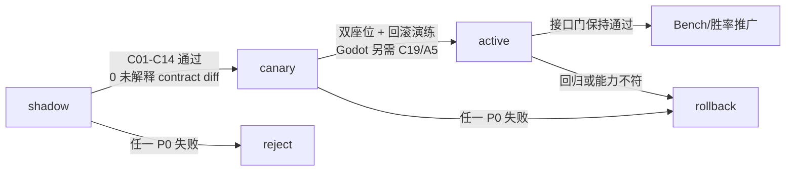

# 05 — 验收、推广与回滚

## 1. 证据优先级

PtcgDAP 的验收遵循以下优先级：

1. 官方 bundle、官方 CABT environment 与 production replay 的可复核事实；
2. 由锁定来源生成的 contract fixtures；
3. public-only security/conformance 测试；
4. shadow/canary 的逐决策证据；
5. Kaggle isolated runtime 结果；
6. Godot PC/Android clean-install、断网与设备资源证据；
7. 胜率和性能指标。

后一层不能推翻前一层。一个胜率更高但包含 hidden-information leak、非法输出或 stale binding
的候选必须立即淘汰。

## 2. 验收等级

| 等级 | 名称 | 完成定义 |
|---|---|---|
| A0 | Contract-ready | 来源锁、schema、enum、Card ID 映射和 golden corpus 可复现 |
| A1 | Interface-aligned | CABT lifecycle、wire、可见性、所有声明 prompt、选择和日志语义一致 |
| A2 | Policy-conformant | 同一 public observation 与共享策略包在 Python reference 和每个声明的 Godot executor/backend 产生相同最终决策和 trace；模型数值按显式误差契约验收 |
| A3 | Engine-aligned | 在明确 Card ID/规则/随机能力范围内，Godot 与官方 native engine 每步零未解释语义差异 |
| A4 | Kaggle-operational | 官方入口、包、隔离运行、双座位、资源、时间与 no-ingress/egress 全通过 |
| A5 | Player-device-operational | 声明支持的 Godot PC/Android 构建把完整 AI 决策、已声明模型的推理、预算降级与 fallback 在玩家设备本机执行；clean install 后飞行模式可运行；不要求系统 Python、远程推理、动态模型下载或运营方算力；平台包、资源、完整 manifest 与回滚门通过 |

发布时必须写完整声明，例如：

```text
A0: pass
A1: pass (SelectType set X, search capability=none)
A2: pass (portable IR nodes Y)
A3: unsupported (not claimed)
A4: pass (bundle hash Z)
A5: pass (Windows x86_64 + Android arm64, device manifest Q)
```

禁止只写“完全对齐”。A4 与 A5 是两条独立运行门：Kaggle 包可运行不证明玩家设备可运行，
玩家设备可运行也不证明 Kaggle 包合规。

## 3. 验收矩阵

### C01 — 初始 deck 与 episode reset

验证：

- `select is null` 时清空上一局 session state；
- 返回值恰好是 60 个官方数值 Card ID；
- deck hash 与 manifest 一致；
- 第一次回调不走常规 policy；
- 异常终局没有 end hook 时，下一次初始 callback 仍能重置；
- 不依赖 Python 进程跨 episode 的复用。

通过标准：所有 fixture、双座位和连续多 episode 测试零串局。

### C02 — Raw envelope、schema 与 nullability

验证：

- raw dict 原样保存；
- CABT 四字段的 known typed view 正确；
- `step`、`remainingOverageTime` 与未来字段往返不丢失；
- `None` 与空列表/空对象不混淆；
- 字段缺失与字段显式 null 有明确、不同的处理规则；
- canonical hash 不受语言字典遍历顺序影响。

通过标准：golden round-trip 逐字节或 canonical 等价，unknown-field 注入零崩溃。

### C03 — Enum 向前兼容

验证：

- 保存 raw integer；
- 已知 enum 能映射稳定名称；
- 未知新增值不会被错误映射为旧值；
- unknown select/option/context 触发可审计的 fail-closed fallback；
- fallback 仍满足当前 `minCount/maxCount`。

通过标准：枚举追加 fuzz 不产生非法输出、隐藏信息读取或静默错误语义。

### C04 — 公开可见性与授权窗口

sentinel 覆盖：

- 己方未公开牌库顺序和未授权 deck identities；
- 双方盖放奖赏牌；
- 对手手牌 identities（仅允许 count）；
- 对手牌库 identities（仅允许 count）；
- 面朝下 Active/其他盖牌；
- private engine flags、RNG state、oracle labels；
- `select.deck` 只在官方授权搜索窗口出现，且只含允许候选；
- search token 不持久化到 public trajectory。

通过标准：所有 public payload/trace/schema round-trip 中 sentinel 零命中。

当前状态：P2-WP3 已在 replay-verified official-wire 输入上通过 23 条共享向量、真实 public goldens、
双运行时 hidden sentinel/fuzz 与逐节点 provenance/hash 验证；Search token/presence、unknown key/value 和
private hash 零输出。P2-WP4 又在 exact accepted firewall owner result 上通过双运行时 ordered-log、witness
chain 与 pending/commit/replay/reset/stale/cross-cursor 门，只关闭 pure cursor 子门。P2-WP5 再在 exact
Godot engine types、registry、catalog/source bytes 与 direct-reference public events 上通过 W1–W7、真实 engine
capture、source drift、stale generation 与 hidden-data 零输出门，只关闭 shadow projector 子门。official
decision port、完整 option owner 与 public trajectory writer 尚不存在，因此程序级 C04/C10/C12 仍不得标记为通过。

### C05 — Card ID、serial、attack 与实体身份

验证：

- 官方 Card ID 与本地打印显式一一映射；
- 同名异印不得猜配；
- 两位玩家所有物理卡的 `card_serial` 在一局内全局唯一，移动区域不改变；
- CABT `Pokemon.serial` 等于当前顶层物理卡 serial，进化/退化时允许改变，旧层物理卡 serial 保留在
  `preEvolution`；
- Godot `host_pokemon_entity_serial` 是独立的 Host-private 连续性键，在同一次在场生命周期的
  active/bench、进化/退化中稳定，但永不进入 wire、fingerprint、policy 或 public trace；
- 同一 root 物理卡同时最多绑定一个 active Host entity；owner、match generation 与 lifecycle 冲突
  均 fail closed；
- attack/ability/option fingerprint 不依赖内存地址或进程自增 ID；
- 官方 skill payload 当前没有数值 Ability ID 时，必须把 ability identity 明确记为 unsupported/not
  available；不得从名称、顺序、文本或本地 ID 合成所谓官方 Ability ID；
- deck identity 使用精确 60 卡与 hash，而非展示名称。

通过标准：collision/evolution/zone-transition 测试在各自 identity domain 内零未声明漂移；映射缺失即
不可导出。P2-WP1 的 Godot serial registry 与 P2-WP2 的 Card/Attack catalog 是两个互相独立的 shadow
子证据：后者完整固定 1267 个官方 Card ID、1556 个 Attack ID，但只桥接 9 个 exact local printing；
P2-WP1 只完成 Godot serial registry 子门，不单独构成 C05 通过；P2-WP2 也只完成
shadow Card/Attack catalog 子门。它们单独或合并都不构成 C05 通过。完整 local/deck mapping、
真实 Host provenance、ability identity 可用性
与 live binding 仍须另行验收。

### C06 — Option 字段、顺序与 fingerprint

验证：

- type-dependent Option 字段、SelectType、SelectContext 与 nullability；
- option 顺序与 engine 当前窗口完全一致；
- fingerprint 纳入所有实际 present 的官方字段，显式 null 与 missing 不碰撞；
- fingerprint 跨运行稳定但不替代当前 index；
- 重复语义但不同 serial/position 的 option 不被错误合并；
- `SKILL_ORDER` 等顺序敏感场景保留顺序。

通过标准：golden option 序列逐项相等；reorder fixture 能检测差异且重新绑定。

### C07 — 输出合法性

验证：

- Python 必须是 exact `list[int]`，GDScript 必须是 exact `Array` of `TYPE_INT`；bool、IntEnum、
  float、StringName 与 packed/tuple-like 容器不能冒充；
- `minCount <= len <= maxCount`；
- 每个 index 在当前 option 范围；
- index 不重复；
- `minCount=0` 可合法返回空列表；
- 多选顺序保留；
- deck callback 与 regular callback 的输出域不混用。
- policy exception/timeout/unknown semantics/invalid output 整单丢弃，只从同一已验证窗口重算 fallback；
  结构坏窗口与无受信 pinned deck 显式 reject，不制造 index/Card ID。

通过标准：属性测试和异常注入的每条出口都是合法输出或明确拒绝执行。

### C08 — Stale window、重排与 reobserve

验证：

- ticket 绑定 session、observation hash、window id 和 option fingerprint；
- 状态变化、窗口关闭、option 重排、重复提交、跨玩家复用全部拒绝；
- 每次选择后重新观察和绑定；
- 多阶段卡效不缓存旧 index 计划；
- 超时后 fallback 也只针对当前 window。

通过标准：所有 stale/replay/fault-injection case 100% 拒绝，无错误本地命令被执行。

### C09 — Selection family 覆盖

至少分别验证：

- initial deck；
- setup active/bench；
- mulligan 与先后手；
- prize placement（如合约出现）；
- MAIN 原子动作；
- trainer、ability、attack 多阶段 interaction；
- deck/discard/hand/board target；
- optional-zero；
- ordered multi-select；
- KO、take prize、forced send-out；
- terminal 与 `selectMax=0` 自动推进。

通过标准：声明支持范围内每个 family 都有正向、边界和拒绝测试；未覆盖项明确 unsupported。

### C10 — 增量 logs 与执行 witness

验证：

- logs 只覆盖上次 agent selection 到本次 callback；
- 不重复、不跳过、不混入 private engine event；
- accepted、bound、executed witness 共享 session/window/selection identity；
- 自动推进阶段不会伪造 agent callback；
- public log canonicalization 在双 Host 一致。

通过标准：trajectory replay 能逐决策重建窗口并验证 chosen indexes；任何 witness 断链均失败。

### C11 — Base/Adapter 所有权

验证：

- mandatory、terminal、legality、cardinality、hard veto、fallback 属于 Base；
- Deck/Matchup adapter 不能覆盖这些职责；
- 每个决策 trace 有唯一 owner；
- adapter 只能读取 public Strategic Context；
- constraint、scorer、future evaluator 不能执行引擎命令。

通过标准：owner audit 零重复/零空缺；恶意 adapter 测试无法绕过 sanitizer。

### C12 — Trace、隐私与 Search API

验证：

- public strategic trace v2 不含 hidden identity、private replay 字段、搜索 token 或本地对象；
- private engine replay 不可被 runtime policy loader 读取；
- `search_begin_input` 仅作为当前官方 observation 的 opaque token 使用；
- Godot host 在 capability 为 `none` 时不会伪造 token 或宣称官方 search；
- manifest search 声明与实际 SDK/native library 一致。

通过标准：schema、path isolation、sentinel 和 package audit 全通过。

### C13 — Session、座位与并发隔离

验证：

- seat 0/1 公开视角正确；
- session state 不跨 match、seat 或 parallel agent 泄漏；
- module global 只在明确 episode scope 内使用；
- 异常/timeout/INVALID 后可安全开始新 episode；
- 对手 inactive 时不收到虚构 callback。

通过标准：双座位、交替 episode 与隔离进程测试零污染。

### C14 — 时间、fallback 与离线运行

验证：

- 600 秒 total overage bank 被正确观测，不当作每步 600 秒；
- policy、adapter、trace 的耗时可归因；
- 接近预算时进入 deterministic current-window fallback；
- 无网络、无下载、无外部数据库/LLM/API；
- CPU-only 冷启动和峰值内存符合公开资源；
- fallback 本身有严格上界。

通过标准：隔离/断网运行、时间注入和资源门通过，零 TIMEOUT。

### C15 — Python/Godot executor 与 model backend differential

验证：

- 相同 contract/policy package/observation/window；
- canonical parsing、默认值、排序、tie-break 和数值运算一致；
- index、owner、reason、macro、trace hash 一致；
- unsupported node 双端同样 fail-closed；
- option reorder 后双端都重新绑定语义意图；
- 每个声明的 native/GDScript model backend 在每个声明 OS/ABI 上覆盖 operator、shape、缺省值、
  量化、NaN/Inf/overflow、边界/tie vector；
- model score/value 遵守固定 dtype、rounding 与显式绝对/相对误差；所有阈值/tie fixture 的最终
  index、owner 和 trace 必须精确一致，数值接近不能豁免决策差异；
- 正常路径记录 expected backend/model load、invocation、output witness，unexpected fallback 为零。

通过标准：声明 portable 的 corpus 上最终 index/owner/reason/trace 100% 相同；中间模型数值必须在
固定误差契约内。不允许用“统计上接近”豁免任何最终决策差异。

### C16 — Godot/native engine differential

验证：

- 只在声明 Card ID、规则、deck 与 random capability 范围内比较；
- 每步 current、option 有序序列、logs、damage/status、KO/prize/result；
- 随机输入和种子能力被如实记录；
- 差异归类为 contract、canonicalization、rule、random 或 unsupported；
- 不以策略 action 相同替代引擎状态相同。

通过标准：A3 范围内零未解释 diff；范围外明确列出而不是忽略。

### C17 — Kaggle package 与入口

验证：

- `.tar.gz` 根目录存在 `main.py` 和 `deck.csv`；
- 最后一个顶层 callable 是预期 agent wrapper；
- import 优先级不会误载系统/其他 `cg`；
- 60 卡、Card ID、archive 安全解包和文件大小门；
- isolated self-play、双座位对 first agent；
- 如声明 search，SDK 与 native libraries 实际在包内并能加载；
- submission 没有未声明 capability 或开发期绝对路径依赖。

通过标准：官方/权威 validator 全绿且 `0 invalid / 0 error / 0 timeout`。

### C18 — 兼容、推广与回滚

验证：

- match start pin 完整 manifest；
- hash/capability 不兼容会拒载；
- shadow、canary、active 开关按 deck/version 生效；
- active pointer 能原子切回上一完整 manifest；
- 局中不热切；
- public replay schema 向后可读，private replay 永不成为 policy input；
- rollback drill 有实际记录。

通过标准：故障注入后新局恢复到上一版本，进行中的对局保持其 pinned 版本或安全终止。

### C19 — 玩家设备本地运行

验证：

- manifest 明确声明支持的 Godot PC/Android 平台、OS/架构/ABI、最低运行时、backend 与模型 hash；
- manifest 只引用独立、版本化、产品批准的 device acceptance profile ID/hash；候选不能修改最低
  OS/CPU/RAM、环境温度、持续时长、重复次数、设备矩阵，以及延迟、内存、包体、温度/降频或
  电量阈值；
- clean install 后，在 DNS/socket 阻断和 Android 飞行模式下完成代表性完整对局；
- contract、IR、config、catalog、weights、executor 与 fallback 均随应用或完整离线包交付并逐项验 hash；
  平台包/离线内容包的签名算法、signing key ID、trust root、签名覆盖范围与 manifest 绑定，
  篡改时 fail-closed；
- 不需要系统 Python、外部进程/sidecar、运营方推理服务或运行时模型下载；
- aligned gameplay decision path 零 DNS、socket、HTTP 与外部进程启动尝试；
- `local_device_report` 固定 OS 级网络/进程审计方法、工具版本、过滤规则、采集区间、PID/package
  覆盖范围和原始结果 hash；飞行模式或连接失败本身不能证明“零尝试”；
- 正常 lane 实际加载并调用 manifest 声明的 executor/backend/model，产生逐决策 invocation/output
  witness 且 unexpected fallback 为零；未使用 learned model 时必须显式声明 `learned_model=none`；
- 记录冷启动、每决策 p50/p95/p99/max、峰值 RSS/private bytes、应用/模型包体；
- Android 记录持续对局的设备型号、OS、CPU/ABI、温度/降频和电量变化；
- 低性能、backend 不可用、模型损坏或资源超限时进入 deterministic local legal fallback，
  不得把性能降级转成远程 fallback；
- 回滚能让新局原子切回上一完整 aligned local manifest。必要时可让之后的新局切回明确隔离的
  local legacy owner，但该模式必须撤销 A1/A2/A5 声明，且不能充当 aligned 局内 fallback。

通过标准：每个声明平台的产品批准边界设备与代表性设备矩阵通过 clean-install 完整对局；零 aligned
AI 网络/外部 Python/远程计算依赖；资源指标满足独立 acceptance profile；正常 lane 零意外 fallback；
运行中 backend/model/resource 故障必须由同一 public observation 的 local aligned fallback 合法完成。
赛前签名/manifest 拒载或 engine 已无法维持规则/安全不变量时才允许安全终止。该结果只授予 A5，
不暗示 A3/A4。

P3-WP1 的 decision-source 子门必须单独报告：snapshot/result DTO 与 audit hash 均非 authority；只有 exact owner 当前
snapshot 加调用时重新提交的 current source 通过 generation、顺序、标量与 WeakRef object identity 重验后，才可返回
shadow source copy。该结果仍不得被描述为 binding、ticket、commit 或执行通过。

P3-WP2 的 binding 子门也必须单独报告：只有 exact owner current binding 与调用时提交的 current port/snapshot/window/
callback/index 通过 identity、order、fingerprint 与 WeakRef lifetime 重验后，才可返回 Host-private resolution。serialized
binding/result、bundle hash 与 schema pass 均非 authority，且不得回显 command/object/callback。该结果仍不得被描述为
ActionTicket、consume、commit、executor 或 live Host 通过。

P3-WP3 的 ticket 子门必须继续单独报告：只有 exact owner-issued ticket 针对 exact current binding/window/selection 与
private session/callback 重验通过后，才能成功 claim 一次并返回 exact private binding resolutions。错误 session/callback/public
hash 不消耗；stale/dead/current-authority failure 必须撤销。serialized ticket/claim、ticket id、bundle hash 与 schema pass 均非
authority，且不得回显 session/callback/current source/command/object refs。claim 成功仍不得描述为 engine commit、execution、
executor、live Host 或接口/引擎对齐通过。

## 4. 证据包格式

每个工作包的 evidence 目录至少包含：

```text
manifest.json
source_lock_snapshot.json
contract_hashes.json
test_commands.txt
test_results.json
fixtures_manifest.json
public_trajectory.jsonl       # 如适用
strategic_trace_v2.jsonl      # 如适用
diff_report.json              # 如适用
resource_report.json          # 如适用
local_device_report.json      # 声明 A5 时必需
rollback_report.md
known_gaps.md
```

`manifest.json` 必须记录：Git commit/worktree diff hash、official bundle hash、contract schema、
enum snapshot、Card ID catalog、deck、host、engine、policy、adapter、IR、executor、trace schema、
capabilities、seat、seed/random-control、target platform/OS/架构/ABI、local inference backend、
model artifacts、`execution_location`、`external_compute`、aligned AI network policy、resource profile、
device acceptance profile ID/hash、package signer/trust policy、degradation/fallback 和生成时间。

独立 identity-catalog 工作包还必须分别记录 catalog bundle、schema、subordinate source manifest、official
master、exact bridge 与 shared vectors 的 raw/canonical hash，并明确父 P1 CABT bundle 与 `SOURCE_LOCK`
是否改变。完整官方 master、双 runtime loader conformance 或 repository artifact 可读均不能自动升级为
player package、device、policy 或 engine parity 证据；export include filter 与每查询资源成本必须在
`applicability/known_gaps` 中如实声明。

测试输出只保存公开数据；如需 private engine evidence，必须放在隔离目录并明确
`runtime_policy_input=false`。

## 5. Promotion gate



### Shadow → Canary

必须满足：

- A0 通过；
- 当前声明范围 A1 通过；
- public sentinel 零泄漏；
- stale ticket 测试零漏放；
- 观察/option/log 差异为零或全部有批准的 `known-difference`；
- canary manifest、deck、seat、host 和 rollback pointer 明确。

### Canary → Active

必须满足：

- 两个座位都完成代表性 episode；
- `0 invalid / 0 error / 0 timeout`；
- 无串局、无 dirty game；
- policy/package differential（如声明 A2）通过；
- 时间和内存余量通过；
- Godot 玩家端候选在每个声明平台通过 C19/A5；Kaggle 候选按 C17/A4 独立验收；
- rollback drill 成功；
- 未用胜率豁免任何 contract gate。

### Active → Strategy promotion

在 contract gates 持续全绿后，才比较 paired seeds、lane win rate、置信区间和行为指标。
策略 promotion 只能改变 policy/adapter manifest 的 active pointer；若 contract/capability hash 变化，
必须重新从 shadow 开始。

## 6. 立即拒绝与自动回滚条件

以下任何一项是 P0 级失败：

- public payload/trace 出现隐藏牌 identity、private RNG 或 oracle label；
- 返回非法 deck/action schema、越界/重复 index 或错误 cardinality；
- 使用 stale/reordered window 执行动作；
- Card ID/serial 冲突或按名称猜配；
- manifest hash/capability 与实际运行内容不符；
- Godot 伪造官方 search token；
- 对局中途混用 legacy 与 aligned owner；
- package 发生 ingress/egress；
- aligned Godot 决策链调用远程推理、动态下载模型、依赖系统 Python/sidecar，或故障时转远端；
- official validator 出现 INVALID/ERROR/TIMEOUT；
- 证据无法复现或来源锁被静默改变。

处理顺序：停止新 canary → active pointer 回滚 → 保留失败 evidence → 标记 manifest rejected →
完成 first-divergence 分析 → 新候选从 shadow 重来。

## 7. 失败分类

| 分类 | 典型症状 | 责任层 |
|---|---|---|
| `contract` | 字段/null/enum/lifecycle 错误 | L0/API parser |
| `visibility` | 隐藏信息进入 observation/trace | public firewall |
| `identity` | Card ID/serial/printing 漂移 | catalog/registry |
| `window` | option 顺序、stale binding、cardinality | broker/binder/sanitizer |
| `log` | 增量边界错误或 witness 断链 | log cursor/trace |
| `base_owner` | mandatory/terminal/veto 被 adapter 覆盖 | Base Graph |
| `adapter` | 牌组事实、目标或 scorer 错误 | Deck/Matchup adapter |
| `portable_ir` | Python/GDScript 分歧 | IR/executor |
| `model_backend` | operator、shape、量化、ABI 或 invocation witness 分歧 | local model backend/conformance |
| `engine_rule` | 相同选择后状态转移不同 | E-track/engine |
| `random` | seed/RNG 能力不同 | engine capability |
| `package` | 入口、import、依赖、资源错误 | submission pipeline |
| `device_runtime` | PC/Android 本地 backend、ABI、包内 artifact、断网或资源门失败 | Godot package/local inference backend |
| `strategy_quality` | 合法但选择差、胜率低 | policy iteration |

必须先定位 first divergence，再修正责任层。不要在 scorer 中掩盖 contract/window/engine 错误。

## 8. 资源与重型测试安全

本项目遵守机器级 `AGENTS.md`：

- 不并行启动多个高内存 Python 训练、benchmark、replay 或 simulation pool；
- 使用 `D:\ai\code\ptcgabc` 时最多 `--workers 4`；
- 重型进程前检查当前 Python 进程、可用物理内存和 commit 使用率；
- 有其他重型任务、commit ≥ 70% 或可用内存 < 12 GiB 时不启动；
- 不覆盖任何 `PTCGABC_MAX_*`/`PTCGABC_MIN_*` 安全变量；
- contract/unit/security 测试优先，重型 benchmark 只在相应 promotion gate 执行。

资源报告应至少记录冷启动耗时、每 callback 分位数、总 time-bank 消耗、峰值 RSS/private bytes、
archive/application/model size、CPU/OS/ABI、backend/model hash、device acceptance profile hash 和设备档。
候选不能自行定义或放宽验收阈值。Android A5 还要记录持续对局的温度/降频与电量变化。官方未承诺
GPU，Kaggle 按 CPU-only 验收；玩家端若声明硬件加速，必须同时
保留通过门的本地 CPU/GDScript fallback 或明确缩小支持平台。

## 9. 回滚单位与兼容规则

一个可回滚版本必须是不可变 manifest：

```text
contract + enum + card catalog + deck + host + engine adapter
+ Base + deck/matchup adapter + policy IR + executor + trace schema
+ local inference backend + model artifacts + target platform/ABI/resource profile
+ device acceptance profile + package signer/trust policy
+ capabilities + degradation/fallback + parent/rollback pointer
```

兼容判断是 fail-closed：任何必要 hash、schema major、capability 或 supported Card ID 集不匹配，
loader 都必须拒绝。禁止只回滚模型权重而保留不兼容的 adapter/binder。

进行中的 match 固定旧 manifest；回滚只影响之后创建的新 match。若旧 manifest 已构成安全风险，
允许安全终止而不是局中换 owner。

回到 `local legacy` 只是一种产品级下一局回滚，不是 aligned fallback：必须将该 owner 标为
`non-aligned` 并撤销其 A1/A2/A5 声明。aligned 局内 backend/model 故障只能使用同一 public
observation 上的 deterministic local Base fallback。

## 10. 验收报告模板

```text
candidate_id:
parent_id:
official_bundle_hash:
contract_hash:
deck_hash:
capabilities:
supported_select_types:
supported_card_ids:
A0:
A1:
A2:
A3:
A4:
A5:
target_platforms:
local_inference_backend:
device_acceptance_profile:
package_signer_trust_policy:
execution_location:
aligned_ai_network:
external_compute:
matrix_results:
unexplained_diffs:
invalid_error_timeout:
public_leaks:
resource_headroom:
local_device_report:
backend_invocation_witness:
airplane_mode_result:
rollback_target:
rollback_drill:
known_gaps:
promotion_decision:
```

任何空缺关键字段都等价于未通过，而不是默认通过。

### P3-WP4 独立验收口径

executor 子门必须单独报告：prepare/commit 需要在 Python/GDScript 对 13/10/5 组共享向量零 mismatch，失败 commit
必须零 partial resolution 并进入 aborted，成功 commit 最多一次且不得调用 command/engine method。它只证明 non-live atomic seam，
不证明 W1–W7 broker、真实动作效果、live owner、C08、A0 或 A5。

### P3-WP5 独立验收口径

broker 子门必须单独报告：Python/GDScript 对 W1–W7 family 与 closed lifecycle/fault vectors 零 mismatch；同一 prompt 的
snapshot/window/binding/selection/ticket/preflight/commit witness 必须同源，成功后必须 re-observe 并使用严格更新且不同的上下文；
stale、replay、same-window、cross-owner、mutation 与 stage fault 必须零 partial resolution。回滚必须恢复 23 份 parent exact bytes 并
重现 P3-WP4 494-entry digest `F33869...FF239`。该门只证明 shadow lifecycle orchestration，不证明 W0、真实 engine effect、live owner、
P3 整体、C08、A0 或 A5。

### P3-WP8 独立验收口径

whole-match 子门必须单独报告：Python/GDScript 对 9 个 shared multi-prompt/fault/rollback 场景零 mismatch/skip；每个 prompt 只能由
exact committed broker result 与全新 P3-WP7 applier 处理。成功 witness chain 必须严格递增且 snapshot/window/execution ID 唯一；
capture/apply/replay/result failure 必须 terminally close 当前 aligned 路径并请求下一局 legacy，restore failure 必须锁存 dirty，任何 terminal
路径不得继续执行。rollback 只在严格更新 match generation 消费一次。报告必须 private-free、sealed、non-authoritative。rollback 必须恢复
24 份 parent exact bytes、删除 13 个 P3-WP8 additive paths，并重现 P3-WP7 632-entry digest `CF5A48...F1836`。该门只证明
offline whole-match integration，不证明 production GameStateMachine transaction、live owner、feature flag/canary、P3 总门、A0 或 A5。

### P3-WP6 独立验收口径

owner-gate 子门必须单独报告：Python/GDScript 对 legacy/aligned start、局中切换拒绝、same-generation broker、next-match rollback、
stale/copy/mutation 与严格 host type 共享场景零 mismatch/skip。rollback 必须恢复 20 份 parent exact bytes，删除 P3-WP6 additive paths，
并重现 P3-WP5 539-entry digest `8E6F24...D2C1F`。该门只证明 offline shadow owner-plan 与下一局回滚语义，不证明真实 engine effect、
executed witness、live owner、canary、P3 整体、C08、A0 或 A5。

### P3-WP7 独立验收口径

applier 子门必须单独报告：Python/GDScript 对 11 个 shared protocol/fault 场景零 mismatch/skip；只有 exact active
`aligned_shadow` gate、同代 broker 与 successful committed result 可进入一次性执行。所有 command 必须先完整 capture，再按原顺序
apply；任何 apply failure 必须逆序恢复全部 captured state，restore failure 必须 terminal poison，且 replay/stale/copy/mutation 全部
fail closed。executed witness 必须 private-free、sealed、non-authoritative，并在 broker reobserve 后继续作为历史审计有效。rollback 必须
恢复 23 份 parent exact bytes、删除 P3-WP7 additive paths，并重现 P3-WP6 587-entry digest `8E8D6B...0A86E4`。该门只证明
isolated reversible shadow seam，不证明 production engine adapter、真实 GSM transaction、whole-match integration、live owner、canary、
P3 整体、C08、A0 或 A5。

### P4-WP1 独立验收口径

公共策略上下文子门必须单独报告：Python/GDScript 对全部 shared context/decision vectors 的公开 payload、独立 domain hash、
ordered selected indexes/fingerprints、owner/reason 与 fallback audit 零 mismatch/skip；每个 context 必须重新验证 exact accepted firewall owner
result 与 exact current window，每个 decision 必须重新验证 exact context/window/resolution。private sentinel、Search capability、Host-private
reference、stale/cross-window/fake/copy/mutation、自洽重写 hash 与 semantic contract drift 必须 fail closed 且零 serialized echo。
rollback 必须恢复 24 份 parent exact bytes、删除 13 个 P4-WP1 additive paths，并重现 P3-WP8 680-entry digest
`1F1F5459...22B849`。该门只证明 `StrategicContextV18` 与 `PolicyDecision` 的 offline public contract，不证明 Strategic Trace v2、
Base Graph IR/executor、adapter、policy/model、live owner、package/device、P4-01、A0 或 A5。

### P4-WP2 独立验收口径

trace/IR 合同子门必须单独报告：Python/GDScript 对全部 shared IR/trace success/rejection 的 canonical payload、独立 domain hash、
stable error code 与 owner/audit relation 零 mismatch/skip；IR 必须锁 closed operator/config/owner/capability、exact Base stage 次序与单入口
线性 DAG，trace 必须重验 exact current context/decision/IR 与 legal/strategic/mandatory/terminal/tier/veto/proposal 关系。unknown operator/
capability、cycle、missing Base stage、adapter 越权、private token、stale/copy/mutation、自洽 artifact+bundle 重签与 semantic drift 必须
fail closed 且零 serialized echo。rollback 必须恢复 25 份 parent exact bytes、删除 13 个 P4-WP2 additive paths，并重现 P4-WP1
729-entry digest `9BED8F78...A6C60`。该门只证明 non-authoritative Strategic Trace v2 与 restricted IR contract，不证明 executor、adapter、
policy/model、live owner、package/device、P4-02 至 P4-06、A0 或 A5。

### P4-WP3 独立验收口径

restricted executor 子门必须单独报告：Python/GDScript 对全部 shared success/rejection 的 selected indexes、owner/reason/fallback、
stable error code 与 execution hash 零 mismatch/skip；每次执行必须重验 exact current context owner 与 exact compiler-owned IR。
terminal/mandatory 必须优先且保持当前 frontier 顺序，hard tier 只取最小 tier，veto 不得被 adapter 恢复，goal/macro/tiebreak 只能在存活的
同一 Base tier 内排序；任何 strict host type、private token、stale/copy/mutation、unknown capability 或 self-consistent bundle rewrite 必须
fail closed 且无 serialized echo。rollback 必须恢复 27 份 parent exact bytes、删除 13 个 P4-WP3 additive paths，并重现 P4-WP2
778-entry digest `2A9993C3...91A79A7`。该门只证明 offline restricted executor，不证明 deck adapter、policy/model、time-bank、live owner、
package/device、P4-03 至 P4-06、A0 或 A5。

### P4-WP4 独立验收口径

public deck adapter 子门必须单独报告：Python/GDScript 对全部 shared adapter/proposal/rejection 的 exact payload、matched-rule audit、
stable error code 与两个独立 hash domain 零 mismatch/skip；每次 proposal 必须重验 exact current context owner 与 exact compiler-owned adapter。
规则只能使用 7 个封闭 public numeric predicate，按 minimum priority → source rule order → current option index 排序；不得读取 name/private/path/
callable，不得过滤 legality、改写 terminal/mandatory、跨 hard tier、恢复 veto 或执行 fallback。strict host type、private token、stale/copy/mutation、
fake owner 与 self-consistent bundle rewrite 必须 fail closed 且无 serialized echo。rollback 必须恢复 29 份 parent exact bytes、删除 13 个
P4-WP4 additive paths，并重现 P4-WP3 828-entry digest `B464E8A0...E282D39`。该门只证明 offline public proposal core，不证明
deck-specific rules、policy/model、PolicyDecision/Strategic Trace issuance、time-bank、live owner、package/device、P4-03/P4-05/P4-06、A0 或 A5。

### P4-WP5 独立验收口径

public Base policy orchestration 子门必须单独报告：Python/GDScript 对 5 个 success 与 10 个 rejection shared cases 的 exact selected indexes、
stage/error、PolicyDecision public audit/hash 与 Strategic Trace public audit/hash 零 mismatch/skip；每次调用必须重验 exact current
context/window/IR/adapter owners，并严格执行 validate → propose → execute → sanitize → decision → trace → seal。terminal/mandatory 必须先于
minimum hard tier，adapter 不得跨 tier 或恢复 veto，executor 输出必须再次对 exact current window sanitize；任一阶段失败都不得发布部分结果。
strict host type、private、stale/cross-owner/copy/mutation 与 self-consistent contract rewrite 必须 fail closed 且无 echo。

rollback 必须恢复 35 份 parent exact bytes、删除 13 个 P4-WP5 additive paths 与完整 evidence，并重现 P4-WP4 880-entry digest
`BC65343A...A602BC1`。最终候选门包含 Python targeted 8/8、full discovery 549/549、历史 parent 56/56、boundary 119/119、官方 oracle 34/34、
Godot focused/functional orchestration 各 4/4、trace 7/7、executor 6/6、adapter 6/6 与 suite catalog 3/3。Godot orchestration 每条约 438 秒，
仅是 offline integrity guard，不是 hot-path 性能声明。该门只关闭 P4-03/P4-05 的离线子门，不证明 time-budget、unsupported degradation、
live owner、package/device、P4-06、P4 总门、A0 或 A5。

### P4-WP6 独立验收口径

time-budget/capability 子门必须单独报告：Python/GDScript 对 8 个 step 与 8 个 rejection shared cases 的 initial/next ledger、mode、reason、
remaining、telemetry/result hash、known unavailable capability、unknown count 与 fallback indexes 零 mismatch/skip。纯核心不得读取 wall/monotonic
clock；`elapsed_ms` 必须是 Host-supplied exact nonnegative safe integer。600000/30000/5000 ms 边界、重复 ledger step、elapsed 超预算饱和、
required/optional/unknown capability precedence、strict host types、stale/cross-window/copy/mutation 与 contract rewrite 必须 fail closed。

unknown capability 名称不得进入 serialized output；optional learned/search 不得成为 required、网络或远程 fallback。fallback indexes 必须由 exact
current window 的既有 deterministic owner 生成并再次验证。rollback 必须恢复 34 份 parent exact bytes、删除 13 个 P4-WP6 additive paths 与
完整 evidence，并重现 P4-WP5 934-entry digest `4B508460...906C6A2`。该门只关闭 P4-06 离线子门与 P4 offline pure-core chain，不证明
Host clock、live owner、策略质量、package/device、P4 live/产品总门、A0 或 A1–A5。

### P5-WP1 独立验收口径

Marnie fixture 子门必须单独报告：official/local 两份 60-card identity、19 official IDs、28 local printings、9-entry bridge、10 个
known-unmapped official IDs、34/60 official bridge coverage 与 15/60 local exact coverage；不得按名称、文本、图像或 same-print 推断。
13 个 W0–W7 frame 必须逐项绑定 source replay raw hash、replay ID、seat 与 step，并在 Python/GDScript 复现 public tree hash、selection window、
option fingerprints、cardinality、visibility 和 terminal-no-callback。production action 不得冒充 policy golden。

W2 必须显式报告当前 `rejected/own_active_concealed` 与可独立重建的 raw selection window，不得伪造 accepted firewall result。bundle/artifact
缺失或 drift、自洽重签、strict host type、copy/mutation 与 private sentinel 必须 fail closed；原始 replay container、Search capability、private
hashes、engine object 与 selected indexes 不得进入 fixture authority。rollback 必须恢复 36 份 parent exact bytes、删除 21 个 additive paths 与
完整 evidence，并重现 P4-WP6 994-entry digest `1498B632...EA512`。该门只关闭 P5-01/VS0 与 P5-02/VS1 的 offline fixture 子门，不证明
W2 firewall compatibility、Host trajectory replay、VS2–VS9、canary、package/device、engine parity、A0 或 A1–A5。

### P5-WP2 独立验收口径

基础 P2 firewall bundle、公开 `project()` 与其 W2 `own_active_concealed` 结果必须保持不变。P5 overlay 只可接受 profile 中 exact
CARD/SETUP_BENCH、turn/result、active/hand/prize/log/select shape；19 个共享 case 必须在 Python/GDScript 产生相同 status/reason/compatibility marker，
任何未知字段、越权 identity、host-type substitution 或 visibility 扩张均 fail closed。13 个 P5-WP1 frame 必须原序重放并逐项复算 public hash、
`firewall_accepted` selection window、fingerprints/cardinality 与 ordered chain；terminal 不构造 callback/window，production action 不进入 expected policy。

缺失或 drift、自洽重签、reorder/stale/copy/mutation/internal rebaseline 必须 fail closed。rollback 必须恢复 41 份 parent exact bytes、删除 15 个
additive paths 与完整 evidence，并重现 P5-WP1 1061-entry digest `DBAD04BD...CB1EF`。该门只关闭 exact setup concealment compatibility 与 offline
trajectory replay，不证明 capability adapter、Host replay、P5-03/VS2、live/canary、package/device、engine parity、A0 或 A1–A5。

### P5-WP3 独立验收口径

P5-WP1/P5-WP2 parent bundle 必须保持 exact identity。policy bundle 只可绑定 4 个 P5-WP3 artifact，且不得包含自身最终 hash。13 个 frame 必须
一一映射到 closed capability/rule；每个常规输出必须满足 exact current window 的 cardinality、range、unique 与原序约束。W4 只按公开 candidate 的
official Card ID 648，W5 source 只按公开 Card ID 7，W6 attack 只按 official Attack ID 937；production replay action、name/text/image、Search token、
private state 与 engine object 零输入。

23 个共享 case 必须在 Python/GDScript 产生完全相同的 uniform DTO。public hash、window ID、fingerprints、option order/cardinality、host type、unknown
frame/operation、private field、copy/result mutation、cross-owner 与 internal rebaseline 必须 fail closed。result/serialized dict/decision hash 都不是执行
authority。rollback 必须恢复 41 份 P5-WP2 parent exact bytes、删除 15 个 additive paths 与完整 evidence，并重现 P5-WP2 1124-entry digest
`4F45C4B5...7DDF`。该门不证明 live Host、P5-03/VS2、serial/catalog/projector integration、Base orchestration、package/device、engine parity、A0 或 A1–A5；
完整父链加载性能必须在任何 live/device 使用前重新设计和测量。

### P5-WP4 独立验收口径

P5-WP1/P5-WP2/P5-WP3、catalog、projector、serial registry 与 `SOURCE_LOCK.json` 必须保持 exact identity。新 bundle 只可绑定 4 个 P5-WP4 artifact，
且不得包含自身最终 hash。13 个 frame 必须逐项重算公开 Card/Attack identity、mapped/unmapped partition、Attack owner/order、player/serial/card relation，
并与固定 573 occurrence、94 unique serial、34 Card ID、9 mapped/25 known-unmapped summary 完全一致；任何 unknown、冲突、host-type 替换、private field、
copy/mutation 或 internal rebaseline 均 fail closed。

官方 deck 必须保持 exact 60/19 unique，并明确 9 ID/34 张 mapped、10 ID/26 张 local-unmapped。Godot-only probe 必须从 source-hashed mapped CardData、
sealed registry 与 exact catalog/projector owner/result 同一调用链重验；hidden zone、Host entity、legacy identity 与 private capability 零输出。不得把 official replay serial
数值写成 Godot registry serial parity。23 个共享 case必须双运行时零 mismatch/skip；engine probe 单独报告。rollback 必须恢复 37 份 P5-WP3 parent exact bytes、
删除 15 个 additive paths 与完整 evidence，并重现 P5-WP3 1192-entry digest `0B1FD8EA...374C891`。该门只关闭 P5-03/VS2 的 offline shadow 子门，
不证明 live Host、P5-04 至 P5-09、canary、package/device、engine parity、A0 或 A1–A5。

### P5-WP5 独立验收口径

P5-WP1 至 P5-WP4、P3 default bundles、CABT 主 bundle 与 `SOURCE_LOCK.json` 必须保持 exact identity。新 bundle 只可绑定 schema/profile、13-frame audit 与
23-case vectors，且不得包含自身最终 hash。W0 必须保持 initial-deck fixture；11 个 nonterminal callback 必须各自重建 fresh exact window/snapshot/binding，
按严格递增 generation 完成一次 open → prepare → non-live commit 并进入 mandatory reobserve；terminal 必须零 callback。

W3 `[8,8,7,14]`、W6 `[7,13,12,14]` 与所有 option 顺序不得裁剪或重排；W2 optional-zero 必须产生合法空选择与零 private resolution。P5 opt-in extension
只接受 exact OptionType 8/12/13 shape；wrong profile、host-type、stale/equivalent-copy window、reorder、field/Attack-ID drift、copy/mutation、disk tamper、自洽重签与
internal derived-index replacement均 fail closed。serialized output 中 command/object/callback/session/source/ticket/private resolution 必须零命中，且任何成功结果仍为
`production_actions_used=false`、`execution_authority=false`。

Python/GDScript 23 个共享 case 必须零 mismatch/skip；P3 default Python/Godot 回归、schema/property/static/source-lock/oracle/full discovery、24-file primary 加 1-file supplemental parent snapshot、
历史 rollback chain、diff/hygiene 与 evidence reproduction 必须全绿。rollback 同时恢复 25 份 parent exact bytes、删除 15 个 additive paths 与完整 evidence，并重现
P5-WP4 1260-entry digest `D4EDB2C4...A23A441`。该门只关闭 offline broker/current-window integration 子门，不证明 live/UI/headless Host、ActionTicket、Base
orchestration、engine execution、P5 总门、canary、package/device、engine parity、A0 或 A1–A5。

### P5-WP6 独立验收口径

P5-WP1 至 P5-WP5、P4 public Base parents、CABT 主 bundle 与 `SOURCE_LOCK.json` 必须保持 exact identity。新 bundle 只可绑定 strict
schema/profile、16-case vectors 与 exact audit artifact，且不得包含自身最终 hash。每个适用 case 必须从 source public frame 重过 exact firewall，
新建 `firewall_accepted` window，并顺序重验 context、restricted IR、六 macro adapter、Base policy、same-window sanitizer、PolicyDecision 与 trace。

13 个 production frame 与 3 个 seeded extension 必须保留证据类别，seeded case 不得升级为 official replay evidence。W0、W2 与 terminal 必须明确 N/A；
13 个 orchestrated case 的 owner/reason/indexes/decision/trace/audit hash 必须 Python/GDScript 零 mismatch/skip。六个 macro 只允许 official numeric
Card/Attack ID 与 public predicates，且均须至少激活一次。Base forced/tier/veto/fallback/emit authority 不得被 adapter 绕过。

disk/self-consistent rehash、parent drift、wrong owner/hash、stale/reorder、private sentinel、host-type、copy/mutation/internal rebaseline 必须 fail closed。
rollback 必须恢复 19-file primary 与 7-file supplemental 的 26 份 parent exact bytes、删除 P5-WP6 additive paths 与完整 evidence，并重现 P5-WP5
1324-entry digest `271575C3...4D55515`。该门只关闭 P5-05/VS4 与 P5-06/VS5 的 offline 子门，不证明 live/UI/headless Host、ActionTicket、
engine execution、P5 总门、canary、package/device、engine parity、A0 或 A1–A5。

### P5-WP7 独立验收口径

P5-WP3 capability-policy、P5-WP6 public-Base、P5-WP2 trajectory、CABT 主 bundle 与 `SOURCE_LOCK.json` 必须保持
exact identity。新 bundle 只绑定 strict schema/profile/28-case vectors/exact 13-frame audit，且不包含自身最终 hash。
Python/GDScript 必须实际重算两个父 owner；直接信任 capability/public-Base serialized DTO 不计通过。

13 帧必须无 skip：W0 initial Card ID list、W2 optional-zero 与 terminal lifecycle 走 closed capability/lifecycle node，其余
10 帧只采用 Base final action。每个 current-window result 必须保留 exact public hash、window ID、ordered option fingerprints
与 selected fingerprints；portable trace 必须绑定 node/owner/action/parent hash/previous trace。父 Base result、decision audit 与
Strategic Trace hash 不得改写，capability proposal/adapter hint 不得覆盖 Base final action。

shared vectors 必须覆盖 13-frame/evaluate-all、exact/stale/reordered binding、W4/W5 multi-hint tie-break、四个 supported node、
unknown node/frame/operation 与 host-type drift，Python/GDScript mismatch/skip 必须为 0。disk/self-consistent rehash、parent drift、
copy/mutation/private sentinel 必须 fail closed。rollback 必须恢复 11 份当前 handoff 文档与 28 份兼容性测试的 primary/supplemental
exact bytes、删除 16 个 additive path 与完整 P5-WP7 evidence，并重现 1484-entry pre-P5-WP7 digest
`DE54EA7E55DF33F6A7773CF900CC4041DEE5B58B8B0A6DB6DAECE474A1265D80`。
另以 self-contained sealed-candidate record bridge 从 P5-WP6 1378-entry digest
`BA70563C71A6153D0B893FA9438E2F1E18C7663DD8307389F966DB19CEE92197` 逐层应用既有 exact parent snapshots；
P5-WP5 至 P1-WP3 的 25 个祖先 digest 必须全部保持原值，不得通过重写历史期望或跳过测试获得 green。

该门只关闭 P5-07/VS6 offline differential，不证明 live/UI/headless Host、ActionTicket、engine execution、P5 总门、
canary、package/device、engine parity、A0 或 A1–A5。Godot 首次完整重算约 467 秒，必须作为 hot-path blocker 记录，
不能通过放宽 timeout 变成产品性能声明。

## 11. 作者策略包发现、署名、选择与执行门

### AS-WP0 独立验收口径

AS-WP0 只验证治理、父恢复与测试先行，不验证包实现。必须在修改任何计划内既有文档前保存 exact base64 父字节，绑定 sealed
P5-WP7 manifest、portable-policy bundle 与 `SOURCE_LOCK.json` 身份，并以虚拟回滚重现 1553-entry pre-AS-WP0 digest
`6B4161D7DB460D55AC56760C7716989096EE264E73196C18086F0AB8A4F598E5`。首个 RED 必须精确失败一次，且只因六个
AS-WP1 contract/builder/loader 路径不存在；任何额外失败、父身份漂移或 owner overlap 都不得通过。

该门退出后只允许 AS-WP1 纯离线合同工作，不授予 `.ptcgai` trust、metadata discovery、Godot owner、UI、live、package/device 或
A5 声明。回滚恢复 7 份治理文档父字节并删除 3 个 additive path 与 AS-WP0 evidence；经典 AI 和 live owner 不发生切换。

### AS-WP1 独立验收口径

AS-WP1 必须以 fixed bundle/artifact anchors 验证 strict schema/profile/shared vectors，且自洽改写 artifact+bundle 仍被 Python loader 拒绝。
deterministic ZIP 对相同 payload 的 entry order、stored compression、timestamp、permissions、flags、extra/comment 和 raw bytes 必须完全一致；
raw archive hash、raw manifest hash 与 canonical manifest hash 必须是分离身份域。`files.sha256.json` 精确列出所有 payload，signature 只绑定
canonical package identity 与 raw manifest/files-manifest hash，caller 不得提供 trust override。

负例至少覆盖 raw central/local path、exact/casefold duplicate、traversal/backslash/absolute/drive、entry/single-file/total/compression/image limits、
duplicate/BOM/float/unsafe JSON、missing/unlisted/forbidden/nested member、payload tamper、unknown/tampered signature、compatibility drift、exact-60 deck、
restricted IR/adapter/config 与 self-consistent contract rewrite。test key 只能标记 `test_fixture_only` 且 `execution_trusted=false`。
回滚恢复 9 份 primary 和 1 份 supplemental exact bytes，删除 9 个 additive path 与 AS-WP1 evidence，并重现 1575-entry digest
`CF2A424546969DC4E4256C02A1E4322BDA06906DDA562E1192CFF06DD8C25434`。该门不证明 Godot catalog、production trust、UI、match/live 或 A5。

### AS-WP2 独立验收口径

AS-WP2 必须从调用方已经捕获的 archive bytes 验证 AS-WP1 raw ZIP profile；不能把 Godot `ZIPReader` 的规范化文件名当作 raw central/local
path 证据。GDScript 必须对固定 test-fixture Ed25519 key 验证 valid/tampered case，但该 key 继续
`execution_trusted=false`，不得产生 ready record。strict manifest、file relation、compatibility、exact-60 deck、restricted IR/adapter/config、optional
weights/images 和稳定错误优先级必须与 Python reference 一致。

catalog 只扫描固定 built-in/user roots，按稳定顺序捕获 bytes，发布 copy-only metadata 和已净化 diagnostic；exact duplicate 可合并 install source，
同 package ID/version 但 archive hash 不同必须整组 fail closed。cache 只减少 metadata 重验，`ready_records` 恒为空，启动不得构造 payload handle、
policy executor、BattleScene/AIOpponent/GameManager consumer 或 match authority。autoload/export inclusion、39 个共享 archive case、4 个共享 catalog case、
focused Godot、relevant functional/AI、父快照、静态边界、source lock、syntax/diff 与回滚必须全绿。

回滚恢复 13 份 exact parent bytes，删除 10 个 additive path、完整 AS-WP2 fixture/evidence prefix，并重现 1611-entry pre-AS-WP2 digest
`4AF465BEA81C08589598E08E0FBCCF7C588C46A8BAC8DAC37B8F1C2F213FA537`；不得删除 `user://` 已安装包。该门只关闭 P6-15，
不证明 production trust、UI、match-time revalidation、local deck mapping、live、device 或 A5。

### AS-WP3 独立验收口径

AS-WP3 只验收 setup metadata UI。`GameManager` 必须使用独立 enum 和 allow-list copy-in/copy-out record；记录只含 package ID、version、
archive SHA-256、展示快照和 install source，不得携带 catalog handle、payload、policy、weights 或 engine object。BattleSetup 必须有第三个明确
mode mapping，player deck 仍从正常牌组选择，作者包只从 catalog copy metadata 选择，且不得调用旧 AI deck list 或写入
`ai_deck_strategy`。

UI 必须覆盖 `ready/metadata_only/incompatible/untrusted/invalid/disabled`，净化展示文本，并以 package ID/version/archive hash 恢复 exact
stable identity；显示名相同或改变不得 alias，missing identity 必须恢复为空。作者模式隐藏 classic deck/strategy/LLM/opening 控件，切回后旧状态
恢复。AS-WP3 的开战门必须恒 false：即使 synthetic metadata 标记 `ready`，按钮和 `_apply_setup_selection()` 也不能进入 BattleScene；作者侧
opponent deck resolution 必须返回 null。

退出必须包含 focused UI/model、GameManager/BattleSetup classic regression、catalog compatibility、父快照、静态边界、source lock、syntax/diff 与
完整 PtcgDAP discovery。回滚恢复 15 份 exact parent bytes，删除 5 个 additive path 和 AS-WP3 evidence，重现 1687-entry digest
`3D65625D9FC953F3852303E69EB708A55D252697409B7791836323BCF39398F7`；不得删除 `user://` 包。该门只关闭 P6-16，不证明
match-time archive revalidation、local deck mapping、Host、live、device 或 A5。

### AS-WP4 独立验收口径

AS-WP4 只验收 match-time revalidation、exact deck gate 与 shadow Host。catalog 必须从内部固定 archive 路径重新捕获 bytes，完整重验
archive/profile/path/resource/manifest/files/signature/compatibility/deck/restricted policy；startup metadata、caller hash、显示名、cache 与
test signature 均不能授予 handle。删除、替换、同 identity drift、malformed 或 resource-invalid 包必须在赛前稳定 fail closed。

handle 必须 copy-isolated，固定 package/archive/manifest/files、CABT/Card catalog、restricted Base、policy IR、adapter/config、optional
weights/backend 与 exact local deck mapping，并只允许一次 match claim。deck gate 必须逐项消费 exact 60 official Card ID，只经 reviewed
source-hashed bridge 和 `CardDatabase` 物化本地 printing；不得按名称、文本、图片、same-print 或 display metadata 推断。

Python/GDScript Host 必须只接受 exact public `StrategicContext` 与 current-window prompt owner，输出 current-window indexes 和 public audit；
shared cases 的 indexes、diagnostic 与 audit hash 必须一致。mandatory/terminal/Base tier/veto authority 不能被 adapter 改写，handle/prompt 复用、
cross-match、tamper 与 hidden/private/engine object 输入必须 fail closed。作者结果不得形成 ticket、callback、engine command 或 classic fallback；
BattleScene 不得消费结果，经典 factory regression 必须保持 green。

回滚恢复 20 份 exact parent bytes，删除 19 个 additive path 与完整 AS-WP4 evidence，并重现 1722-entry pre-AS-WP4 digest
`980DE58954F5E5BE7C1BDC4E2ACA0DE595F00B893233CB5ED82753489FD7352F`；不得删除 `user://` 包。该门只关闭 P6-17 match-shadow 子门，
不证明 production trust、Marnie 完整映射、live/canary、package/device 或 A5。

### AS-WP5 独立验收口径

AS-WP5 只验收 W1 `setup_active` 的 development/test canary。source 必须由当前引擎提示与明确 chooser seat 正向构造，经
Projector/Firewall、fresh immutable window、Host index output、same-window sanitizer、binding/ticket/preflight/commit 后最多执行一次；成功后必须
立即产生 W2 `setup_bench` fresh observation，并使所有 W1 snapshot/window/binding/ticket/replay authority 失效。策略异常与非法输出只能在
engine mutation 前使用同窗口 deterministic fallback；候选变化、跨局、重放、unsupported family 与提交后引擎前置条件失败必须 fail closed，
不得路由到 `AIOpponent`。

BattleScene 只允许 exact author mode 与注入 owner identity 进入该 seam；BattleSetup 玩家开战门、catalog ready record、production trust 与
fixture `execution_trusted` 均不得改变。W2 只重观察不执行；其他 prompt family 继续 shadow。隔离 `user://` 的 Godot 测试用于消除本机已有
card override 漂移，真实漂移仍应由 exact deck gate 赛前拒绝，不能删除用户数据。250ms 是 AS-WP6 候选 device budget，AS-WP5 不据此
声明性能、Windows/Android、package、A5 或玩家 live。回滚恢复 31 份 exact parent bytes，删除声明的 AS-WP5 additive/evidence paths，
重现 1774-entry pre-AS-WP5 digest `D8FEB0F9D8179ABAE07B2A6BB5CE2D657DE8700D65999DD74E81C300DE2BDA4F`，且不得删除 `user://` 包。

### AS-WP6 当前验收状态

AS-WP6 已有可执行的 release gate 单元证据：product-fixed trust/approval/device 文档必须逐 canonical hash 匹配，test fixture key 不可晋升，
package ready 必须绑定 production signature、package ID/version 与 archive/manifest/policy/deck 六字段身份、W0–W7、当前声明平台 device report、
rollback 和 A5。caller override、缺文档、hash drift、未批准 profile 或任一 identity 漂移均 fail closed。

production-signing CLI 现只消费固定产品 trust store；private key 必须在项目根外且不是 symlink，派生 public key 必须 constant-time 匹配
指定且唯一的 active production key。同一 payload 在写 `.ptcgai` 前先通过正式 package loader，deterministic receipt 只保存 public hashes，
不保存 private-key path 或材料；package/receipt 只允许独占新建，既有产物不可覆盖，任一写盘失败会清理本次新建的另一产物。
成功重建、仓库内 key、错配、unapproved/revoked/duplicate/unknown key、无效 payload 与写盘原子性共 6 个测试通过。
当前 trust store 为 `unprovisioned`，所以真实 production signing 按预期 fail closed。

D041 收口并把本地 UID 合同/运行时 owner chain 纳入导出门后的 release bundle canonical 为 `6DCDF6EF007F25F3E526A3D2B2BA811A5B4B06A8EC08FB6449AE02032F1735DD`；
当前 `supported_targets` 与 approval/device evidence exact map 都只含 `windows`。因此 Android 字段不是当前 Windows 发布的必要条件，
但夹带 Android 或遗漏 Windows 都以 `release_device_evidence_incomplete` 拒绝，避免既放宽当前声明又被旧双平台硬编码永久阻断。
正式 device report 必须闭合绑定 exact profile ID/canonical hash、原始冷启动/决策样本、重算 max/nearest-rank P95 与六个 evidence hash；
Python/GDScript 对 profile drift、样本不足、汇总不符和无效 evidence 使用一致稳定错误码 fail closed。

D041 的 Windows-local deck 子门另固定 `godot_local_card_uid_v1` 和 `cabt_exportable=false`；Marnie `800018501` 必须同时满足
源 deck raw/canonical、28 个 UID/count/effect、逐卡 raw/canonical、CSV 关系与 `CardDatabase` exact UID；adapter 卡牌谓词只接受
manifest 内字符串 UID，config 绑定 exact manifest hash。该子门已在 Python/GDScript 关闭，
但不构成 W0–W7、production trust、engine parity、A5 或玩家 live。

开发导出证据已证明 Windows resource ZIP/PCK/EXE 可重复；本地 UID 发布门更新后哈希分别为 `D009A814...2392`、`A083D70F...8FC6`、
`947A03F9...639C`。离线 inventory 与 PCK 内运行时都能读取 19/19 合同/loader/release/package/local-UID owner 路径并重验内置权重候选包；
Android debug APK 的实际 archive 也有 10/10 路径，当前 APK 在 x86_64 AVD 飞行模式通过冷启动和触摸 UI；D041 后这些只保留为未来 Android
适配的历史开发记录。当前 Windows 正式退出门仍包括：product-owned production key/key ID 的配置与批准（仓库外签名流程已实现）、批准的 Windows 设备矩阵/阈值、
production-signed exact package、Windows 完整离线作者策略对局、延迟/内存/包体、local fallback/rollback、W0–W7 和 A5。当前 AS-WP6 状态因此为
`implementation_in_progress_external_approval_required`，BattleSetup 与 catalog ready 门保持 false。
真实 provisional probe 的三次 exported-EXE headless wall time 为 2915/2435/2187ms，启动期峰值为 251/178/182 MiB，独立 EXE 为 262 MiB；
它的闭合报告仍固定 `formal_device_report=false`、`a5_claimed=false`，未测门完整列出，因此不进入正式 report/approval hash。

回滚使用 56-file exact parent snapshot（raw `1032CD014DAA08A0239CA4914BDEED256D1CB9BBC23AFEFDF14E8DF989405700`，
canonical `A26298081684AD2E564949136D1B66B8247E9A497CBE16470F078662022CE478`），删除声明的 66 个 AS-WP6 additive/evidence paths，
保留 `user://` packages，并虚拟重现 1836-entry
pre-AS-WP6 digest `7D1BD926E3018E8C1F8AB06F93F3535336122D379B32C034F49B79FE4A379871`。导出成功、模拟器 UI 或候选阈值均不得单独提升 A0–A5。

作者策略模式增加独立 gate，不得由“文件存在”或“UI 可见”直接通过。至少同时满足：

- `.ptcgai` deterministic ZIP、strict manifest、closed path/file allow-list、逐项 hash、签名和资源上限验证通过；
- package ID/version/content hash、作者、牌组、CABT contract、catalog、Base executor、IR、weights/backend 的关系可复现；
- 启动只加载 copy-only 元数据，策略零 invocation；开战时重新读取精确 archive 并整局 pin；
- UI 显示“作者 的 策略名”，但同名/改名不能 alias package identity；classic AI 与作者策略状态完全分域；
- Python/GDScript 对同包、同 public observation、同 current window 的 indexes/fallback/diagnostics 零 mismatch/skip；
- extra/duplicate/path traversal/oversize/tamper/re-sign/hot-swap/stale-window/cross-match 全部 fail closed；
- 包输入和 audit 中 hidden/private/engine object/callback/ticket 零出现；
- 作者策略失败不得在同一局回落到 `AIOpponent`、规则版或大模型版；
- feature flag 关闭或删除新增 owner 后，经典 AI setup、对局和保存兼容 regression 全绿；
- 当前 Windows 构建实际包含合同与受信包，并在断网通过声明设备门；未来 Android 声明必须另行满足 APK/arm64/飞行模式与真机资源门。

rollback 必须恢复 `GameManager`、`BattleSetup`、`BattleScene` 父字节，删除 package catalog/loader/host/factory 与
内置包，同时保留用户目录中的 `.ptcgai` 但停止扫描。进行中的作者策略局不能被热切成经典 AI，只能安全终止或按
match-level rollback 处理。完整设计见 `08-author-strategy-package-mode.md`。

## 12. CSP 产品层验收门

下列门只适用于未来 CSP 工作流，全部保持未评估，不能由既有 P1–P8 或 AS-WP 证据自动关闭。

### C20 — MatchEnvelope 与 immutable release identity

每场可回放/统计比赛必须在第一项 engine action 前固定双方 release/baseline、牌组、engine/rule/catalog、Host/contract/runtime、
evaluation profile、座位和 seed capability。任一局中漂移使比赛 dirty，不能事后修补为 verified。

### C21 — Public UI replay privacy 与非权威性

public replay 必须从 allow-listed public owners/events 正向构造；hidden hand/deck/prize、Search token、private hash/object/callback/ticket
sentinel 零命中。播放器 engine invocation 为 0，不能恢复 GameState、接手、分支或重新模拟。截断、重排、重复和 schema unknown 均 fail closed。

### C22 — Official evaluator 与统计可重建性

只有固定 evaluator trust 能签发 `official_verified`。同一 verified match set 必须确定性重建相同 summary；不同 release/profile/engine、
community 或 dirty match 不能误聚合。invalid/error/timeout/fallback/dirty 必须显式计数。

### C23 — Registry、兼容、撤销与 exact challenge

同名、改名、版本、archive/hash、跨根冲突、tamper、deprecated、revoked 和 client incompatibility 均有确定行为。replay view 与
install/challenge authority 分离；撤销版本不能被同名新版静默替代。

### C24 — Trust-lane 与增长数据完整性

developer/community/official/dirty 从 schema、storage、API、UI 到 aggregation 全分域。北极星 challenge completion 必须绑定 exact release 和
有效终局；下载、播放或 schema-valid 客户端 receipt 不能冒充 official result 或有效挑战。

### C25 — 精选外部作者 beta

至少两个仓库外作者在不修改 core code、不接触 production key 的情况下独立发布，至少三个 release 可挑战，并至少出现一次基于失败 replay
的 v2。beta 前预注册 challenge、作者激活/迭代、队列和成本阈值；结构性门通过不自动证明市场增长。

C20–C25 的完整设计、反例和 Go/No-Go 条件见 `11-competitive-ai-strategy-platform-architecture.md` 与
`12-competitive-ai-strategy-platform-three-pass-review.md`。

### CSP-WP0 合同基线证据

CSP-WP0 的 exact contract bundle canonical 为
`B642E704B92A8A76E0D15D02C20B8CC006C4AD2FEE90324FEEBD35114DF92262`。Python 20/20、Godot owner 5/5、parser 2/2、
suite catalog 3/3 与 builder check 全绿；9 个成功和 23 个拒绝共享向量零 mismatch/skip。完整测试、hash、code review、三轮实现反思、
known gaps 与纯删除回滚见 `artifacts/ptcgdap/csp_wp0/`。

该证据只关闭 schema/profile/threat/evidence baseline。所有输出固定非权威；没有 capture、playback、evaluator signature authority、stats、registry、
网络、engine 或 UI 声明。CSP-WP1 必须重新执行 public-source positive projection、private sentinel 和 engine/ticket invocation=0 的独立门。

### CSP-WP1 public replay vertical slice 证据

CSP-WP1 已以 exact built-in Marnie `800018501` 对 rules baseline `575720` 的 developer-local 完整对局关闭。seed 84590 共
155 次有效 engine progress，正向产生 156 个公开 frame，终局 winner seat 1；checked-in artifact raw SHA-256 为
`F2CDA92012C1B24069546ACC4E8A3916DB48E0C978469444303204C1DBC3BB69`，chain root 为
`D89F601E912FB4465545AD5B3A6509225DF3DBBA3B6425682AEA66D0BF398451`。Python/GDScript 合同 owner 均接受同一 envelope、manifest 和 chain。

公开 source 由 exact author owner 正向 allow-list 构造；当前 private recorder 不进入数据流。nested hand/deck/prize/Search/private/RNG/object/
engine sentinel、tamper、缺帧、乱序、jump-turn、旧 schema、非 terminal finish、路径穿越与 store tamper 全部 fail closed。独立 viewer 只显示
validated frames，审计 engine/ticket/callback invocation 全为 0；既有 main menu、BattleScene、private recorder 与 legacy replay controller 没有
新 consumer。完整 code review、三轮实现反思、测试、hash、known gaps 与 rollback 见 `artifacts/ptcgdap/csp_wp1/`。

该证据只关闭 developer-local UI-only vertical slice。viewer 尚未接入产品导航；frame 尚不表达 attachment/tool/evolution-stack 关系或瞬时 reveal；
没有在线发布、official evaluator signature、stats、registry、challenge、production trust 或 A0–A5 晋升。CSP-WP2 必须独立建立 fixed evaluator、
dirty taxonomy、signature verification 和 deterministic materialization，不能把该局直接称为 official match。

### CSP-WP2 verified evaluator 与统计物化证据

CSP-WP2 已关闭限定的 shadow-conformance 门。固定 profile 绑定 exact Marnie release、rules baseline `575720`、CSP-WP1 engine/rules/catalog/Host
provenance、paired seat/seed capability 和整数统计算法；独立 bundle canonical 为
`E3D4807BD7D902C4701C243D6DD6E9518C95B11B9752C0EA03E75D1E380AAD49`。签发前必须把完整 frame 集重新交给冻结的 CSP-WP0 replay validator，
不能只信任 `replay_contract_accepted=true`。evidence 与 official result 使用不同 Ed25519 domain；dirty result 从已签 evidence 确定性重建且不能伪装 official。

5 个共享签名 records 在正序/逆序下物化相同 summary：2W/1L/1D、4 valid、1 dirty，invalid/fallback 各 1；Python/GDScript 对 7 个拒绝向量和
6 个整数 Wilson 区间向量一致。release/profile/engine/lane/source/signature/evidence/replay/duplicate/empty 漂移均 fail closed；invalid/error/timeout
强制目标策略负场，engine rejection/fallback/runtime dirty 从 W/L/D 排除但保留显式计数。完整 code/security review、三轮反思、hash、测试和纯新增
回滚见 `artifacts/ptcgdap/csp_wp2/`。

该证据只证明 `shadow_test_only` evaluator contract。RFC 8032 fixture 私钥位于 builder/tests，`production_authority=false` 且 grants 为空；向量不是
真实对局 corpus 或 Marnie 胜率。没有 production evaluator service、registry-signed stats snapshot、在线 API/UI、challenge、CSP-WP3 或 A0–A5 晋升。

## D077 developer competition 验收补充

competition service 采用独立门，不借用 A4/A5 或旧 shadow evaluator 结论：

- **COMP-L1 contract**：申请/作者/release/profile/match/replay/排名 schema、auth 和 authority fail closed；
- **COMP-L2 storage**：token 明文零落盘、immutable object、schema drift、幂等/冲突、backup/restore；
- **COMP-L3 scheduling**：round robin、双边换位同 seed、重复激活不重复、lease expiry/old token、停用撤销；
- **COMP-L4 execution**：真实 fixed engine、双方 exact archive、双 DONE/dirty taxonomy、串行资源安全；
- **COMP-L5 privacy**：raw trajectory 不持久化，严格 public allow-list、未知键拒绝、frame chain/size/count 全验；
- **COMP-L6 product output**：match/replay 下载、strategy/deck/author 榜和 matchup matrix 从同一已验证 match set 重建；
- **COMP-L7 completion hardening**：worker 把下载字节重绑 exact release hash；lease 在等号边界失效；录像 start/finish 与终局 result 强绑定；计分零浮点；
  CAS 并发只有一个 owner；所有增长 collection 使用有界 keyset pagination；Godot core/UI architecture scan 为零引用；
- **COMP-P1 ECS**：engine broker 与双方 agent 使用相互隔离的无公网容器、只读/临时文件系统、CPU/RAM/PID/time、无 secret/DB/对手源码/他包访问；
- **COMP-P2 operations**：TLS/Secrets/private worker API、持久存储、告警、恢复和 ECS paired smoke。

本地只关闭 COMP-L1 至 L6；COMP-P1/P2 未关闭。feature rollback 是停止 worker 并去掉 `--enable-competition`，保留数据库/对象作审计；
不得删除或迁移旧 community/device 数据来伪装回滚成功。
