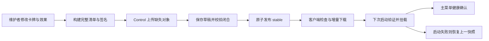

# 卡牌内容增量更新 v1

2026-10-04 发布决策：当前版本暂停启用此功能，以 3D 场地功能完整性为优先。
`project.godot` 固定 `ptcgdap/card_content/enabled=false`：首页不创建卡牌更新入口，
启动器不挂载已安装或待生效的内容包，更新器不检查、不下载、不提示重启。
已有内容文件和玩家存档保留；游戏使用随客户端打包验证的卡牌、规则与卡图。
下面的实现和历史验收保留用于开发验证，不能据此自动重新启用或发布。

状态：2026-09-30，本地实现与验收完成（active / local）；生产尚未部署。客户端和 Control 协同开发，验收边界见文末。

## 目标与范围

发布一次具备内容加载器的客户端后，维护者通过 Control 发布新卡和卡效修复，玩家在游戏内自动或手动下载，无须安装新的 APK/EXE。v1 在下一次启动激活规则更新；一局内始终使用同一内容快照。Windows、Android 使用相同协议；Web 持久化和设备实测单独列证据。

原生引擎、扩展 ABI 或更新器底座变更仍需客户端升级。下载脚本只授予第一方发布者，作者 `.ptcgai` 仍为 data-only，本地 AI 不依赖服务器推理。

## 所有权与现状

- `CardDatabase` 的内存和 user JSON 优先级会遮住修复，已存在不能等于最新。
- `EffectRegistry` 的 preload、脚本类型身份和全局缓存使运行中替换不可靠。
- 规则还分布在状态机、验证器、数据类型、UCIS 和 AI 能力目录中，不能只打包一个效果目录。
- 作者策略摘要门必须保留；同版本资源挂载保证原有 `res://` 源文档读到正确字节。
- Control 实现、存储配置和管理员操作在私有仓库；公开仓库只持有协议、客户端、构建工具和测试。

## 发布单元

`card_content_manifest_v1` 是一份完整快照，包含递增 sequence、显示版本、最低客户端版本、运行时 ABI、平台范围、发布说明、资源包清单和卡牌源/图片索引。回滚以更高 sequence 重新发布旧快照；不接受倒退序号。

清单封装为 RSA-SHA256 / PKCS#1 v1.5 签名信封。签名输入是 base64 payload 解码后的精确 UTF-8 字节，避免跨语言 JSON canonicalization 差异；客户端使用随底座发行的固定公钥，下载内容不能修改信任根。release ID 是 payload SHA-256。

对象以 SHA-256 寻址，大小和资源包内部路径/字节摘要由清单签名。ZIP 资源包使用 Godot 原生挂载；源码 remap 显式覆盖导出后的 `.gdc` 重定向。规则、数据、能力声明分组形成完整快照，不积累无限补丁链。只下载缺失或损坏的对象；卡图独立按需下载。

增量粒度为资源组：effects、engine、data、aligned AI、contracts、catalog、cards；某组没变化就复用已有对象，不对 ZIP 做二进制差分。2026-09-30 本地候选包含 1,011 张卡、7 个必需包，共 3,549,021 bytes；1,010 张卡图独立按需下载。全部对象 81,516,667 bytes，不是每次启动都下载这些图片。



### 导出后脚本的两个约束

1. `.gd.remap` 必须指回同路径 `.gd`，覆盖底座里的 `.gdc` 重定向。把源码映射到另一个 hash 文件名会改变 Godot 的类型身份，已由真实导出 EXE 复现并修复。
2. 底座的全局类缓存不知道后续新增的 `class_name`。构建器对新增类引用注入显式 `preload`，并将新增类继承改为路径。`data/card_content/runtime_classes.json` 是**首次底座发行时冻结的类清单**，常规卡牌更新不得重新生成；否则会误把新增类当作旧客户端已知类。已有类不得移动资源路径。复杂依赖必须通过冻结客户端执行验收。

只允许受限的游戏规则、效果、卡牌数据、目录和能力资源路径。拒绝路径穿越、重复路径、大小写冲突、链接、原生二进制、project.godot、更新器与信任根覆盖。未知字段/格式/ABI fail closed。

## 客户端状态机

`idle → checking → available → downloading → ready → next boot trial → active`

下载先写临时文件，验证后改名。全部必需资源闭合后才写 pending 指针。启动加载器必须是首个 autoload，在 `_init` 中、任何游戏脚本 preload 前验签及挂载。当前进程绝不激活新规则，因此所有缓存、类型身份、已创建 CardData 和对局规则自动固定在当前快照。

trial 标记先于 active 写入；主菜单成功初始化后确认健康。未确认的试启动下次启动恢复 previous。资源挂载后不能卸载，部分挂载失败须退出并在下次启动恢复，不能在同进程混用新旧资源。下载/磁盘故障保留旧 active。基础内置内容始终可用。

官方快照 UID 在 CardDatabase 中优先于旧 user JSON；用户牌组与个人导入文件不删除。搜索目录合并已验证新卡。卡图缓存键含内容摘要，不能拿旧 UID 图片冒充更新图片。安装状态与对局记录携带 release ID。

## 玩家交互

主菜单提供紧凑的卡牌更新状态和可打开的更新面板，包含版本、说明、下载量、自动下载开关、检查、下载与重启操作。启动/返回主菜单轻量检查，未开启自动下载时仅提示。对局不弹窗、不改规则；退出/重启必须由玩家在主菜单选择。

## Control 公开协议

- `GET /v1/card-content/channels/stable`：签名信封；ETag / 304。
- `GET /v1/card-content/releases/{release_id}`：不可变签名信封。
- `GET /v1/card-content/objects/{sha256}`：不可变对象。
- `POST /v1/admin/card-content/missing`：传入 sha256 数组，返回需要上传的对象。
- `POST /v1/admin/card-content/objects/{sha256}`：管理员上传对象，幂等。
- `POST /v1/admin/card-content/releases`：验签、检查对象与依赖后保存草稿。
- `POST /v1/admin/card-content/publish`：携带 expected release ID 原子发布，冲突返回 409。

沿用 Control 管理员会话/CSRF（以及明确启用的管理员 CLI 凭据），开发者凭据无发布权限。Control 持久对象适配器保存对象、草稿和发布标记，独立事务锁序列化多实例发布；本地磁盘实现只用于开发或显式持久磁盘。生产具体存储和接线由私有仓库拥有。客户端不接受清单提供的任意下载主机，下载始终来自配置的 Control origin。

## 策略、服务端与录像

保持现有 exact source/catalog/capability 检查。更新后的卡牌不自动赋予旧作者包兼容资格；不匹配时明确拒绝。共享规则和能力声明可随审核的资源包一起更新。Bot 只有部署对应底座并加载同一内容快照后才具备新卡运行能力，Control 发布本身不授予天梯资格。

记录内容 release ID 用于诊断和重放；重新模拟必须匹配规则快照。公开策略输入不增加网络、隐藏信息或脚本对象。

## TDD 与验收

1. Python 协议/构建 RED→GREEN：签名、确定性、增量复用、闭合快照、非法路径、损坏对象、ABI、回滚序号。
2. Godot RED→GREEN：真实 RSA 验签、暂存/重启激活、旧缓存遮蔽、失败启动回退、图片修订、UI 状态。
3. Control HTTP：管理员边界、匿名下载、ETag、上传幂等、未闭合发布拒绝、并发版本冲突、持久重启、回滚。
4. 冻结已导出客户端：不重导出，发布新效果，再修复已有脚本；实际执行结果变化；失败候选回退。脚本原有 `.gdc` remap 路径必须覆盖。
5. 现有 CardDatabase、图片、作者包及相关引擎回归；Windows/Android/Web 证据分开，不以 headless 单元测试冒充设备验收。

## 回退

玩家保留上一健康快照和内置基线。维护者把旧快照以新的 sequence 发布即可远程回退，旧对象不可覆盖。移除功能时恢复首个 autoload 与内容 UI 接入，用户牌组和导入不受影响。

## 实施与证据

实现入口：`scripts/card_content/`、`tools/card_content_release.py`。`ContentBootstrap` 必须保持 project.godot 首个 autoload；首个正式底座必须包含公钥、类清单及 CardDatabase/目录/图片接入。运行时不需要 Python。签名私钥保存在维护者机器仓库之外，Control 只持有公钥；当前公钥 ID 为 `maintainer-20260930`。

### 日常发卡流程

先完成卡效测试、目录/能力声明更新，并以受审源码构建。sequence 在整个 stable 渠道中严格递增，草稿也不能重用另一个版本已占用的序号。

```powershell
$cardSigningKey = Join-Path $env:USERPROFILE '.ptcgdap/card-content/publisher-20260930.pem'
python tools/card_content_release.py build --source . --out artifacts/card-content-release-2 --sequence 2 --version 2026.10.01.1 --notes '新增卡牌与卡效修复' --private $cardSigningKey --key-id maintainer-20260930
python tools/card_content_release.py verify --bundle artifacts/card-content-release-2
# 管理员令牌通过 PTCG_CARD_CONTENT_ADMIN_TOKEN 注入；或 --session-file 传入 cookie/csrf_token JSON。
python tools/card_content_release.py upload --origin https://api.ptcg.skillserver.cn --bundle artifacts/card-content-release-2
# upload 只保存草稿。使用返回的 release_id 和服务端当前 release_id 原子发布。
python tools/card_content_release.py publish --origin https://api.ptcg.skillserver.cn --release-id <新release_id> --expected-release-id <当前release_id>
```

初次发布的 expected release ID 为空。`rollback --source <旧bundle目录> --out <新目录> --sequence <更大序号> --version <回退版本> --private <签名密钥路径> --key-id maintainer-20260930` 会重新签名旧内容，再按 upload/publish 流程发布。私钥备份与更换属于维护者操作；不能从服务器下发新信任根替代底座公钥。

本地 `artifacts/card_content/review-candidate` 已构建并完整 verify，release ID 为 `41eea393ed1d9f3720ab727557cf43f7bab922eb143431a7c04c111d66fb1f4b`，未上传。它使用当前工作区源码，正式上线前仍需冻结受审源码集合，不能把其他未发布改动自动带入生产。

### 复现命令与结果

```powershell
python -m pytest tests/test_card_content_release.py tests/ptcgdap/test_card_source_portability.py tests/ptcgdap/test_author_strategy_package_catalog.py -q
.\scripts\tools\run_godot_tests.ps1 -Runner functional -Suite 'CardContent,CardCatalogIndex,CardData,CardDatabaseCatalogFallback,CardDatabaseSeed,CardImageCacheService,CardImageFallback,BattleRecorder' -UserDataRoot .godot_test_user/card_content_verified
.\scripts\tools\run_godot_tests.ps1 -Runner focused -SuiteScript res://tests/ptcgdap/godot/test_author_strategy_card_source_portability.gd -UserDataRoot .godot_test_user/card_content_portability
python tests/card_content/frozen_client_acceptance.py --godot D:/ai/godot/Godot_v4.6.1-stable_win64_console.exe
python tests/card_content/android_content_acceptance.py --godot D:/ai/godot/Godot_v4.6.1-stable_win64_console.exe --adb C:/Users/24726/AppData/Local/Android/Sdk/platform-tools/adb.exe --serial emulator-5554 --output artifacts/card_content/android-new-run
```

- Python 公开协议及作者包源兼容回归：15 passed。
- Godot 卡牌/图片/录像相关矩阵：146 项（最终报告见 `artifacts/card_content/validation-summary.json`）；作者策略原始卡源兼容：4 passed。
- Windows release EXE：只导出一次，12 个步骤通过。新卡、已有脚本修复、损坏下载、坏脚本试启动回退、递增序号回滚、离线恢复均由真实客户端执行。证据 `artifacts/card_content/frozen-20260930-233127/report.json`。
- 完整游戏资源验证：同版本 Godot console 以 `--main-pack` 打开冻结的完整游戏 EXE，真实 CardDatabase、CardCatalogIndex、EffectRegistry、EffectProcessor 执行新效果（抽 2 张）和已有效果修复（7 → 8，新增效果 2 → 3），EXE 摘要保持不变。证据 `artifacts/card_content/full-runtime-global-classes/report.json`。该项明确区别于前一项直接运行原生 EXE。
- Android：独立包 `org.ptcgdap.cardcontentlab`、x86_64 模拟器，APK 只安装一次，9 步通过，APK 摘要不变。证据 `artifacts/card_content/android-5/report.json`；未冒充 ARM 真机验收，也未覆盖用户正式游戏安装。
- 布局：600×900 竖屏截图 `artifacts/card_content/update-panel-portrait.png`；长说明在固定面板内滚动，横/竖屏边界由 CardContent 功能测试验证。
- RED→GREEN 记录覆盖签名/闭合包、旧缓存遮蔽、新增类、版本身份、304 手动下载、离线仍可应用待更新、卡牌筛选、图片缓存假就绪及不合法信封；服务端测试证据留在私有仓库。

### 验收边界

2026-10-01 补齐正式安卓应用验收：原分发 APK 缺少整个内容更新模块，先前独立 lab APK 的通过不能代表正式客户端。新增实际产物门禁、完整首页入口测试和手机触摸尺寸；同时隔离测试源码，防止其污染导出的全局类索引。最终 APK、实际触摸证据、失败记录和回退见 [Android 入口验收](../evidence/ptcgdap/card_content_android_entry_20261001.md)。

2026-10-01 再次复跑完整游戏新增卡/旧卡修复的三个阶段，全部通过；证据 `artifacts/card_content/full-runtime-workflows-20261001/report.json`。仍使用首次冻结完整 EXE，同版本 console 的 `--main-pack` 执行真实数据库、目录、注册与效果处理，底座摘要保持不变。标准夹具验证基础设施，实际每次新增/修复的业务卡仍需本次精确 bundle 的目标卡测试与冻结客户端执行证据。

需要发布一次新底座客户端，此后协议范围内的新卡、卡图、卡效和共享 GDScript 修复无需重打 APK/EXE。规则包重启后生效，不在当前对局中热替换对象；健康确认只证明启动到主菜单，不能替代每张卡的效果测试。更新器/UI/原生扩展以及新底座 ABI 变更仍走完整客户端更新。

本轮没有提交、推送、部署 Control 或发布线上内容；ARM 真机、Web 持久化、Linux/macOS 导出与线上 MySQL/代理路径尚未验收。默认发布平台不包含 Web。旧资源对象保留供复用和回退；服务端对象有配额，自动清理历史发布不在 v1 中。Bot 运行时和天梯资格仍走独立发布与验证流程。
