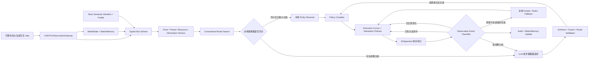
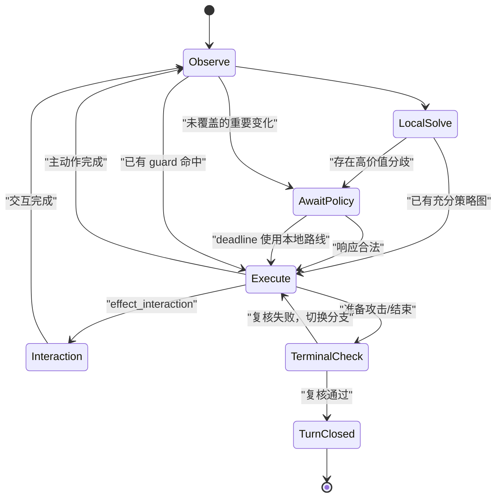

# PTCG 18.0 独立 LLM 条件策略图架构方案

状态：隔离实现已覆盖 24 套；24/24 graph-ready 并可在 BattleSetup 选择，6 套保留既有 ROI 配对状态，其余仍为 experimental
日期：2026-07-19
适用范围：18.0 内置 24 套 AI 卡组
架构代号：V18CPG（V18 Conditional Policy Graph）

> 本方案完整替代第一版“单路线选择器”设计。V18CPG 是一条全新、隔离的 18.0 LLM 策略链路；它不替换、不修改、不继承旧 LLM 策略，也不接入正在其他分支开发的完整 Agent 版本。

## 目录

- [0. 实施校准 v2（2026-07-19）](#0-实施校准-v22026-07-19)
- [1. 最终架构决策](#1-最终架构决策)
- [2. PTCG 对架构的真实要求](#2-ptcg-对架构的真实要求)
- [3. 目标与非目标](#3-目标与非目标)
- [4. 强隔离边界](#4-强隔离边界)
- [5. 核心术语与生命周期](#5-核心术语与生命周期)
- [6. 总体架构](#6-总体架构)
- [7. 观察事件与运行时状态机](#7-观察事件与运行时状态机)
- [8. 合法信息边界与信念状态](#8-合法信息边界与信念状态)
- [9. 多时间尺度策略](#9-多时间尺度策略)
- [10. 通用战术求解层](#10-通用战术求解层)
- [11. 路线搜索与受限路线合成](#11-路线搜索与受限路线合成)
- [12. 条件策略图协议](#12-条件策略图协议)
- [13. 精确执行与类型化交互](#13-精确执行与类型化交互)
- [14. 事件驱动重规划与响应速度](#14-事件驱动重规划与响应速度)
- [15. 降级、所有权与防抖](#15-降级所有权与防抖)
- [16. 24 套卡组快速适配](#16-24-套卡组快速适配)
- [17. 猫头夜鹰专项闭环](#17-猫头夜鹰专项闭环)
- [18. 引擎接入](#18-引擎接入)
- [19. 可观测性与效果评估](#19-可观测性与效果评估)
- [20. 测试与验收](#20-测试与验收)
- [21. 分阶段实施](#21-分阶段实施)
- [22. 风险与固定决策](#22-风险与固定决策)
- [23. 预期目录](#23-预期目录)

## 0. 实施校准 v2（2026-07-19）

首轮真实配对迭代确认：条件策略图本身不够，V18CPG 还必须具备“精确 Rule 下限 + 可证明局部升级 + 信息纪元重开 + 确定性执行”四个闭环。以下规则覆盖本文中较早、较宽泛的描述：

1. **Rule 是精确可执行下限。** Frontier 保留每个合法动作的 candidate id、action id、Rule 分数和顺序；同一路线内的动作不能在绑定前合并。模型偏好、提示词结论和分数加成都不是优势证明。
2. **升级必须有独立证书。** 模型路线通过统一安全盾；跨越大分差的局部升级必须由 capability module 根据公开状态签发并在执行前复核。证书声明类型、公开证据、是否 terminal、交互所有权和失效条件。
3. **本地策略只在当前信息纪元有效。** 成功的抽牌/搜索动作若改变合法动作、手牌规模或物质事实，旧 `local_gate` 图和 cursor 必须清空，再次进入 Rule/证书/模型比较。普通动作、失败的信息动作不重开；模型图按自己的 typed checkpoint 前进。
4. **安全批准与执行权分离。** 安全层先批准精确 candidate；执行层再按 Rule 顶分与目标分差动态计算足够的选择权，确保能压过 `-100000` 一类 Rule 哨兵分。固定 `+20000` 不能保证执行，动态权重也绝不能反过来批准策略。
5. **无网络有两个不同验收模式。** `--no-model` 关闭模型和证书，要求完整 decision log 与 Rule 相同；`--verified-local-only` 只开启确定性证书，统计每一个正向与负向 paired flip。两者不得混为“模型关闭”。
6. **不完整基准不计局数。** 每局结束必须断开 bridge/signal 并释放 GameStateMachine/effect graph。只有正常退出且写出 JSON artifact 的 clean game 才进入验收；被杀进程的控制台片段只能诊断。

当前校准证据：核心契约测试 13 组通过；三套 pilot 的 `--no-model` 共 30 局完整决策日志零差异；Tord 在 50 个 paired seed 上由 Rule `13/50` 提升到 verified CPG `14/50`，1 个正向翻转、0 个负向翻转、0 个异常局；真实模型在该正向 seed 上保住胜局，但可见等待 p95 为 `12.149s`，且 50 局只提升 `2pp`，因此仍保持 experimental，不能据此宣布 promotion。

### 0.1 实施校准 v3：传输 RNG 隔离与拒绝原子性（2026-07-19）

后续 paired replay 证明，旧共享 Python fallback 用进程级随机数生成临时文件名，会推进对局全局 RNG；同时，被拒绝的 response 曾把 action owner 改为 `local_gate`，间接启用了额外交互 override。两者都能造成 `model_accepted=0` 但同 seed 动作漂移。

v3 固定以下契约：

1. V18 网络适配器不得调用进程级随机函数；fallback token 只由 process id、对象 id 和单调序号组成，并用“构造请求前后下一 RNG 值相同”的夹具验证。旧 ZenMux 客户端不修改。
2. response 拒绝是原子的。schema、绑定、安全、证书、过期或 deadline 拒绝只能写 audit；不得保留 model graph/cursor，不得改变 agenda、action owner 或 interaction owner。
3. 真实传输运行若 `model_accepted == 0`，完整 decision log 必须与相同 seed 的 `--verified-local-only` 完全一致。

新证据：核心契约测试 14 组通过；最终 profile 的三套 `--no-model` 共 30 局与 Rule 完整日志零差异；profile 14 的 Tord 在 181820–181829 由 Rule `2/10` 提升到 verified CPG `3/10`，1 个正向、0 个负向；将单回合 visible-wait 硬预算收紧到 `6500ms` 后，强制 RNG-safe Python transport 并启用 `--compare-verified-reference` 的 seed 181820 运行中 4 次 response 均在约 `6250ms` deadline 降级，CPG 仍获胜，自动 reference checks `1`、mismatches `0`，完整动作日志与 verified-local 相同，visible-wait p95 `6.252s`。旧的“1 次 accepted 后获胜”artifact 因 RNG 污染撤出 promotion 证据。

### 0.2 实施校准 v4：20 决策优势集与架构冻结（2026-07-20）

为避免在三套 pilot 上无限调参，V18CPG 增加一个先于 24 套扩展的固定终点：`dominance_decisions_v1`。它包含 20 个来自既有 replay/十轮台账的公开状态决策，其中 Tord 6 个、猛雷鼓 7 个、火伊布猫头夜鹰 7 个，覆盖公开能量搬运、Area Zero 太晶扩容、缺失属性附能、奥琳加速、确定性取奖、低牌库终止、进化根优先和锁定主动位换位。

每个用例必须同时满足：

1. 从原始公开 observation、合法动作与 Rule 分数重建 production frontier；
2. 冻结并断言 Rule 的精确 action id；
3. V18CPG 通过正式 safety/capability 路径选择另一个精确 candidate；
4. 能力证书由模块重新计算，fixture 禁止写入 `verified_advantage`；
5. 断言替代动作和证明类型，不接受仅比较 profile 分数或提示词结论。

当前结果为 `20/20`，artifact：`tmp/v18cpg/v18cpg_dominance_decisions_v1.json`。基线执行先暴露 `cycle_pivot` 将语义编译结果覆盖为空数组的问题，修复后从 18/20 达到 20/20，核心 14 组契约仍通过。由此冻结通用选择语义：后续除回归或跨卡组阻塞证据外，不再修改核心，而通过语义 manifest、能力模块和小 profile delta 扩展 24 套。

该门槛证明“在预声明的 20 个精确决策上 V18CPG 确定性优于 Rule”，不等同于总体胜率 promotion；配对对局仍用于 smoke、负向翻转和最终统计晋级。

### 0.3 实施校准 v5：冻结后完成 24 套扩展（2026-07-20）

20 决策门槛通过后没有继续修改通用选择语义，而是按既定扩展面完成：

1. 24 个内置 18.0 deck id 与 Rule profile catalog 精确对齐，生成 24 个独立 `v18cpg_*` strategy id，并逐套绑定对应 Rule 策略作为可执行下限。
2. 12 类 capability module 全部进入统一 registry；新增九种战略形态使用一个参数化模块实现，卡组 profile 只声明模块组合和小型 delta，不复制 24 个 wrapper。九种形态各自具有精确公开状态字段、typed hint、隐藏信息 sentinel、route validation 与“不得签发未证明证书”的夹具。
3. semantic compiler 为 24 套生成 UID/effect 级 manifest 和 coverage ledger；名称/文本推断只允许用于构建期或显式 fallback，运行时正式角色仍以稳定 UID/effect key 为准。
4. BattleSetup 和共享 registry 只接入一层 metadata adapter，不维护 24 套 UI 映射；`ai/v18_conditional_policy_enabled` 与 `V18CPG_FEATURE_ENABLED` 默认关闭，因此当前 Rule/旧 LLM/Agent 行为不变。
5. 24 套配对 no-model smoke 共 26 局全部 clean，模型调用为 0；每局 decision log、步数、总回合、胜负与 Rule 精确一致，并且每套至少覆盖 3 个己方决策回合。验证器输出：`tmp/v18cpg/v18cpg_24_no_model_smoke_summary.json`。

由此，Phase 5 的“全部版本已构建并达到 smoke-ready”完成，架构优化阶段到此收口。新扩展的 21 套不能仅凭 smoke 宣称总体胜率超过 Rule；它们保留 `experimental`，后续进入逐套 paired benchmark/promotion，而不是回头无限调整共享核心。

### 0.4 实施校准 v6：生产启用链路收口（2026-07-20）

扩展完成后的 feature-enabled 验收暴露了两个共享阻塞，并以回归证据为边界修复：

1. 宿主原先没有把实际执行的 Rule 顶动作和完整分数证书传给 V18CPG，导致模型选择同一 Rule 根动作时仍会被当作歧义 tie 拒绝。现在 `AIOpponent` 用独立 V18 Rule fallback 对宿主增强后的完整合法动作计分，并把稳定 action id、动作类型、分数和全量 score map 一起传入 route search。
2. 严格 profile 原先要求所有已接受响应都带“模型执行优势证书”，连“精确选择 Rule 根、仅保留未来策略图”的 shadow response 也被拒绝。现在 shadow/defer 路径可安装图但不获得偏离 Rule 的根执行权；真正的 model-owned root 仍必须通过原有证书门。

冻结集同时补齐机器可验证的来源链：20 个 case 各自绑定三份十轮失败台账中的具体 round、失败类别和派生说明；验证器要求来源文件存在且记录完整。最终证据分三层，禁止混淆：

- 决策优势：`dominance_decisions_v1` 继续为 `20/20`，证明预声明的精确公开状态选择确定性优于 Rule。
- 隔离下限：最新代码重跑 24 套共 26 局 `--no-model`，逐动作日志、步数、回合和胜负继续与 Rule 完全一致。
- 启用链路：确定性 Rule-root fixture 在 24 套真实经过 request/schema/binding/safety/policy/audit 生产路径，共 612 次响应全部接受，0 拒绝、0 fallback、visible-wait p95 `0ms`，传输 RNG 隔离全部通过；汇总为 `tmp/v18cpg/v18cpg_24_enabled_fake_smoke_summary.json`。

启用态单局 smoke 另如实记录 4 个由本地 capability 证书改变路线后的负向 paired flip。它们不影响链路 smoke 结论，也绝不作为胜率 promotion 证据；后续逐套晋级仍必须用多 seed paired benchmark 统计正负翻转和置信区间。至此共享架构与 24 套构建收口，不因任意单 seed 结果继续无限调参。

### 0.5 实施校准 v7：compact wire v3 与本地严格校验（2026-07-20）

21 套深度迭代的首个真实模型 round 暴露了传输瓶颈：语义策略协议已经是 `v18cpg-2`，但每次请求仍重复发送完整 JSON Schema、`$defs` 和可从 frontier 推导的索引，导致 41/42 次调用耗尽 `6500ms` 可见等待预算。该问题只在隔离的 V18CPG 网络层修复，不改变 Rule、旧 LLM 或 Agent：

1. **语义 schema 与传输协议独立版本化。** 策略语义继续由 response schema v2 定义；模型传输使用 `transport_contract_version=3`。wire 升级不自动改变策略语义。
2. **完整 schema 不再随请求发送。** system contract 只描述紧凑 typed grammar；`V18CPGPolicyValidator` 在本地补齐 sparse 默认值后，严格执行 required/additional/type/enum/length、DAG、全图 exact candidate 绑定和安全检查。本地 validator 才是最终权威。所有节点先完整验形；语义不可达的死节点随后确定性删除，绝不替模型猜测或补造边。
3. **请求按语义去重。** 公共 module facts 提取到 `capability_context`，候选只发送 exact override；false、0、空字符串和空集合使用固定 sparse 默认语义。压缩必须可由 `context + override` 无损重建，不能用字段白名单吞掉新模块事实。
4. **delta 是自包含的剩余策略重规划。** 它携带当前 compact observation、belief、agenda、cursor、MaterialDelta、facts、ledger、prize/threat、capability context、updated frontier 和 future-route allowlist，不依赖服务端缓存上一请求。
5. **一个图可以包含多个 checkpoint。** 已覆盖 guard 的 checkpoint 在本地零调用推进；只有未覆盖且高 regret 的新信息纪元才发 delta。模型 wire 上限 8 节点，实际还必须服从 profile 的 `limits.max_policy_nodes`。
6. **传输审计可分解。** 每个 response 记录 `transport_contract_version`、`is_delta`、`system_prompt_bytes`、`user_prompt_bytes`、payload/response bytes 和 visible wait。

当前硬门：strict compact response、双 checkpoint 八节点、全图 candidate↔route 绑定、self-contained delta、12/12 module compaction 等契约共 16 组通过；共享 blocker 12 组、20/20 dominance、24/24 profile 与 12/12 module coverage 均通过。首次真实单局将接受率从旧 round 的 `1/42` 提升到 `6/10`，加入 per-profile node limit 后同 seed 为 `7/10`，且消除了 `node_count` 拒绝；但两次测试仍均为 `0pp` 且已接受 response 都是 exact Rule-root shadow，因此这只是延迟/可用性证据，不是策略强度晋级证据。

### 0.6 实施校准 v8：跨模块证明闭合与轮次渐进长考（2026-07-26）

真实对局暴露了一个不能由提示词修复的组合缺口：动态费用模块已经证明“月月熊换上后费用支付完成”，猛雷鼓扩展也已经暴露月月熊收尾 operator，但 Base Graph 没有把“合法撤退、目标身份、费用、240 伤害、230HP、双奖和重观察”闭合为一条可执行证书，最终安全层仍选择结束回合。

v8 固定以下契约：

1. 单模块事实正确不等于路线可执行。所有跨动作升级必须形成 transition certificate，绑定精确首动作、费用/额度、目标、后继攻击、伤害/击倒、奖赏和失效条件。
2. 多动作证书只授权当前一个引擎动作。撤退后必须重观察并重新验证月月熊攻击，不能把预测当作已经存在的合法 attack action。
3. 若对手下一攻击窗口获胜、Rule 根为结束回合，而公开可证的换位后击倒能严格增加当前窗口奖赏，则该确定性救援可先于强制模型判断执行。
4. 测试必须同时包含 production selector 和真实引擎 witness；只检查动态费用表或 operator 标签不再算完成。
5. 可见等待采用有界轮次渐进预算：前期基线 6500ms，每两个引擎回合增加 1500ms，上限 18000ms。请求准入、在途 deadline、UI soft timeout 和 audit 必须使用同一个有效值。
6. 延迟验收按前/中/后期分桶。允许后期长考，但不能用后期预算掩盖开局变慢。

### 0.7 实施校准 v9：请求到执行漏斗与精确决策权（2026-07-26）

真实模型审计发现：`model_accepted` 既不能证明模型动作已执行，也不能区分“模型确认 Rule 根”与“模型图改变后续动作”。本轮将审计升级为 schema v3，并把每个请求按 `request_id + policy_id + revision_id` 连接到最终 `action_result`：

1. 漏斗固定为 `started -> resolved -> provider response -> contract validated -> accepted -> installed -> causal execution / verified agreement`。`effective participation = causal execution + verified agreement`，所有比例按去重请求计算，不能用一个请求执行多个动作来放大收益。
2. 请求按 `turn_opening_graph`、`checkpoint_replan`、`strategic_arbitration` 分桶。一节点 shadow 是有效的验证后同意，但不是因果执行；多节点或多动作 typed root 才是 graph-bearing，只有该集合适合作为“图是否转化为执行”的分母。
3. Base 同时公开 `route.available.<suffix>` 与 `route.model_switch_allowed.<suffix>`。所有 `follow_route` 分支必须同时守卫合法性和执行决策权，并与运行时使用同一套安全计算；`route:information` 的事实后缀只能写 `information`，不得写成 `route.available.route:information`。
4. 根节点是精确 candidate 决策。模型可见 frontier 只保留精确 Rule 根和通过运行时安全门的候选，完整 frontier 留在宿主侧供 checkpoint 后重绑定。模型不再看到必定会被执行层拒绝的根候选。
5. 若完成求解器已证明一个公开、单调、无模型选择空间的强制前缀，宿主先无等待执行该前缀，保持“本回合必需模型判断”未完成，再从新观察请求模型。模型侧完成契约可以保留未来 action ID 清单，但强制推荐 candidate 必须属于 `allowed_candidate_ids`。
6. 默认轮次等待保持前期 `6500ms`，每两个引擎回合增加 `1500ms`，总上限 `18000ms`；猛雷鼓依据直连实测从 `7500ms` 起步。增长只给后期同回合多次信息重规划，常见单次响应不被人为拖长。

合理的架构漏斗水位固定为：provider response `>=99%`、contract validation `>=95%`、request-to-effective participation `>=75%`、graph-bearing installed-to-causal execution `40%-60%`、accepted-unexecuted `0`、已接受分支的运行时不安全回退 `0`。这些是管线有效性门槛，不是胜率晋级证据。

最终同种子真实模型 3 局（seed `183410..183412`）记录：26/26 provider response、26/26 contract valid、26/26 accepted、24/26 effective participation（`92.3%`）；14 个 graph-bearing 安装请求中 8 个产生模型因果执行（`57.1%`），0 fallback，单次 visible-wait p95 `7145ms`。V18CPG 与 Rule 均为 2/3、3/3 clean；该小样本只证明漏斗达标和未观察到劣化，不宣称统计胜率优于 Rule。最新共享回归为 24/24 启用态 fixture（604 accepted calls）及 24/24 无模型等价 smoke（26 局）。

### 0.8 实施校准 v10：24 套批量 Graph-ready 与供应商熔断（2026-07-27）

在 v9 漏斗合同稳定后，24 套 Profile 统一继承 `required_first_main_window`：每个有战略选择的首个主行动窗口必须完成一次模型判断，确定性必做前缀仍可先执行并在新观察上请求。BattleSetup 可用性与统计晋级拆开：24 套都可选择 Rule/大模型版；既有 6 套保留 ROI 状态，其余标记 `graph_ready_experimental`，不伪称非劣或严格更强。

批量证据包括：23 套非猛雷鼓复杂场景全部通过（通常每套 5 个，N 的索罗亚克 10 个）；24/24 启用态 fixture 共 604 次接受；24/24 无模型 26 局保持精确 Rule 决策日志；12/12 capability module compaction 与 9/9 战略形状 public-state fixture 通过；BattleSetup 真实控件测试逐一确认 24 套均出现 Rule 与 V18CPG 两个选项。

真实 DeepSeek 家族烟测在余额耗尽前完成 12 套：所有对局 clean，均未观察到相对 Rule 的负翻转；请求合同大部分达到 100%，少量拒绝来自回合等待预算。后续 6 套收到 HTTP 402 `Insufficient Balance`，因此不计为模型策略证据。该事件同时暴露并修复了 Base 缺陷：402/401/403 现在分别归类为额度/认证终止错误，首个失败后本局熔断后续请求，并关闭 verified-local 证书与 V18 硬守卫，严格退回 Rule。陆地水母同一 seed 从旧行为的 14 次失败请求和负翻转，修复为 1 次失败请求、后续全 Rule、Rule/CPG 同胜且零模型动作日志等价。

## 1. 最终架构决策

V18CPG 不采用以下两个极端：

- 不采用“每个动作都问一次模型”的高延迟闭环。
- 不采用“模型一次输出几十个低层动作分支”的庞大自由文本决策树。

它采用紧凑的条件策略图：

1. 本地从合法可见信息构建 `ObservationEnvelope` 和 `BeliefState`。
2. 本地求解奖赏、攻击、资源、对手威胁、信息价值和连续性事实。
3. 本地通过约束搜索生成可执行路线 frontier。
4. LLM 返回主路线、关键条件分支、资源预留、交互策略和重规划条件。
5. 客户端按动作逐步执行；抽牌、检索、揭示和效果交互形成信息检查点。
6. 命中预规划分支时零调用切换；出现未覆盖且会改变战略优劣的新状态时发送小型增量请求。
7. 不设“每回合最多调用几次”的策略上限，改用预期决策损失、剩余可见等待预算和状态版本控制调用价值。
8. 模型可以选择本地路线，也可以用受限宏动作 DSL 提议新路线骨架；所有路线最终都由本地验证和编译。

核心原则是：

> 模型负责跨信息状态比较和组合战略，本地负责信息安全、合法性、精确执行、资源一致性和快速降级。

## 2. PTCG 对架构的真实要求

### 2.1 一个回合不是一个决策

当前引擎每次只执行一个主动作，然后重新生成合法动作。效果又会拆成搜索、丢弃、目标、能量分配、伤害分配等多个交互步骤。因此一个 PTCG 回合包含连续决策序列：

```text
回合抽牌
→ 主动作选择
→ 效果交互 1
→ 效果交互 2
→ 新手牌/新牌库信息
→ 下一主动作
→ 攻击前最后检查
→ 攻击与奖赏处理
```

策略不能在每一步重新失忆，也不能假设首次生成的动作队列在所有新信息下仍然正确。

### 2.2 信息动作会改变后续最优解

PTCG 中大量动作本身不直接拿奖，但会改变决策信息：

- 抽牌和洗切抽牌改变手牌。
- 牌库搜索揭示关键牌是否仍在牌库，并可合法推断奖赏区可能性。
- 查看牌库顶、公开卡牌、弃牌回收改变可用资源。
- 对手的手牌干扰、场面变化和送出新出战位改变奖赏路线。

因此路线必须包含信息检查点和条件分支，不能只包含“动作成功/失败”。

### 2.3 动作有不同的不可逆程度

下列动作会锁死未来路线：

- 使用本回合唯一 supporter。
- 完成唯一一次手贴能量。
- 丢弃关键牌、攻击能量或恢复资源。
- 占用最后一个备战位。
- 使用 ACE SPEC、VSTAR Power、撤退或体育场额度。
- 自爆、回手核心、攻击或主动结束回合。

规划器必须区分信息获取、可逆展开、资源承诺、场面承诺和终结动作，并在合理时延迟不可逆承诺。

### 2.4 胜利目标不等于当前伤害最大

不同卡组和局面可能追求：

- 最短奖赏路线。
- 通过铺伤制造下一回合多杀。
- 单奖换双奖的交换优势。
- 保存下一回合攻击链。
- 控制对手资源直至牌库耗尽。
- 牺牲当前伤害重建进化链或能量引擎。

统一的“伤害 + 当前奖赏”分数无法覆盖这些目标。

### 2.5 局面是部分可观测的

引擎持有完整对象，不代表 AI 有权使用全部字段。尤其需要隔离：

- 对手手牌内容。
- 双方奖赏卡身份。
- 牌库顺序。
- 非当前效果允许查看的牌库顶或隐藏区域。

强策略可以维护合法推断，但不能读取真实隐藏值。

## 3. 目标与非目标

### 3.1 目标

- 覆盖 `DeckStrategyV18ProfileCatalog` 中全部 24 个 deck id。
- 一套通用运行时适配全部卡组，不创建 24 个大型 wrapper。
- 保留大决策树“提前覆盖未来分支”的优势，但将其压缩为类型化条件策略图。
- 支持跨抽牌、检索、揭示、交互和主动作的持续闭环。
- 支持至少当前回合、对手合理反击和下一自身回合连续性的短期视野。
- 不限制有价值的信息事件重规划次数，但控制用户可见等待时间。
- 模型可在受限 DSL 内补充本地候选集没有覆盖的战略路线。
- 通过语义编译和能力组合快速适配 24 套牌。
- 所有模型输入遵守严格的可见信息协议。
- 对模型、本地门控、策略图分支、合成路线、编译器和规则 fallback 分别归因。
- 现有规则策略、旧 LLM 策略和 Agent 分支行为保持不变。

### 3.2 非目标

- 不迁移或重构旧 LLM runtime、prompt builder、decision tree 或 interaction bridge。
- 不导入 Agent runtime/service，也不实现开放式工具循环、自由探索或长期开放记忆。
- 不在 LLM 中模拟完整游戏引擎。
- 不使用未经授权的隐藏信息提高胜率。
- 不要求模型输出每个 UI 点击或完整卡名动作列表。
- 不以极小 token 为唯一目标；允许用适度响应长度换取有效条件分支。
- 不在未完成验收前替换规则版默认策略。

## 4. 强隔离边界

### 4.1 代码边界

新决策代码只进入：

- `scripts/ai/v18_cpg/**`
- `tests/v18_llm_policy_graph/**`
- `scripts/tools/v18cpg/**`
- V18CPG 独立 schema、semantic manifest 和 profile 数据

新目录不得 preload、load、extends、call 或静态引用：

- `DeckStrategyLLMRuntimeBase.gd`
- `LLMTurnPlanPromptBuilder.gd`
- `LLMRouteCandidateBuilder.gd`
- `LLMRouteCompiler.gd`
- `LLMRouteActionRegistry.gd`
- `LLMInteractionIntentBridge.gd`
- 任意 `DeckStrategy*LLM.gd`
- 任意 Agent runtime、service 或 adapter

旧代码只能用于识别失败类型，不能作为复制或继承来源。

### 4.2 允许共享的稳定接口

| 接口 | 使用方式 |
| --- | --- |
| `GameState` / `PlayerState` / `CardData` | 只能由 ObservationGateway 按权限过滤后读取 |
| legal-action builder / rule validator | 获取当前合法动作与执行前验证 |
| effect interaction step | 读取当前 step 明确提供的合法 items 和 `visible_scope` |
| card/effect metadata | 离线或启动时生成语义清单 |
| `ZenMuxClient.request_json` | 仅作为 JSON 传输层 |
| V18 profile catalog | 只读获取 24 套身份和规则基线映射 |
| V18 rules strategy | 仅由独立 fallback adapter 新建并配置 |

禁止把 raw `GameState`、raw `PlayerState.deck` 或 raw interaction objects 直接发送给模型。

### 4.3 允许修改的现有文件

实现阶段只允许小型、可开关、增量接线：

- `DeckStrategyRegistry.gd`
- `BattleAiOpponentFactory.gd`
- `BattleSetup.gd`
- `AIOpponent.gd`
- 必要时 `AIStepResolver.gd`

这些改动只能识别新 `runtime_kind`、转发公开事件和调用新接口，不得改变旧 strategy id、旧 `_llm` 路径或规则版默认行为。

## 5. 核心术语与生命周期

| 术语 | 定义 |
| --- | --- |
| Match | 从 setup 到胜负判定的完整对局 |
| Turn | 一个玩家从回合开始到攻击/结束回合的区间 |
| Observation Event | 合法可见状态发生变化的事件 |
| Information Epoch | 两次会显著改变策略的信息事件之间的稳定区间 |
| Decision Window | 需要选择主动作或效果交互的引擎窗口 |
| Policy Revision | 一次有效模型响应或本地策略图修订 |
| Policy Graph | 当前回合的主路线、检查点、条件边和终止节点 |
| Route | 在一个或多个检查点之间的可验证宏动作 DAG |
| Execution Cursor | 当前策略图节点、路线步骤和状态版本位置 |
| Match Agenda | 跨回合保留的胜利目标、攻击链和资源承诺 |
| Belief State | 基于合法观察维护的未知卡牌和对手威胁分布 |

ID 层次固定为：

```text
match_id
└── turn_id
    ├── policy_id
    │   ├── revision_id
    │   ├── node_id
    │   └── route_id
    └── decision_window_id
        └── request_id
```

一个 turn 可以有多个 policy revision；一个 decision window 最多有一个未完成请求，但一个 turn 不限制 revision 数量。

## 6. 总体架构



LLM 不持有引擎对象，也不直接执行动作。策略图始终先经过本地 schema、可见性、守卫表达式、资源和合法性验证。

## 7. 观察事件与运行时状态机

### 7.1 事件分类

新 EventBridge 只发送以下注册事件：

| 事件 | 典型来源 | 是否可能形成新 information epoch |
| --- | --- | --- |
| `TURN_HANDOFF` | 对手回合完全结束 | 是 |
| `TURN_DRAW_RESOLVED` | 自身回合强制抽牌完成 | 是 |
| `MAIN_ACTION_RESOLVED` | 主动作成功或失败 | 视 state delta |
| `INTERACTION_OPENED` | 效果选择窗口出现 | 是，若合法候选包含新信息 |
| `INTERACTION_STEP_RESOLVED` | 搜索/丢弃/分配等完成 | 视结果 |
| `FULL_DECK_VIEW_OPENED` | 合法完整牌库搜索 | 是，并更新可推断奖赏 |
| `RANDOM_DRAW_RESOLVED` | 抽牌/洗切抽牌完成 | 是 |
| `SHUFFLE_RESOLVED` | 牌库重新随机化 | 更新顺序未知标记 |
| `COMMITMENT_SPENT` | supporter、手贴、撤退等额度消耗 | 通常不是新信息，但会锁定路线 |
| `BEFORE_TERMINAL` | 攻击或结束回合前 | 必须本地复核 |
| `ATTACK_RESOLVED` | 攻击、伤害与 KO 完成 | 更新 Match Agenda |
| `PRIZE_TAKEN` | 奖赏卡进入手牌 | 是，用于下一回合 |
| `SEND_OUT_REQUIRED` | 出战位被击倒 | 独立策略窗口 |
| `TURN_ENDED` | 回合结束 | 固化本回合审计 |

### 7.2 状态机



### 7.3 事件物质性判定

每个事件计算 `MaterialDelta`，至少包括：

- 当前路线是否合法。
- 当前路线可达到的伤害/奖赏档是否变化。
- 是否出现新支配路线。
- 关键资源、额度、攻击手或备战位是否变化。
- 对手威胁和下一回合连续性是否跨阈值。
- Match Agenda 的胜利方式是否变化。

普通排序变化、同身份卡实例变化、不会改变路线的额外手牌，以及已有 interaction policy 能唯一解决的选择，不创建新 information epoch。

## 8. 合法信息边界与信念状态

### 8.1 ObservationGateway 是唯一入口

规划、模型请求、日志中的策略输入都必须来自 `V18CPGObservationGateway`。其他组件不得自行读取 raw hidden zone。

### 8.2 可见性矩阵

| 信息 | 常态可见性 | 例外 |
| --- | --- | --- |
| 自己手牌 | 精确可见 | 无 |
| 自己场面、弃牌区、放逐区 | 精确可见 | 无 |
| 自己牌库张数 | 可见 | 无 |
| 自己牌库身份 | 只维护合法推断 | `VISIBLE_SCOPE_OWN_FULL_DECK` 时可读取当前合法展示 |
| 自己牌库顺序 | 不可见 | 仅当前效果明确展示的顶部卡 |
| 自己奖赏身份 | 不可见 | 奖赏被拿取后成为手牌可见信息 |
| 对手场面、弃牌区、放逐区 | 精确可见 | 无 |
| 对手手牌 | 仅张数和公开过的历史信息 | 当前效果明确展示/选择的卡 |
| 对手牌库 | 仅张数和公开历史 | 不读取实际数组 |
| 对手牌表 | 由 `decklist_visibility` 决定 | 内置公开对战可配置为 known，否则只用 archetype belief |
| 对手奖赏身份 | 不可见 | 拿取并公开后更新 |

### 8.3 搜索窗口规则

Effect step 已提供 `items`、`card_items` 和 `visible_scope`。V18CPG 只能使用当前 step 暴露的数据：

- 完整牌库搜索窗口可以更新“当前牌库中确实存在”的身份和数量。
- 搜索结束后可以记住合法观察结果，用于推断关键牌可能在奖赏区。
- 不得因为 `PlayerState.deck` 在内存中可访问就绕过 `visible_scope`。
- 支持合法 whiff 时，空选择必须作为显式策略选项，而不是解析失败。

### 8.4 BeliefState

BeliefState 维护集合或概率，而不是虚构确定值：

```json
{
  "own": {
    "possible_prized": {"Boss's Orders": [0, 1], "Lightning Energy": [0, 2]},
    "last_full_deck_observation": {"turn": 3, "known_counts": {}},
    "deck_order_known": false
  },
  "opponent": {
    "decklist_mode": "configured_known",
    "possible_response_roles": ["gust", "hand_reset", "bench_damage"],
    "revealed_counts": {},
    "hand_contents_known": false
  }
}
```

belief 更新必须由注册观察事件驱动，并可从事件日志重放得到相同结果。

## 9. 多时间尺度策略

### 9.1 Match Agenda

Match Agenda 跨回合存在，但不是开放式记忆。它只保存类型化战略状态：

- `victory_mode`: `prize_race`, `spread_closeout`, `resource_lock`, `deckout`, `rebuild`。
- `prize_path`: 预期的 1～3 个奖赏目标类别。
- `attacker_chain`: 当前、下一和应急攻击手角色。
- `protected_resources`: 未来两回合不能轻易消费的资源。
- `opponent_threat_posture`: 当前主要反击类别。
- `risk_posture`: `safe`, `balanced`, `forced`。
- `expires_when`: 需要废弃 agenda 的事实条件。

每次自身回合开始、重大 KO 或核心引擎消失时复核 agenda。普通抽牌不重建 agenda。

### 9.2 Turn Policy Graph

Turn Policy Graph 管理本回合：

- 主路线和备选路线。
- 信息检查点。
- 分支 guard。
- 本回合资源 reservation。
- 各 interaction policy。
- 不可逆动作前置条件。
- 攻击/结束回合终止条件。

### 9.3 Interaction Policy

Interaction Policy 只做当前效果的具体选择，但继承 agenda、route 和 resource ledger。它不能独立决定战略目标。

### 9.4 Opponent Response Envelope

策略图的短期视野固定为：

```text
当前自身回合结果
→ 对手一组合理反击类别
→ 下一自身回合连续性
```

不进行完整开放式 Agent 搜索，也不假设对手一定持有某张隐藏卡。

## 10. 通用战术求解层

### 10.1 Card Semantic Manifest

从 deck list、CardData 和 effect metadata 生成卡牌能力图。语义键优先使用 card id/effect id，不使用中文卡名作为执行逻辑条件。

基础 role：

- attacker / alternate_attacker / finisher
- draw_engine / search_engine / recovery
- evolution_piece / evolution_accelerator
- energy_source / energy_accelerator / energy_mover
- pivot / gust / hand_disruption / lock
- damage_counter_source / damage_counter_mover
- bench_protection / resource_recycler

人工 profile 只补充无法由结构推导的组合关系和风险偏好。

### 10.2 ResourceLedger

每类资源维护：

```text
available_now
reserved_current_route
reserved_next_turn
recoverable
possibly_prized
safe_to_discard
exclusive_quota
```

至少覆盖：卡牌身份/role、各属性能量、备战位、supporter、手贴、撤退、体育场、一次特性、VSTAR/ACE SPEC、未来攻击手和进化根。

资源具有动态影子价格。例如最后一张关键能量、唯一 recovery、下一回合手贴和唯一 Boss 的价格随奖赏路线变化。

### 10.3 PrizeGraphSolver

输出：

- 自己最短合理获胜路径。
- 对手最短合理获胜路径。
- 当前攻击的 prize swing。
- spread/damage counter 后的多目标 closeout。
- self-KO 带来的奖赏和场面代价。
- 单奖、双奖和三奖攻击手的交换效率。
- 是否已经存在最短无风险终结路线。

### 10.4 ThreatResponseSolver

根据公开牌表或 belief 生成对手响应类别：

- active KO
- gust engine KO
- bench multi-KO
- hand reset/disruption
- ability/item/retreat lock
- stadium replacement
- development when no KO

每条自身路线分别计算 expected response、credible worst response 和 recovery cost。未知牌不能被当作确定存在。

### 10.5 InformationValueSolver

给动作标注：

- `information_gain`
- `reversible_setup`
- `resource_commitment`
- `board_commitment`
- `terminal`

排序原则不是一律“先抽牌”，而是比较：

```text
信息带来的预期路线改进
- 为获得信息必须支付的资源和锁线成本
```

在不会损害路线时优先获取信息；若信息动作本身会消耗 supporter、清空优质手牌或触发低牌库风险，则可以后置或跳过。

### 10.6 Outcome Vector

路线统一输出多维结果，不提前压成不可解释的单分：

```text
win_now
prizes_now
two_turn_prize_swing
estimated_damage
attack_ready
attack_uptime_next_turn
board_development
resource_delta
information_gain
future_flexibility
lock_value
deckout_margin
self_ko_cost
counter_ko_risk
gust_exposure
bench_damage_exposure
hand_disruption_exposure
uncertainty
```

本地 evaluator 可以根据 `victory_mode` 产生排序分，但模型仍看到关键分项和不确定性。

## 11. 路线搜索与受限路线合成

### 11.1 本地搜索不是固定模板列表

`V18CPGRouteSearch` 在合法宏动作图上做受限 beam search：

1. 从当前 legal actions 生成 typed macro actions。
2. 用资源额度和依赖约束扩展可行前缀。
3. 在信息动作处插入 checkpoint，而不是穷举所有抽牌结果。
4. 在攻击/结束回合处形成 terminal route。
5. 用 outcome vector 和多样性规则保留 frontier。

同一个 current-turn DAG 可以顺序包含多个 checkpoint，例如“搜索结果 → 抽牌/揭示结果 → 攻击前确认”。每个 checkpoint 必须有唯一 node id、typed guard 和显式 `otherwise`；命中已有分支时继续本地执行，不产生网络调用。图始终无环，并受当前 profile 节点上限约束。

内部 route pool 可配置，首版建议最多 24；发送给模型的非支配 frontier 默认 4～8、最多 10。不能再把“最多 6 条”作为策略上限。

### 11.2 宏动作 DSL

允许的宏动作由本地注册表提供，例如：

```text
DRAW(via_action_id)
SEARCH(via_action_id, desired_roles, policy_id)
BENCH(role, source_action_id)
EVOLVE(target_role, source_action_id)
ACCELERATE(source_action_id, target_role, energy_symbols)
MOVE_ENERGY(source_role, target_role, count)
PIVOT(target_role, method_action_id)
GUST(target_selector)
MOVE_COUNTERS(source_selector, target_selector, count)
ATTACK(attacker_role, attack_id, prize_goal)
END_TURN(reason)
```

每个宏动作必须能映射到当前或前置动作后可出现的 engine action id。

### 11.3 双通道输出

模型可以：

- `select_candidate`：用同一 frontier entry 的 `candidate_id + route_id` 精确选择当前动作。
- `propose_typed_route`：用精确 `first_candidate_id` 和本次请求提供的宏动作枚举合成 2～4 步路线骨架。

只有 checkpoint 后的节点可以用 `follow_route` 表达未来宏观意图；root 不能只给 route id，也不能用 `select_existing` 绕过精确候选绑定。

受限合成路线必须经过相同的 dependency、resource、visibility、quota、terminal 和 engine validation。失败时记录 `synthesis_rejected`，不会发“修一下 JSON”的第二请求。

### 11.4 路线切换迟滞

避免每次小抽牌都推翻计划：

- 当前路线失效时立即切换。
- 新路线能直接获胜或改变奖赏档时允许切换。
- 其他情况下，新路线相对当前路线的优势必须超过 profile 的 `switch_margin`。
- 已支付的不可逆承诺提高切换门槛。

## 12. 条件策略图协议

### 12.1 请求内容

compact wire v3 主请求包含：

- `transport_contract_version=3`、lifecycle 和每套 profile 的 `limits.max_policy_nodes`。
- 当前压缩 ObservationEnvelope、BeliefState 与 MatchAgenda。
- facts、ResourceLedger、PrizeGraph、ThreatResponse。
- 候选公共的 `capability_context`、只保留 exact override 的 frontier。
- 后继节点可引用的 future-route allowlist。

请求不携带完整 JSON Schema/`$defs`，也不重复发送 root route/candidate index、candidate-id catalog、fact-path catalog 或 operator catalog；这些均由固定 system contract 和本地 validator 约束。调度器在本地执行 deadline、节点和 token budget。请求仍禁止 raw logs、隐藏 zone、完整效果实现或自由文本动作注册表。

### 12.2 主响应示例

```json
{
  "policy": {
    "root_node_id": "node:root",
    "nodes": [
      {
        "node_id": "node:root",
        "kind": "route",
        "route_ref": {
          "mode": "select_candidate",
          "route_id": "route:opening_search",
          "candidate_id": "candidate:fan_call_exact"
        },
        "next_node_id": "node:after_search"
      },
      {
        "node_id": "node:after_search",
        "kind": "checkpoint",
        "branches": [{
          "when_all": [{"fact": "attack.ready", "op": "==", "value": true}],
          "next_node_id": "node:attack"
        }],
        "otherwise": "node:information"
      },
      {
        "node_id": "node:information",
        "kind": "route",
        "route_ref": {"mode": "follow_route", "route_id": "route:information"},
        "next_node_id": "node:after_information"
      },
      {
        "node_id": "node:after_information",
        "kind": "checkpoint",
        "branches": [{
          "when_all": [{"fact": "prize.win_now", "op": "==", "value": true}],
          "next_node_id": "node:attack"
        }],
        "otherwise": "node:develop"
      },
      {
        "node_id": "node:attack",
        "kind": "route",
        "route_ref": {"mode": "follow_route", "route_id": "route:attack_ko"}
      },
      {
        "node_id": "node:develop",
        "kind": "route",
        "route_ref": {"mode": "follow_route", "route_id": "route:evolve"}
      }
    ]
  }
}
```

`agenda_patch` 可省略；空的 `reservations`、`interaction_policy_refs`、`interaction_policies` 和 `replan_if` 也可省略。本地先把它们规范化为固定空值，再执行与完整 response 等价的严格校验。

### 12.3 Guard DSL

guard 只能引用本地注册 fact path，操作符固定为：

```text
==, !=, >, >=, <, <=, in, not_in, exists
```

禁止模型返回任意代码、表达式字符串、卡名模糊匹配或访问对象路径。

### 12.4 图结构约束

- sparse omissions 必须先 canonicalize，再 strict validate。
- root 必须存在并绑定当前 frontier 的精确 candidate；`candidate_id` 与 `route_id` 必须来自同一 engine-owned entry。
- node id 唯一。
- 所有边目标存在。
- 图在本回合内必须无循环；允许共享子节点形成 DAG，也允许多个顺序 checkpoint。
- 安装后的所有节点必须从 root 可达；已严格验形但不可达的死节点只允许被 canonicalizer 删除，不得自动连边或获得执行权。
- route node 必须引用合法本地 route 或合法 typed proposal。
- checkpoint 必须声明 `otherwise`，值只能是 node id、`local_best`、`replan` 或 `rules_fallback`。
- terminal node 之后不得存在执行边。
- reservations 的释放点必须存在。
- 模型 wire 绝对上限 8，且必须服从 profile 的 `limits.max_policy_nodes`；本地语义 schema 的防御性硬上限仍为 12。

### 12.5 增量响应

增量请求是自包含的 compact remaining-policy revision，发送 transport version、lifecycle/base version、当前 compact observation/belief/agenda、cursor、MaterialDelta、facts、ledger、prize/threat、capability context、updated frontier 和 future-route allowlist。服务端不得依赖上一请求 body 或会话缓存来重建状态。

增量响应以完整替换未执行剩余图的方式安装；不能修改已经执行的历史节点或已消费资源。它与主响应走相同的 lifecycle、stale、resource、全图 binding、DAG 和 safety 校验，任何拒绝都必须原子回落。

## 13. 精确执行与类型化交互

### 13.1 Execution Cursor

cursor 保存：

- policy/revision/node/route/step id。
- expected observation version。
- 已消费 quota 和 resource reservations。
- 已完成 interaction step 及选择结果。
- 当前 terminal preconditions。

迟到响应必须同时匹配 match、turn、policy、revision base、request 和 observation version 才能生效。

### 13.2 共同前缀

如果所有可信分支共享一段安全动作前缀，客户端可先执行该前缀，再等待后续策略。共同前缀必须：

- 对所有保留路线合法。
- 不消耗会区分路线的独占资源。
- 不降低信息价值。
- 不包含 supporter、手贴、撤退、ACE SPEC、自爆或 terminal action，除非所有路线明确共享该承诺。

### 13.3 类型化 InteractionPolicy

统一 DSL 至少支持：

```text
rank_by
must_include
must_preserve
desired_roles
target_position
energy_symbols
damage_threshold
prize_goal
min_select
max_select
allow_explicit_empty
assignment_constraints
tie_breakers
```

需要覆盖：cards、pokemon_slots、counter_distribution、card_assignment、field_assignment 和 action_hud。

### 13.4 执行器边界

编译器和执行器可以：

- 展开宏动作。
- 绑定稳定 action/slot/card instance id。
- 按 dependency 排序。
- 重新验证合法性。
- 在 guard 命中时切换节点。

它们不可以：

- 偷偷插入更强战略线。
- 用文本猜测模型意图。
- 把无效模型路线修补后记作模型成功。
- 继续执行与当前 observation version 不匹配的队列。

## 14. 事件驱动重规划与响应速度

### 14.1 不设置回合调用次数硬上限

调用单位是 information epoch，而不是 turn 或 action：

- 一个 decision window 同时最多一个未完成请求。
- 一个 information epoch 最多产生一个有效 policy revision。
- 一个 turn 可以有多个 information epoch 和增量 revision。
- 一个已安装图可以本地穿过多个声明过的 checkpoint；guard branch hit 为零调用。
- 不因固定次数耗尽而强制继续明显过时的路线。

### 14.2 何时调用

满足以下全部条件才调用：

1. 当前 checkpoint 没有覆盖当前事实的可用 guard，或现路线已失效。
2. 本地 frontier 存在有意义的战略分歧。
3. `expected_regret_without_model` 高于 profile 阈值。
4. 仍有足够可见等待预算。
5. 当前 observation version 没有同类请求在途。

以下情况不调用：

- 已有 guard 命中。
- interaction policy 能唯一解决。
- 新路线提升低于 switch margin。
- 只是同身份实例、顺序 tie 或无关手牌变化。
- 已存在无风险获胜路线。
- 剩余等待预算不足，且本地路线可安全执行。

### 14.3 速度预算

速度目标从“每次请求多快”升级为“玩家实际等多久”：

- `local_planning_ms`: 本地观察、求解和搜索耗时。
- `request_wall_ms`: 每个请求墙钟时间。
- `visible_wait_ms`: 没有可执行安全动作时玩家感知的等待。
- `turn_visible_wait_ms`: 整回合累计可见等待。
- `system_prompt_bytes` / `user_prompt_bytes`: 按 full/delta 与 wire version 分桶的实际输入字节。
- `payload_bytes` / `response_bytes`: 实际传输与输出大小。
- `policy_graph_hit_rate`: 新信息命中已有分支、无需调用的比例。
- `calls_per_information_epoch` 与 `calls_per_turn`。

初版配置项：

```text
request_deadline_ms
turn_visible_wait_budget_ms
delta_response_token_budget
initial_response_token_budget
expected_regret_threshold
switch_margin
```

有效回合预算不是固定常数，而是：

```text
effective_budget =
  min(turn_visible_wait_budget_cap_ms,
      turn_visible_wait_budget_ms
      + floor((turn_number - 1) / turn_visible_wait_growth_every_turns)
        * turn_visible_wait_growth_ms)
```

默认值为 `6500 + floor((turn_number - 1) / 2) * 1000`，封顶 `10500ms`。这一增长只扩大后期高价值 information epoch 的可用长考时间，不改变每个 decision window 最多一个在途请求、迟到响应丢弃和本地 deadline fallback 契约。

数值必须通过目标模型基线测量确定，不在架构中写死 3.5 秒或固定调用数。

### 14.4 Token 预算

- 初始策略图建议目标 400～900 completion token，硬上限由 profile 节点数、本地 schema 和 API token budget 共同控制。
- 增量 revision 建议 120～350 token。
- 简单局面零调用。
- reasoning 默认关闭或最小化。
- 请求只发送当前必要摘要，禁止每次内联完整 JSON Schema；MatchMemory 使用固定字段而非历史全文。

### 14.5 Warm start

可选优化是在对手回合完全结束、状态不再变化后预计算 facts/frontier，并在自身强制抽牌完成后只更新 delta。若未来验证网络调用预取有收益，可生成包含“抽到不同 role”分支的 provisional policy；它必须在 `TURN_DRAW_RESOLVED` 后重新验证，不能预先读取实际抽牌。

## 15. 降级、所有权与防抖

### 15.1 降级层级

| 原因 | 所有者 | 处理 |
| --- | --- | --- |
| 当前策略图 guard 命中 | `policy_graph` | 零调用切换节点 |
| 不值得请求模型 | `local_search` | 选择本地非支配路线 |
| 主/增量请求超时 | `deadline_fallback` | 使用本地 frontier，不发纠错请求 |
| schema/guard 非法 | `schema_fallback` | 拒绝 response，使用本地 frontier |
| typed synthesis 非法 | `route_validation` | 忽略 proposal，保留合法本地选择 |
| 当前路线执行前失效 | `event_replan` | 命中分支或按价值发增量请求 |
| 本地无可执行路线 | `rules_fallback` | 独立 V18 rules 接管当前窗口 |
| 引擎 legal/effect 异常 | `engine_error` | 停止策略执行并记录，不伪装为策略失败 |

### 15.2 所有权

每个动作必须记录一个且仅一个 owner：

```text
model_selected_local_route
model_synthesized_route
policy_graph_branch
local_gate
deadline_fallback
schema_fallback
rules_fallback
```

### 15.3 防抖

- route switch 使用 `switch_margin`。
- 已支付承诺提高切换成本。
- 同一 MaterialDelta hash 不重复请求。
- 迟到响应不可覆盖更新 revision。
- 增量 patch 只允许修改未执行子图。

## 16. 24 套卡组快速适配

### 16.1 两层适配

第一层是所有牌共享的通用 solver：visibility、belief、prize graph、threat response、resource ledger、information value、route search。

第二层是可组合牌组能力模块：

| 模块 | 主要能力 |
| --- | --- |
| `stage2_chain` | 多进化链、糖果/TM、进化根和备战位冲突 |
| `dragapult_spread` | 幻影潜袭、铺伤目标和多回合奖赏图 |
| `damage_counter_control` | 愿增猿、雪妖女、自爆、伤害搬运 |
| `tera_noctowl_search` | 太晶条件、Fan Call 双检索、路线绑定 |
| `energy_burst` | 加速、移动、弃能伤害档和未来能量债 |
| `gardevoir_embrace` | 精神拥抱、承伤预算和攻击手构建 |
| `control_recycle` | 封锁、循环、牌库耗尽和非伤害胜利 |
| `copy_attack_toolbox` | 复制来源、费用、效果和来源保存 |
| `partner_chain` | 角色卡名联动和专属 supporter/tool |
| `cycle_pivot` | 循环抽牌、零撤退、回手重铺和交接 |
| `grass_spread` | 草能量横向展开与移动 |
| `fire_toolbox` | 火能量加速、移动和多攻击手切换 |

### 16.2 语义编译流程

```text
deck list + CardData + effect metadata
→ card role inference
→ evolution / energy / search / recovery dependency graph
→ capability module activation
→ generated semantic manifest
→ small hand-authored profile delta
→ exact scenario generation
```

人工 profile 只允许：

- 模块开关和参数。
- 特殊 combo dependency。
- 风险姿态和 switch margin。
- Match Agenda 倾向。
- 无法从 effect metadata 推断的语义覆盖。

禁止把大量卡名 if-chain 或可执行动作脚本塞入 profile。

### 16.3 覆盖表

| Deck ID | 中文名 | 主模块 | 组合模块 |
| ---: | --- | --- | --- |
| 18000230 | 喷火龙多龙巴鲁托 | `stage2_chain` | `dragapult_spread`, `energy_burst` |
| 18000625 | 愿增猿火焰鸡 | `damage_counter_control` | `stage2_chain`, `energy_burst` |
| 800015734 | 自爆多龙巴鲁托 | `dragapult_spread` | `damage_counter_control`, `stage2_chain` |
| 800015934 | Tord太晶盒 | `tera_noctowl_search` | `energy_burst`, `cycle_pivot` |
| 800016834 | 纯赛富豪 | `energy_burst` | `cycle_pivot` |
| 800017047 | 象牙猪火焰鸡 | `stage2_chain` | `energy_burst`, `cycle_pivot` |
| 800017097 | 无碟沙奈朵 | `gardevoir_embrace` | `damage_counter_control` |
| 800017407 | 赫普苍响 | `partner_chain` | `energy_burst`, `cycle_pivot` |
| 800017631 | 雪妖女愿增猿 | `damage_counter_control` | `control_recycle` |
| 800017643 | 火伊布猫头夜鹰 | `tera_noctowl_search` | `energy_burst`, `cycle_pivot` |
| 800018105 | 虫甲圣沙奈朵 | `gardevoir_embrace` | `damage_counter_control`, bench protection profile |
| 800018359 | 大比鸟控制 | `control_recycle` | `stage2_chain`, `cycle_pivot` |
| 800018497 | 沙奈朵 | `gardevoir_embrace` | `damage_counter_control` |
| 800018498 | 学院沙奈朵 | `gardevoir_embrace` | `damage_counter_control`, academy tempo profile |
| 800018499 | 多龙巴鲁托 | `dragapult_spread` | `stage2_chain`, `damage_counter_control` |
| 800018500 | 陆地水母厄诡椪 | `grass_spread` | `energy_burst`, `cycle_pivot` |
| 800018501 | 玛俐的长毛巨魔 | `stage2_chain` | `energy_burst`, `damage_counter_control` |
| 800018502 | N的索罗亚克 | `copy_attack_toolbox` | `partner_chain`, `cycle_pivot` |
| 800018509 | 猛雷鼓厄诡椪 | `energy_burst` | `tera_noctowl_search`, `cycle_pivot` |
| 800018539 | 阿响凤王 | `fire_toolbox` | `partner_chain`, `energy_burst` |
| 800018543 | 竹兰烈咬陆鲨 | `partner_chain` | `stage2_chain`, `cycle_pivot` |
| 800018880 | 阿响火暴兽 | `partner_chain` | `stage2_chain`, `cycle_pivot` |
| 800019125 | 火焰鸡多龙巴鲁托 | `stage2_chain` | `dragapult_spread`, `energy_burst` |
| 800033475 | 远古巨蜓 | `cycle_pivot` | `grass_spread` |

## 17. 猫头夜鹰专项闭环

猛雷鼓、火伊布和 Tord 太晶盒共同使用 `tera_noctowl_search`，但 Match Agenda 和资源价值不同。

### 17.1 Fan Call 前

求解器先确定：

- 太晶宝可梦在场条件是否满足。
- 猫头夜鹰是否可进化且特性未用。
- 当前攻击手差哪些 role，而不是只差哪些固定卡名。
- 本回合 supporter/手贴/备战位额度。
- 目标伤害档和最小能量消费。
- 下回合必须保留的攻击手和能量。

### 17.2 Fan Call 搜索窗口

进入完整牌库可见 scope 后：

- ObservationGateway 只读取 effect step 提供的可见卡和合法候选。
- 更新关键卡当前是否在牌库及可能奖赏推断。
- InteractionPolicy 在成对选择空间中评估组合，不独立给每张牌打分。
- 选择结果必须完成当前 route 的 dependency 或有明确 development 目标。

### 17.3 Fan Call 后检查点

至少覆盖：

- 已达到本回合 KO 档，进入最小资源 commit 路线。
- 关键属性能量缺失，转入其他加速或保存路线。
- 搜索发现关键卡不在牌库，更新 prized belief 并切换攻击手。
- 新抽到/找到的卡打开更高奖赏档，且提升超过 switch margin。
- 无法攻击时停止浪费资源，转入下一回合发展。

三套牌必须共用同一 checkpoint/guard/interaction DSL，差异只来自 semantic manifest 和 profile delta。

## 18. 引擎接入

### 18.1 Strategy id 与 metadata

- 规则版保持 `v18_<deck_id>_<slug>`。
- 新版使用 `v18cpg_<deck_id>_<slug>`。
- `runtime_kind`: `v18_conditional_policy`。
- UI label：`18.0 条件策略大模型版 <中文名>`。

```json
{
  "id": "v18cpg_800018509_raging_bolt_ogerpon",
  "base_strategy_id": "v18_800018509_raging_bolt_ogerpon",
  "runtime_kind": "v18_conditional_policy",
  "requires_model": true,
  "experimental": true,
  "label": "18.0 条件策略大模型版 猛雷鼓厄诡椪"
}
```

### 18.2 通用策略接口

`V18ConditionalPolicyStrategy` 暴露：

```text
configure_profile(profile, semantic_manifest)
configure_runtime(host, api_config)
on_observation_event(event_envelope)
choose_main_action(visible_state, legal_actions)
pick_interaction_items(visible_items, step, context)
on_execution_result(action_ref, success, visible_delta)
has_active_policy(turn_id, observation_version)
```

现有 AIOpponent/AIStepResolver 只做 method detection 和事件转发，不承载 V18CPG 智能逻辑。

### 18.3 Registry 与 Battle Setup

- Registry 只构造一个通用 strategy，根据 V18CPG profile 配置。
- variant 列表来自 registry metadata，不硬编码 24 条中文标签。
- 不再通过 `_llm` 后缀判断模型策略。
- feature flag 为 `v18_conditional_policy_enabled`，默认关闭。
- flag 关闭时旧注册表和 UI 快照必须完全一致。

### 18.4 网络隔离

V18CPG 可以调用 `ZenMuxClient.request_json`，但使用独立 RNG-pure client wrapper、compact wire、timeout、request registry 和 audit。semantic schema 与 transport contract 独立版本化；完整 schema 只在本地 validator 中生效，不随每次请求传输。每个 decision window/version 最多一个在途请求，迟到响应丢弃，所有拒绝保持原子性。它不共用旧 LLM pending request、signals、prompt cache 或 replan 状态。

## 19. 可观测性与效果评估

### 19.1 日志目录

`user://logs/v18cpg/<run_id>/<match_id>/<turn_id>.jsonl`

测试、基准和真实对战必须使用不同 `run_id`，防止日志污染。

### 19.2 事件字段

每个决策事件至少包含：

```text
run_id, match_id, turn_id, policy_id, revision_id
node_id, route_id, decision_window_id, request_id
deck_id, strategy_id, profile_version, semantic_version, schema_version, transport_contract_version
observation_version, observation_hash, belief_hash, legal_action_hash
frontier_hash, policy_graph_hash, material_delta_hash
event_type, event_materiality, graph_branch_hit, is_delta
route_origin, action_owner, fallback_layer, fallback_reason
system_prompt_bytes, user_prompt_bytes, payload_bytes, response_bytes
prompt_tokens, completion_tokens
local_planning_ms, request_wall_ms, visible_wait_ms, compile_ms, interaction_ms
```

### 19.3 核心指标

| 维度 | 指标 |
| --- | --- |
| 策略图 | graph acceptance、branch hit、uncovered checkpoint、delta call、revision count |
| 候选 | frontier coverage、synthesis attempt/valid/executed rate |
| 执行 | route completion、guard switch、interaction consistency、terminal validity |
| 质量 | fixture accuracy、counterfactual regret、prize efficiency、paired win rate |
| 连续性 | attack uptime、next-attacker survival、rebuild turns、resource debt |
| 信息安全 | hidden-field access、visibility-scope violation、belief replay mismatch |
| 速度 | full/delta system/user/payload/response bytes p50/p95、压缩比、visible wait p50/p95/p99、turn visible wait、calls/epoch、calls/turn |
| 降级 | local gate、deadline、schema、route rejection、rules fallback |

单一“LLM 接管率”不能作为成功指标。

## 20. 测试与验收

### 20.1 架构与隔离

- forbidden-import scanner 对 `scripts/ai/v18_cpg` 通过。
- 旧规则、旧 LLM、Agent 文件无修改。
- feature flag 关闭时 registry、factory 和 BattleSetup 行为不变。
- 24 个 V18CPG profile 与 24 个规则 profile 一一对应。

### 20.2 信息安全

- 使用 sentinel hidden cards，证明模型 payload 和策略日志中不会出现。
- full-deck search 只在合法 `visible_scope` 期间暴露相应数据。
- search 前后 belief 更新可由事件日志确定性重放。
- opponent decklist unknown 模式不访问选中 deck id 的完整牌表。
- 迟到响应不能带回旧 observation 的隐藏或过时数据。

### 20.3 策略图契约

- root、边、DAG、node 上限、otherwise、guard enum、release point 全部验证。
- 本地 route selection 和 typed synthesis 分别测试。
- compact request 不含完整 schema/`$defs` 和重复索引/catalog。
- sparse response 与完整 response canonicalize 后语义相同。
- `capability_context + candidate override` 可无损重建每个模块的非默认事实。
- self-contained delta 含当前 compact state/cursor/frontier，不依赖前一 prompt。
- 双 checkpoint、多分支图可验证和本地执行。
- 已执行节点不能被 remaining-policy revision 修改。
- 相同 MaterialDelta 不重复发请求。
- branch hit 不产生网络请求。

### 20.4 执行与交互

- 每种主动作 kind 有编译/执行 fixture。
- cards、slots、counter distribution、card assignment、field assignment、action HUD 均有 fixture。
- 资源不双花，terminal 后无动作。
- explicit empty/合法 whiff 能正确表达。
- 攻击前必须进行 terminal precondition 复核。

### 20.5 通用战略场景

每套牌至少覆盖适用的：

- opening/setup debt。
- 首次攻击启动。
- 搜索后关键牌可能奖赏。
- full bench / bench padding。
- active engine 被 gust 后 retreat/pivot。
- 当前攻击已就绪时避免无意义 churn。
- 资源 reserve/debt/overcharge。
- attackless turn 和发展路线。
- rebuild/handoff。
- prize closeout。
- low deck/deckout 风险。

这些类别来自现有 V18 规则回归中反复出现的真实失败形态，不能只测“能出牌”。

### 20.6 性能验收

同模型、同机器、同网络时段、同状态集：

- 本地 observation + solvers + route search p95 目标 ≤ 15ms；超过时必须 profile。
- branch hit 路径不得产生模型等待。
- 一个 decision window 最多一个在途请求。
- schema 错误不产生纠错网络请求。
- full/delta 分别记录 system/user/payload/response bytes；wire 升级不得靠削弱本地校验换速度。
- `turn_visible_wait_ms` p50/p95 不差于旧 LLM 基线。
- 在策略图更长响应下，首动作可见等待仍不回退。
- timeout 后在一帧加本地选择时间内恢复。

不再用“平均 calls/turn 必须更低”作为硬门槛；如果额外调用带来可测胜率提升且总可见等待不增加，可以接受。

### 20.7 策略效果验收

分层晋级：

1. exact fixture：关键策略图和交互通过率 ≥ 95%。
2. pilot：同 seed、先后手平衡至少 100 局，点估计相对对应规则版提升 ≥ 5 个百分点。
3. promotion：至少 3 个独立 paired-seed 批次，合计不少于 300 局；95% 配对 bootstrap 区间下界高于 0，或通过预先声明的非劣界并在关键对局指标上显著改善。
4. batch：24 套全部达到 smoke-ready 后才批量展示；默认切换仍需单独批准。

总局数、clean games、平局、崩溃、超时、各 fallback 必须完整进入报告。

## 21. 分阶段实施

### Phase 0：先冻结契约

在写策略逻辑前完成并测试：

- terminology 和 ID lifecycle。
- ObservationEnvelope / visibility matrix。
- event taxonomy / MaterialDelta。
- BeliefState replay contract。
- ResourceLedger schema。
- route macro DSL。
- policy graph/guard/response semantic schema 与独立 transport contract version。
- action ownership/audit schema。
- runtime metadata 和 feature flag。

这些接口一旦进入 Phase 1，除版本化升级外不得临时改字段语义。

### Phase 1：无模型的本地闭环

- ObservationGateway、BeliefState、MatchMemory。
- semantic compiler 和 manifest validator。
- PrizeGraph、ThreatResponse、ResourceLedger、InformationValue。
- constrained route search、validator、compiler。
- EventBridge、ExecutionCursor、typed interaction。
- 用 deterministic fake policy graph 完成整回合。

先证明本地链路正确，再接真实模型。

### Phase 2：条件策略图协议

- compact wire v3 DecisionClient、strict local validator、sparse canonicalizer、capability factoring、自包含 remaining-policy revision。
- graph branch、guard、防抖、deadline、所有权审计。
- fake client 覆盖迟到、乱序、截断、非法合成、多 checkpoint 和多 revision。

### Phase 3：猫头夜鹰试点

依次完成：

1. 猛雷鼓厄诡椪。
2. 火伊布猫头夜鹰。
3. Tord太晶盒。

三套必须共享模块和 checkpoint DSL。

### Phase 4：不同战略形态

- 沙奈朵：多次能量交互与承伤预算。
- 自爆多龙：奖赏图、自爆和铺伤。
- 大比鸟控制：资源锁、牌库耗尽和低伤害效用。
- 远古巨蜓：循环、撤退和攻击手交接。

### Phase 5：24 套语义扩展

- 先扩语义和能力模块，再加小型 profile delta。
- 自动生成 coverage ledger 和标准场景。
- 禁止为了赶覆盖复制 pilot strategy。

### Phase 6：强度迭代与灰度

- 按 observation、belief、semantic、route search、policy、compiler、interaction、engine 分类失败。
- paired seed 迭代。
- 达标卡组解除 `experimental`，未达标卡组继续隐藏。

## 22. 风险与固定决策

### 22.1 主要风险

| 风险 | 固定应对 |
| --- | --- |
| 策略图再次膨胀成大树 | 节点硬上限、route 引用、typed guard、共享子节点 |
| 本地候选限制模型上限 | 允许受限 typed route synthesis |
| 频繁抽牌导致反复请求 | 多 checkpoint graph branch hit、MaterialDelta、switch margin、自包含 remaining-policy revision |
| 额外调用拖慢反馈 | 用 visible wait budget 和 expected regret 决策，不用固定调用数 |
| 模型利用隐藏信息 | ObservationGateway 唯一入口、sentinel tests、belief replay |
| opponent model 过度自信 | expected + credible worst response，并显式 uncertainty |
| profile 再次硬编码 | semantic compiler + module + small delta，禁止执行逻辑 |
| compiler 掩盖模型错误 | route origin/owner 分离，拒绝静默战略修补 |
| 多 revision 发生竞态 | 完整 ID/version 匹配，过时响应丢弃 |
| fallback 污染强度数据 | model/local/rules 分层统计 |

### 22.2 已固定、不再反复讨论的决策

- 架构核心是条件策略图，不是单 route id。
- 重规划按 information epoch 触发，不设每回合次数硬上限。
- 保留本地路线 frontier，同时允许受限 typed synthesis。
- 规划视野包含当前回合、对手合理反击和下一回合连续性。
- 合法信息只能经 ObservationGateway。
- MatchMemory 是类型化、有限、可重放的，不是 Agent 长期记忆。
- 模型不直接输出 UI 动作和自由代码。
- runtime、schema、日志、测试和 skill 与旧 LLM/Agent 完全隔离。
- feature flag 默认关闭，旧策略映射不变。

## 23. 预期目录

```text
scripts/ai/v18_cpg/
├── V18ConditionalPolicyStrategy.gd
├── V18CPGProfileCatalog.gd
├── runtime/
│   ├── V18CPGEventBridge.gd
│   ├── V18CPGExecutionCursor.gd
│   └── V18CPGRulesFallbackAdapter.gd
├── observation/
│   ├── V18CPGObservationGateway.gd
│   ├── V18CPGBeliefState.gd
│   ├── V18CPGMatchMemory.gd
│   └── V18CPGMaterialDelta.gd
├── semantics/
│   ├── V18CPGDeckSemanticCompiler.gd
│   ├── V18CPGCardSemanticRegistry.gd
│   └── V18CPGSemanticManifestValidator.gd
├── planning/
│   ├── V18CPGFactBuilder.gd
│   ├── V18CPGResourceLedger.gd
│   ├── V18CPGPrizeGraphSolver.gd
│   ├── V18CPGThreatResponseSolver.gd
│   ├── V18CPGInformationValueSolver.gd
│   ├── V18CPGRouteSearch.gd
│   ├── V18CPGRouteEvaluator.gd
│   └── V18CPGRouteValidator.gd
├── policy/
│   ├── V18CPGPolicyGraph.gd
│   ├── V18CPGPolicyValidator.gd
│   ├── V18CPGGuardEvaluator.gd
│   └── V18CPGDecisionScheduler.gd
├── execution/
│   ├── V18CPGRouteCompiler.gd
│   └── V18CPGInteractionPolicy.gd
├── network/
│   └── V18CPGDecisionClient.gd
├── audit/
│   └── V18CPGDecisionAudit.gd
├── schema/
│   ├── observation_envelope_v1.json
│   ├── policy_graph_response_v1.json
│   ├── policy_graph_response_v2.json
│   └── V18CPGContracts.gd
├── modules/
│   └── <12 capability modules>
└── profiles/
    ├── v18cpg_profiles.json
    └── generated_semantic_manifests/

tests/v18_llm_policy_graph/
├── fixtures/
├── test_v18cpg_isolation.gd
├── test_v18cpg_visibility.gd
├── test_v18cpg_belief_replay.gd
├── test_v18cpg_event_state_machine.gd
├── test_v18cpg_policy_graph.gd
├── test_v18cpg_route_search.gd
├── test_v18cpg_route_synthesis.gd
├── test_v18cpg_interactions.gd
├── test_v18cpg_profile_coverage.gd
└── test_v18cpg_latency.gd

scripts/tools/v18cpg/
├── compile_semantic_manifests.gd
├── run_fixture_suite.gd
├── run_headless_duels.gd
└── build_coverage_ledger.py
```

最终交付必须是一条闭环、部分可观测、跨信息事件持续规划的 V18CPG 链路。它与旧大决策树共享“提前考虑未来”的目标，但不共享任何旧实现，也不再把复杂 PTCG 回合压缩成一次 route id 选择。
