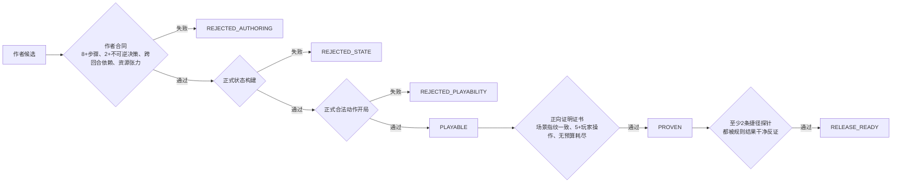

# 卡组训练残局生产流水线

日期：2026-07-23  
状态：V1 已实现并通过首轮生产审计

## 1. 目标与边界

流水线把“作者觉得有意思的场面”逐级收敛为可发布残局。它服务当前卡组训练中心的七套冻结牌组：自爆多龙、沙奈朵、赛富豪、猛雷鼓、玛俐、N 的索罗亚克、自爆恶喷。

V1 不动态生成题目，也不把一次 AI 对局胜利当成证明。大模型或作者负责设计场面和解题意图；正式规则引擎负责构建、执行与验收；证明证书和反捷径探针负责给发布结论留下可复查证据。

## 2. 固定身份

`pipeline_targets.json` 同时锁定 `deck_key`、冻结牌组 ID、生产策略 ID、候选数量和课程轴。流水线再从 `DeckTrainingCatalog.DECKS`、60 张牌组文件和 `DeckStrategyRegistry` 反向核对，任何一处漂移都会失败关闭。

| 训练牌组 | 冻结 ID | 正式策略 |
| --- | ---: | --- |
| 自爆多龙 | 800018506 | `dragapult_dusknoir` |
| 沙奈朵 | 800018497 | `v18_800018497_gardevoir` |
| 赛富豪 | 800016834 | `v18_800016834_pure_gholdengo` |
| 猛雷鼓 | 800018509 | `v18_800018509_raging_bolt_ogerpon` |
| 玛俐 | 800018501 | `v18_800018501_marnies_grimmsnarl` |
| N 的索罗亚克 | 800018502 | `v18_800018502_ns_zoroark` |
| 自爆恶喷 | 800025404 | `v17_bomb_charizard` |

每套牌组有 10 个候选槽位和至少 5 条专属课程轴。课程轴不代表候选题已经过质量认证，只规定接下来要训练的计算主题；候选仍必须逐级过门。

## 3. 状态机与发布门



具体门槛：

- 作者合同：专家难度、1—2 个玩家回合、至少 8 个作者步骤、至少 2 个不可逆决策、明确跨回合依赖、稀缺资源张力和至少 4 奖价值。
- 状态编译：由 `DeckTrainingStateFactory` 构造真实 `GameStateMachine`，不能只解析 JSON。
- 可操作性：由 `AILegalActionBuilder` 确认玩家开局至少存在一个正式合法动作。
- 正向证明：证书必须为 `PROVEN`，场景 SHA-256 指纹和求解器版本一致，最短解至少 5 个玩家动作，无未知分支和搜索预算退出。
- 反捷径：每题至少配置两条有教学意义的常见误解；覆盖作者见证步骤后重新走正式规则。只有以未达目标得到 `REFUTED` 才算通过。动作非法、缺少见证步骤、未支持交互或预算耗尽都不能冒充反证。

`RELEASE_READY` 是 V1 的生产发布资格，不等于已经穷举所有玩家走法。当前三题使用“正式规则 AI 固定回应 + 作者见证”证书，并辅以明确的负例探针。将来通用引擎适配器补齐全部交互枚举后，可增加 `EXHAUSTIVE_PROVEN` 金级门槛；不能把见证证明静默升级为完全 AND/OR 穷举证明。

## 4. 产物

- `data/deck_training/pipeline_targets.json`：七套目标牌组、课程轴、冻结身份和候选配额。
- `data/deck_training/shortcut_probes.json`：每道已证明题的负例捷径及见证步骤覆盖。
- `scripts/training/pipeline/DeckTrainingPuzzlePipeline.gd`：身份、候选、证明、捷径和发布状态的唯一审计入口。
- `scripts/tools/run_deck_training_puzzle_pipeline.gd`：无界面 CLI，写出机器可读 JSON 报告。
- `data/deck_training/proofs/*.json`：正向证明证书。
- 报告中的 `backlog`：为每个候选给出课程轴、当前状态和下一道门。

流水线不维护第二份牌组到 AI 策略映射；正式策略始终查询 `DeckStrategyRegistry`。

## 5. 使用方式

全量审计：

```powershell
& 'D:\ai\godot\Godot_v4.6.1-stable_win64_console.exe' --headless --path . -s res://scripts/tools/run_deck_training_puzzle_pipeline.gd
```

只审计一套牌组：

```powershell
& 'D:\ai\godot\Godot_v4.6.1-stable_win64_console.exe' --headless --path . -s res://scripts/tools/run_deck_training_puzzle_pipeline.gd -- --deck-key=gholdengo
```

默认报告写入 `user://deck_training_pipeline/latest.json`。进程退出码只表示流水线基础设施和清单是否有效；候选是否可发布以每题 `status` 和汇总 `release_ready` 为准，因此尚未证明的题不会阻断其他牌组的生产工作。

## 6. 首轮结果

2026-07-23 的全量运行结果：

- 目标身份：7/7 通过；每套牌组都是冻结的 60 张牌并能解析到正式策略。
- 候选清单：70 个；70/70 能构建正式状态，70/70 有正式合法开局。
- 正向证明：3 个，均为自爆多龙对沙奈朵。
- 反捷径审计：3 个题全部通过，每题两条，共 6 条干净反证。
- 发布资格：3 个；其余 67 个保持 `PLAYABLE`，下一步是重做高质量局面并生成正向证明，绝不因“能打开”直接发布。

## 7. 新题生产工作法

1. 先从目标牌组的课程轴选择一个精算主题，写清终局价值和玩家必须学到的判断。
2. 反向设计唯一资源约束：至少两个操作顺序或分配选择必须产生不可逆后果。
3. 使用冻结双方牌组和固定可见牌序建立场面；隐藏信息不得参与玩家必需的心算。
4. 用正式规则完成一条至少 5 个玩家动作的见证路线并生成证书。
5. 从真实试玩错误中提取至少两条“合法但失败”的捷径，加入探针库；非法动作不算捷径。
6. 运行全量流水线。只消费 `RELEASE_READY` 集合；`PLAYABLE` 只能进入内部候选池。
7. 修改场面、目标、固定牌序或证明合同后必须重跑证书和全部捷径探针，旧证书会因指纹漂移失效。

## 8. 后续演进

- 为其余六套牌组逐套实现专属见证适配和捷径模板，优先赛富豪“两回合四奖”和自爆恶喷“送奖—反击枪—百蕾雅三奖”。
- 把试玩失败路径自动归类为新的负例探针候选，人工确认其教学价值后入库。
- 扩展通用 `DeckTrainingEngineProofAdapter` 的交互枚举，逐步用完全 AND/OR 证明替换固定见证证明。
- 上线时由卡组训练浏览器只读取发布清单，避免内部 `PLAYABLE` 候选误进玩家题库。

## 9. 针对牌与 Combo 应用维度

残局课程不能只覆盖主攻手的标准展开。冻结牌组中的单卡科技、对局针对牌和多卡联动必须成为独立设计维度，否则玩家只会练到“顺着卡组说明书操作”，学不到这些卡为什么被放进60张。

V1 采用两层证据：

1. `DeckTrainingTacticScanner` 扫描七套冻结牌组中每张非能量卡的正式卡面描述，标记自爆铺伤、搬伤、备战伤害、捕捉、物品封锁、基础特性封锁、道具封锁、备战保护、弱点改写、退化、奖赏增量、零撤退、附能、能量转移和复制招式等语义角色；一张且具有针对语义的卡进入 `tech_candidates`。
2. `tactic_recipes.json` 保存人工确认的具体套路。每条配方必须引用冻结牌组中的准确卡图编号，针对型配方还必须引用实际存在的目标卡，并写明触发条件、收益、至少两个出题钩子和至少一个误用后果。扫描器负责失败关闭，不能引用“印象里卡组可能有”的卡。

首版已经录入七套牌组各3条、共21条配方，包括：

- 猛雷鼓的爬地翅对皮卡丘ex：斗弱点把120变为240，顽强之心留下10HP后，再由灼伤的宝可梦检查完成击倒。
- 沙奈朵的莉莉艾的皮皮ex对龙属性：先在场改写弱点，再计算超属性二倍伤害线。
- 玛俐的谢米对多龙铺伤、雪妖女加愿增猿的检查伤害时钟，以及铺伤后的退化清场。
- 赛富豪的能量输送PRO爆发、暗码迷置顶加嘉奖硬币定向抽牌、阻碍之塔关闭护符HP。
- N的索罗亚克从备战区调用达摩狒狒招式、奖差下空手道王加不服输头带的70伤修正。
- 自爆恶喷的钥圈儿封基础特性，以及黑夜魔灵送奖同时开启恶喷增伤、反击捕捉器和白蕾雅。

每套牌组的第5、10个候选槽位固定为 `tech_combo_application`。这些场面必须在题目数据中声明经过验证的 `tactic_pattern_ids`；缺少声明会进入 `NEEDS_TACTIC_DESIGN`，下一道门固定为 `encode_and_prove_verified_tactic_application`。绑定配方只证明题目确实在训练这个套路，仍需继续通过正式状态、5+操作证明和负例捷径审计。
