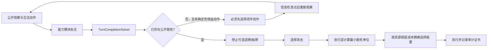

# V18CPG 猛雷鼓回合资源闭环与最小致死设计

日期：2026-07-25  
状态：已实现并通过代码回归与专项烟测，待真实模型批量对战数据复核  
适用架构：仅 `scripts/ai/v18_cpg`，不修改 Rule、旧 LLM、Agent

## 1. 问题定义

猛雷鼓目前有两类低级失误：

1. 猫头夜鹰已经能正常发动，手牌和场面也允许继续做资源，但 AI 因为已有一个合法攻击而过早攻击，没有先用猫头夜鹰拿互补的两张 Trainer，把本回合伤害和抽牌能力做完整。
2. 「雷鸣蹴击」面对低血量目标时支付过量能量。例如对 30 HP 电电虫，丢 1 张基本能量已经造成 70 点并完成击倒，不应该继续丢能量。

这两个现象不是同一个评分参数能解决的问题：

- 第一类是“回合是否已经做完”的规划完整性问题。
- 第二类是“既定动作如何支付资源”的执行正确性问题。

因此设计采用规划层和执行层两道独立关卡，不能仅靠提示词提醒模型“聪明一点”。

## 2. 目标

- 猫头夜鹰可用、当前攻击不能击倒且公开资源存在明确增益时，攻击和结束回合不能绕过资源闭环检查。
- 猫头夜鹰一次拿两张 Trainer 时按组合价值评分，优先拿能共同完成本回合攻击路线的组合。
- 消耗型攻击只支付公开信息可证明的最小致死资源。
- 支付后尽量保留当前攻击费用、下回合攻击连续性和厄诡椪引擎能量。
- 不新增固定、无条件的模型请求，不降低无信息变化时的正常反馈速度。
- 机制由 V18CPG Base 提供，24 套 V18 LLM 策略自动继承；卡组只声明专属能力参数。

## 3. 总体结构

### 3.1 规划层：回合资源闭环清单

`V18CPGTurnCompletionSolver` 从经过验证的公开状态、事实和候选前沿生成紧凑合同：

- `ko_available`：是否已经有公开可验证的击倒。
- `current_public_damage`：当前公开伤害上限。
- `damage_deficit`：距离击倒还差多少伤害。
- `must_review_before_terminal`：攻击或结束前是否必须复查资源。
- `productive_actions`：能明确补全攻击路线的当前合法候选。
- `minimum_lethal_units`：击倒所需的最少伤害资源单位。
- `instruction`：继续补全并重观察，或停止可选操作并最小支付。

“生产性动作”使用白名单识别，不把“手里有卡”误判为“必须全部用掉”。当前白名单包括：

- 猫头夜鹰的已配置攻击闭环机会；
- 补齐主攻手指定能量费用的贴能；
- 公开可发动的古代宝可梦能量加速；
- 会产生新信息世代的能量引擎特性；
- 公开可验证的能量移动或加速动作。

模型只能从清单给出的准确 `candidate_id` 中选择，不能自行发明动作。产生抽牌、检索或其他新信息后，仍按多信息世代架构重新观察，再决定下一段动作。

如果模型仍选择非击倒攻击或结束回合，Base 会在策略安装前运行终局闸门。闸门只在 `must_review_before_terminal = true` 时生效，并将动作绑定到清单中优先级最高的精确生产性候选；它不会重新请求模型，也不会在已经存在公开击倒时阻止攻击。

### 3.2 猛雷鼓专属：猫头夜鹰攻击闭环

猛雷鼓配置以下约束：

- 猫头夜鹰路线从负偏置改为正偏置。
- 当前攻击不能击倒、猫头夜鹰可用时，优先级目标切换为 `route_completion`。
- 避免提前选择 `route:attack_pressure` 或 `route:end_turn`。
- 猫头夜鹰的目标伤害闭环基准设为 210。
- 取牌按二元组合评分，不按单卡独立评分。
- 首选组合角色为：
  - `supporter_acceleration`
  - `energy_access`

在当前猛雷鼓牌表中，对应的典型组合是博士的研究/沙俪类加速 Supporter 与大地容器等能量入口。实际取牌仍由当前可见牌库候选和语义清单约束，不硬编码“永远拿固定两张卡”。

猫头夜鹰只在下列条件同时满足时获得“攻击闭环机会”：

- 卡组显式开启该能力；
- 猫头夜鹰动作当前合法；
- 当前没有公开可验证的击倒；
- 配置的闭环伤害下限高于当前公开伤害；
- 对手剩余 HP 高于当前公开伤害。

一旦已经有击倒，猫头夜鹰和其他可选抽滤立即退出闭环清单，避免为了“多操作”而错过奖赏卡。

### 3.3 执行层：最小致死支付

对猛雷鼓的能量丢弃交互，执行层重新验证：

1. 当前动作必须是配置过的主攻手及攻击序号。
2. 当前交互步骤必须是 `discard_basic_energy`。
3. 对手战斗宝可梦剩余 HP 必须来自当前公开观察。
4. 计算：

   `minimum = ceil(remaining_hp / damage_per_energy)`

5. `minimum` 必须不超过交互上限和真实可选能量数。
6. 只返回恰好 `minimum` 张能量。

以每张能量 70 点为例：

| 对手剩余 HP | 最少丢弃 | 伤害 |
|---:|---:|---:|
| 1–70 | 1 | 70 |
| 71–140 | 2 | 140 |
| 141–210 | 3 | 210 |

该校验在交互层执行，即使 Rule 默认选择过多、模型没有精确表达数量，最终也不会“大炮打蚊子”。

### 3.4 资源保留排序

满足最小数量后，选择具体能量时按“破坏性成本”升序：

1. 普通可消耗能量；
2. 主攻手身上超过攻击费用所需数量的重复属性能量；
3. 厄诡椪等引擎需要保留的最低能量；
4. 主攻手当前攻击费用中必须保留的最后一份属性能量。

同一成本使用稳定实例 ID 排序，确保同局面可复现。

例：猛雷鼓身上有雷、雷、斗，厄诡椪身上有草，攻击 140 HP 目标：

- 必须丢 2 张；
- 丢 1 张多余雷和 1 张草；
- 保留猛雷鼓的一雷一斗完整攻击费用；
- 禁止丢两张雷造成攻击费用断档。

## 4. 为什么不增加延迟

- `TurnCompletionSolver` 是纯本地、公开状态、线性扫描，最多输出 6 个精确候选。
- 合同随现有模型请求发送，本身不额外调用模型。
- 猫头夜鹰、厄诡椪、抽牌或检索本来就会改变信息状态；只在真实信息世代后触发现有的紧凑差异重规划。
- 最小致死计算和能量排序完全在执行层完成，不等待模型。

因此增加的是确定性检查，不是额外网络往返。

## 5. 全卡组继承与扩展规则

所有 V18CPG 策略通过 `V18ConditionalPolicyStrategy` 自动获得：

- 回合闭环合同生成；
- 模型输入中的闭环约束；
- 攻击/结束前的生产性动作复查；
- 已有击倒后的可选操作停止信号；
- 能力模块提供的确定性交互覆盖入口；
- 对应审计记录。

卡组模块可以声明：

- 哪些动作能确定性补全路线；
- 每个伤害资源单位的数值；
- 哪些交互步骤允许最小致死覆盖；
- 需要保护的攻击费用、引擎能量和下回合资源；
- 特殊检索的互补角色组合。

未声明精确证书时，Base 只提醒模型复查，不擅自改写执行结果，避免跨卡组误伤。

## 6. 审计与失败保护

执行层覆盖成功时记录：

- `event_type = minimum_lethal_interaction_override`
- `certificate_kind = public_minimum_resource_ko`
- 原 Rule 选择数量
- 最终选择数量
- 当前路线、候选和动作所有者

以下任一条件不成立时拒绝覆盖并回到原有安全路径：

- 攻击者或攻击序号不匹配；
- 目标 HP 不可见或无效；
- 伤害单位配置缺失；
- 最小数量超过可选数量；
- 交互步骤不是允许的能量丢弃步骤；
- 候选动作已经失效。

## 7. TDD 验收场景

专项测试必须覆盖：

1. 当前只有 70 点非击倒攻击、猫头夜鹰可用：
   - 生成 `must_review_before_terminal = true`；
   - 精确列出猫头夜鹰候选；
   - 猫头夜鹰拿到加速 Supporter＋能量入口；
   - 模型请求收到同一闭环合同。
2. 对 30 HP 电电虫：
   - 真实攻击交互只选 1 张草能；
   - 实际造成 70 点并击倒；
   - 猛雷鼓的一雷一斗保留。
3. 对 140 HP 目标，猛雷鼓为雷、雷、斗，厄诡椪为草：
   - 只选 2 张；
   - 选择草＋多余雷；
   - 保留一雷一斗。
4. 已经有公开击倒：
   - `must_review_before_terminal = false`；
   - 猫头夜鹰等可选滤牌不再列为生产性动作；
   - 指令切换为最小致死支付。
5. 24 套 V18 profile：
   - 每套请求都包含 schema 版本正确的共享闭环合同。

回归门禁：

- 猛雷鼓原复杂决策用例全部通过；
- V18CPG contracts、shared blockers、多信息世代执行、24 卡组覆盖全部通过；
- 无模型 24 卡组与 Rule 决策日志保持逐局精确一致；
- 假模型 24 卡组请求全部被接受，无新增回退、停滞或 RNG 污染。

## 8. 数据验证计划

代码级验证通过后，真实收益按以下指标观察：

- `Noctowl-before-premature-attack rate`
- 猫头夜鹰两张 Trainer 的互补组合命中率
- 猫头夜鹰信息世代后同回合继续操作率
- 猛雷鼓攻击平均丢弃能量数
- `overpay_energy_count`
- 击倒后完整攻击费用保留率
- 手牌存在公开生产性候选时的提前攻击/结束率
- 决策可见等待 P50/P95

只有专项场景、共享回归和真实对局指标同时改善，才视为该演进有效。单纯提高模型文本中的“合理解释”不算验收通过。
