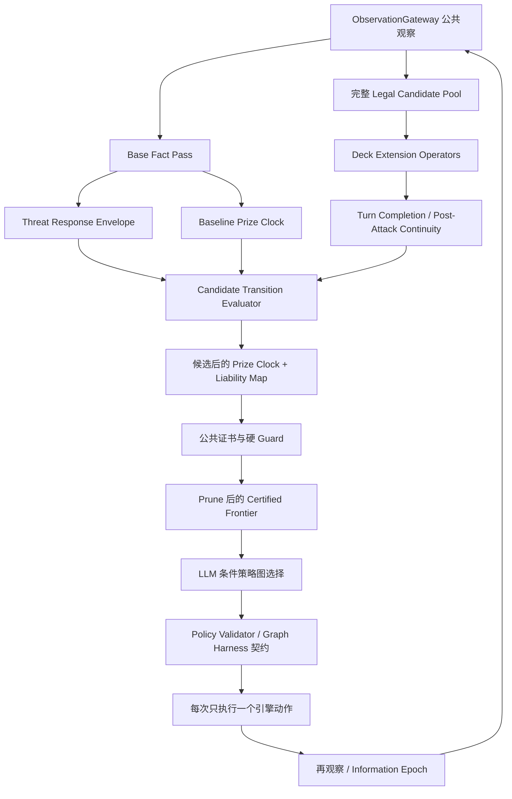

# V18CPG 奖赏轮次、换位保奖与卡组扩展图 Graph Engineering 改造设计

> 日期：2026-07-26
> 状态：Base Prize Clock 已落地；猛雷鼓月月熊同窗口换位反杀与轮次递增等待已完成 TDD
> 适用范围：隔离的 `scripts/ai/v18_cpg/` 条件策略图架构
> 首批代表卡组：800018509 猛雷鼓厄诡椪、800018497 沙奈朵、800018499 多龙巴鲁托
> 不适用范围：旧 LLM 策略、旧大决策树、另一个分支中的完整 Agent 架构

## 1. 结论

现有 V18CPG 已经能处理“本回合能不能打、能不能击倒、攻击后是否留有续航”，但还没有把人类牌手真正使用的“还需要几个攻击轮次才能赢、对手还需要几个攻击轮次才能赢、怎样通过奖赏映射把对手拖慢一回合”变成强类型的共享求解结果。

本次改造应新增一层全局 Base Graph：

1. 用 **攻击窗口时钟**，而不是简单的 `turn_number`，计算双方最快与稳健的获胜时点。
2. 用 **奖赏日程** 表达 `2-2-2`、`2-2-1-1`、`2+1`、`2+1+1` 等取奖路径。
3. 用 **场上负债图** 判断受伤、可被一拳击倒、可被抓取的多奖宝可梦是不是下一攻击窗口的失分入口。
4. 把撤退、交替、免费撤退、回手、伤害搬运、击倒后的出战选择统一建模为 **换位/保奖转换**。
5. 在对手最佳可信回应下重新计算奖赏日程；仅仅把双奖宝可梦退到备战区，不得自动宣称已经“错奖”。
6. Base Graph 负责全局硬约束；每套卡组的 Extension Graph 只负责提供卡组特有的攻击、换位、伤害分配和资源恢复算子。
7. LLM/决策 Agent 不负责发明轮次数学，只能从本地求解器生成并经过 Graph Harness 验证的候选路径中选择、排序和组合条件图。

这不是替换已经落地的猫头夜鹰、草面具、回合完成和攻击后连续性逻辑，而是把它们的输出提升为“能否维持或翻转奖赏轮次”的可计算输入。

## 2. 目标与非目标

### 2.1 目标

- 让 AI 明确区分“伤害领先”与“攻击轮次领先”。
- 让 AI 能识别：同样本回合拿 2 奖，暴露一个受伤双奖宝可梦和暴露一个单奖攻击手，可能是完全不同的胜负结果。
- 让 AI 在适当时机通过撤退、交替、回手、出战选择或伤害搬运保护奖赏结构。
- 让沙奈朵的一奖攻击手链、猛雷鼓的快攻与一奖桥、多龙的精准铺伤和一回合多奖，共用同一套 Base Prize Clock。
- 让每一个高于 Rule 的确定性改判都能给出公共状态证明；不确定的对手手牌只能进入可信风险评估，不能伪装成确定性事实。
- 在不增加可见等待的前提下，把多回合战略压缩成本地结构化事实和小型条件策略图。
- 通过新的 Graph Harness 在求解、候选、模型响应、执行和再观察五层约束决策 Agent。

### 2.2 非目标

- 不把 V18CPG 改造成自由行动的完整 Agent。
- 不允许模型读取对手隐藏手牌、牌库顺序或奖赏卡身份。
- 不在本次设计阶段修改任何代码。
- 不把三套代表卡组的具体状态硬编码进 Base Graph。
- 不用一个模糊总分替代攻击轮次、奖赏、资源、存活和不确定性。
- 不承诺所有“多打一回合”的路径都值得执行；如果它同时让自己的获胜时钟延后更多，仍应拒绝。

## 3. 现有实现对照审计

### 3.1 当前已有的可复用能力

| 层 | 当前实现 | 可复用价值 |
| --- | --- | --- |
| 公共观察 | `V18CPGObservationGateway.gd` | 完整观察中已经有双方 HP、奖赏价值、附着能量、撤退费用、先后手和回合额度 |
| 即时事实 | `V18CPGFactBuilder.gd` | 已有攻击就绪、当前击倒、最大伤害、手贴/支援者额度等基础事实 |
| 资源连续性 | `V18CPGPostAttackContinuitySolver.gd` | 已能估算猛雷鼓攻击后的能量、草面具引擎和下一攻击手债务 |
| 回合完成 | `V18CPGTurnCompletionSolver.gd` | 已能在终结攻击前找出有收益的前置动作并要求逐步再观察 |
| 卡组能力模块 | `V18CPGCapabilityRegistry.gd` | 已有 `energy_burst`、`gardevoir_embrace`、`dragapult_spread`、`damage_counter_control` 等扩展点 |
| 候选与策略图 | `V18CPGRouteSearch.gd`、`V18ConditionalPolicyStrategy.gd` | 已有 Rule floor、候选 frontier、条件图、guard、信息事件重规划和执行所有权 |
| 隐藏信息隔离 | ObservationGateway、BeliefState、sentinel tests | 已形成不能绕过的观察入口 |

### 3.2 当前缺口

| 现状 | 具体问题 | 本次改造方向 |
| --- | --- | --- |
| `V18CPGPrizeGraphSolver.solve()` 用 `ceil(剩余奖赏 / 可见最大单体奖赏)` | 没有攻击先后权、跳过攻击、攻击手重建和对手最佳选奖；备战双奖即使不能抓也会抬高最快值 | 改为攻击窗口时钟与多条奖赏日程 |
| `V18CPGThreatResponseSolver` 主要用场上能量数量估算反击风险 | `credible_worst` 固定写入抓引擎和手牌干扰，没有绑定实际目标、伤害档和付费条件 | 输出有证据来源的对手回应集合 |
| `FactBuilder` 的奖赏事实只有 `current_swing` 和 `win_now` | 无法表达 `2-2-2` 对 `2-2-1-1`，也无法表达本回合不取奖但翻转后续时钟 | 新增固定路径的 `prize_clock` 和 `liability` 事实 |
| `V18CPGCyclePivot._pivot_snapshot()` 只比较卡住、攻击就绪和换上后的伤害 | 换位只被理解成“解卡住”，没有理解成“保护奖赏、移除濒死负债、改变对手取奖路径” | 新建全局 `PrizeClockPivot`，不把牌组型 `cycle_pivot` 强行扩成 Base |
| `RouteSearch._candidate()` 的 outcome 主要是即时伤害、即时奖赏和资源承诺 | 一个本回合不多拿奖、但让对手多打一回合的动作没有正确价值 | 增加候选转换后的时钟和负债增量 |
| `V18ConditionalPolicyStrategy._compact_slot()` 没有把完整观察中的 `retreat_cost` 传给模型 | 模型看得到动作，却看不到稳定的换位代价事实 | 本地求解并传紧凑换位摘要；必要时补齐紧凑槽位字段 |
| `MatchAgenda.prize_path` 每回合初始化为空 | 奖赏计划主要依赖模型补丁，不能由求解器确定性重放 | 由本地 Prize Clock 生成并版本化，模型只能选择已注册路径 |
| `dragapult_spread` 目前主要暴露可铺伤目标数量 | 现有测试报告也明确指出尚未绑定逐目标 6 个指示物与多奖结果 | 新增精确 Counter Allocation 与同回合/下一窗口奖赏图 |
| 沙奈朵的换位桥是少量精确场景证明 | 对特定手牌、HP、奖赏数和目标做了成对证明，泛化不足 | 用 Base Liability/Pivot 求解器承接共性，沙奈朵扩展只提供精神拥抱和伤害搬运算子 |
| 三套 Rule 策略有各自的撤退、低 HP、抓取负债启发式 | 这些逻辑分散且没有共同的攻击窗口定义 | Rule 继续作为 floor；V18CPG 用统一图层比较候选后的轮次变化 |

### 3.3 一个重要的现有资产

`V18CPGPostAttackContinuitySolver` 已经回答了“打完之后还有没有下一攻击手、能量和引擎”。Prize Clock 不应重复做这件事，而应消费它的结果：

```text
当前候选动作
  -> 回合完成/攻击后连续性
  -> 当前攻击是否成立
  -> 下一次我方攻击窗口是否按时出现
  -> Prize Clock 计算 finish_tick
```

如果没有这层衔接，奖赏图仍会错误地认为“理论上下一回合还能拿 2 奖”，却忽略猛雷鼓已经把所有能量丢完、沙奈朵没有下一只攻击手或多龙的第二只进化链没有完成。

## 4. 战略核心：攻击窗口，而不是自然回合数

### 4.1 Attack Window Tick

定义全局半回合攻击窗口：

- `tick = 0`：从当前公共状态出发，下一次真实可用的攻击窗口。
- `tick = 1`：另一方的下一次攻击窗口。
- `tick = 2`：本方再下一次攻击窗口。
- 如果某方当前不能攻击，窗口仍然经过，但该方事件为 `pass/develop`，其第一笔奖赏后移。
- 击倒后的出战、回合间伤害、自爆给奖和额外奖赏必须作为独立事件进入时钟，而不是假装都发生在普通攻击末尾。

在我方主阶段且当前可攻击时，常见时序是：

```text
tick 0 我方攻击
tick 1 对方攻击
tick 2 我方攻击
tick 3 对方攻击
tick 4 我方攻击
```

因此：

- 我方 `2-2-2` 的完成时点是 `tick 4`。
- 对方 `2-2-2` 的完成时点是 `tick 5`。
- 即使双方都“需要 3 次攻击”，我方仍因先获得当前攻击窗口而领先。
- 如果我方本回合错过攻击，完成时点可能从 `tick 4` 变成 `tick 6`，这通常比节省一张资源更严重。

### 4.2 Prize Schedule

每条奖赏日程是一个有前提的事件序列：

```json
{
  "schedule_id": "own:robust:2-2-2",
  "actor": "own",
  "events": [
    {"tick": 0, "prizes": 2, "target_class": "active_two_prize"},
    {"tick": 2, "prizes": 2, "target_class": "credible_two_prize"},
    {"tick": 4, "prizes": 2, "target_class": "credible_two_prize"}
  ],
  "finish_tick": 4,
  "required_preconditions": [
    "current_attack_payable",
    "next_attacker_uptime",
    "second_target_access"
  ]
}
```

至少保留两类日程：

- `fastest`：公共状态允许的最快路径，用于发现上限。
- `robust`：经过对手最佳可信回应和资源连续性审查后仍成立的路径，用于主要决策。

规划主指标：

```text
race_margin = opponent.robust_finish_tick - own.robust_finish_tick
```

- `race_margin > 0`：我方领先。
- `race_margin = 0`：需要引擎优先级或同时结算规则判断。
- `race_margin < 0`：我方落后，必须寻找终结、多奖、错奖、干扰或攻击窗口压缩路线。

`finish_tick` 不可达时使用显式 `unreachable_within_horizon`，不能用一个很大的伪数字掩盖。

### 4.3 “错奖”必须分成三层

#### A. 表面换位

把受伤双奖宝可梦从战斗场退到备战区，换上一奖宝可梦。

这只改变了当前战斗场，不代表奖赏路径已经改变。

#### B. 可信错奖

结合已观察卡牌、已知牌表能力范围、场上资源、支援者/物品额度和伤害档，对手更可能只能击倒当前一奖宝可梦。

这可以进入模型拥有的风险判断，但不能自动生成确定性改判证书。

#### C. 强制错奖

在注册的公共回应集合中，对手的最佳合法回应仍不能取得原来的双奖：

- 双奖负债已经通过回手等方式离场。
- 抓取/换位额度被公共效果锁住。
- 所有抓取资源已经由公共信息完全核销，且没有注册的恢复路线。
- 即使抓到双奖宝可梦，公共伤害上限也无法击倒。
- 抓取动作本身会消耗关键额度并使对方攻击窗口或击倒前提失效。

只有这一层可以生成 `public_prize_clock_flip` 或 `public_prize_denial_pivot`。

### 4.4 退到备战区不等于安全

Base Graph 必须执行以下硬约束：

```text
if damaged_two_prizer moves active -> bench
and opponent has a credible gust + KO lane
then:
    forced_prize_denial = false
    opponent_schedule must include gusted_two_prize lane
```

这条规则直接避免一种常见低级错误：AI 以为自己“上了一奖挡一下”，实际把 30 HP 的双奖宝可梦留在备战区，对手抓出来直接结束比赛。

### 4.5 场上负债不是只看剩余 HP

每个我方槽位生成 `LiabilityLane`：

```text
slot_id
prize_count
remaining_hp / max_hp
public_damage_thresholds
credible_ko_next_window
active_exposure
gust_exposure
bench_damage_exposure
retreat_cost
retreat_payment_loss
switch_or_recall_available
future_engine_value
future_attacker_value
attached_resource_value
can_be_removed_from_board
can_be_made_non_lethal
```

负债优先级不能用单一 HP 排序。一个 60 HP 的一奖宝可梦可能正是想要的错奖桥；一个 210 HP 的满血辅助 ex，如果对方能稳定打 220，则仍是双奖负债。

### 4.6 候选决策的词典序

候选先经过硬 guard，再按下列词典序/Pareto 关系比较：

1. 本回合直接获胜。
2. 阻止对方下一攻击窗口直接获胜。
3. 保持或改善 `robust race_margin`。
4. 在不延后我方 `robust finish_tick` 的情况下，延后对方 `robust finish_tick`。
5. 同回合多奖与精确收奖。
6. 保持当前攻击窗口与下一攻击手连续性。
7. 移除或降低可避免的多奖负债。
8. 保持卡组 Extension Graph 的引擎条件。
9. 最小资源消耗、信息价值和未来灵活性。

不能把这些维度粗暴相加成一个总分，否则“多保 1 张能量”可能错误地抵消“输掉 1 个攻击窗口”。

## 5. 新版总体架构



### 5.1 双阶段求解

为避免循环依赖和延迟膨胀，采用两阶段：

#### State Pass

只看当前公共状态，生成：

- 当前双方的攻击窗口归属。
- 当前最快/稳健基础奖赏时钟。
- 对手回应能力集合。
- 当前槽位负债图。
- 必须防止的下一窗口终结。

#### Candidate Pass

对完整合法候选池逐一做浅层转换：

- 该动作执行后立即可确定的公共变化。
- 需要哪个 interaction 才能完成。
- 是否保持当前攻击和当前奖赏下限。
- 是否改变主动位、移除一个槽位或移动伤害。
- 是否改善下一攻击手连续性。
- 对手最佳回应后的新奖赏时钟。

证书和 frontier rescue 必须发生在 prune 前，避免一个 Rule 分低但能防止下一回合输掉比赛的换位/回手动作在进入模型前就被裁掉。

### 5.2 有界视野

默认求解：

- 双方各最多未来 4 个攻击窗口。
- 当前同回合动作前缀最多沿着已注册 dependency 展开。
- 同一公共状态、相同资源签名和不差的奖赏时钟使用 dominance 合并。
- 不展开未知抽牌的具体卡名，只保留 `attack_uptime probability/range` 和可注册的可见搜索结果。

这足以表达常见的 `2-2-2` 对 `2-2-1-1`，同时避免重新制造一棵不可控的大决策树。

## 6. 新的强类型契约

### 6.1 版本策略

本次是破坏性语义升级，不能静默复用旧版本：

| 契约 | 建议版本 |
| --- | --- |
| 本地语义事实 | `v18cpg-3` |
| Route outcome | `route_schema_v3` |
| Prize Clock | `prize_clock_v1` |
| Liability/Pivot | `liability_pivot_v1` |
| 紧凑网络传输 | `transport_contract_v4` |
| 新 Harness 语料 | `prize_clock_pivot_harness_v1` |

现有 `v18cpg-2`、transport v3 和 `dominance_decisions_v1` 保持冻结并继续回归。

### 6.2 PrizeRaceState

```json
{
  "schema_version": 1,
  "initiative": {
    "next_attack_actor": "own",
    "own_first_attack_tick": 0,
    "opponent_first_attack_tick": 1
  },
  "own": {
    "prizes_remaining": 4,
    "fastest_finish_tick": 2,
    "robust_finish_tick": 4,
    "fastest_schedule_id": "own:2-2",
    "robust_schedule_id": "own:2-1-1"
  },
  "opponent": {
    "prizes_remaining": 4,
    "fastest_finish_tick": 3,
    "robust_finish_tick": 5,
    "fastest_schedule_id": "opp:2-2",
    "robust_schedule_id": "opp:2-1-1"
  },
  "race_margin": 1,
  "must_prevent_next_window_win": false,
  "clock_flip_available": true,
  "schedules": []
}
```

### 6.3 OpponentResponseEnvelope

每条回应必须说明证据与确定性：

```json
{
  "response_id": "opp:gust_damaged_ex",
  "kind": "gust_ko",
  "target_slot_id": "slot:own_damaged_ex",
  "prizes": 2,
  "earliest_tick": 1,
  "evidence": [
    "configured_known_capability",
    "supporter_quota_expected_open",
    "public_damage_threshold_met"
  ],
  "certainty": "credible",
  "certificate_eligible": false
}
```

确定性分级：

- `guaranteed_public`：完全由当前公共状态和规则确定。
- `bounded_public`：在注册且完整的公共回应集合内确定。
- `credible`：包含隐藏手牌不确定性，只能用于模型风险判断。
- `speculative`：只进审计，不得影响强证明。

### 6.4 LiabilityMap

```json
{
  "active": {
    "slot_id": "slot:active",
    "prize_count": 2,
    "credible_ko_next_window": true,
    "remaining_hp": 60,
    "retreat_cost": 1,
    "evacuation_actions": ["action:retreat:backup", "action:turo"],
    "evacuation_to_bench_still_gustable": true
  },
  "bench_lanes": [
    {
      "slot_id": "slot:damaged_ex",
      "prize_count": 2,
      "gust_ko_next_window": true,
      "avoidable": true
    }
  ],
  "preventable_prizes_next_window": 2
}
```

### 6.5 Candidate outcome v3

每个候选至少增加：

```text
own_fastest_finish_tick_after
own_robust_finish_tick_after
opponent_fastest_finish_tick_after
opponent_robust_finish_tick_after
robust_race_margin_after
own_schedule_after
opponent_schedule_after
current_attack_window_preserved
current_prize_floor_preserved
opponent_finish_tick_delta
own_finish_tick_delta
liability_removed_prizes
liability_reduced_prizes
new_gust_liability_prizes
retreat_resource_cost
supporter_quota_cost
multi_prizes_now
multi_prizes_next_own_window
uncertainty_class
```

模型只接收紧凑差异，不接收每个候选的完整展开树。

### 6.6 固定 fact paths

建议注册以下稳定路径：

```text
prize_clock.own_fastest_finish_tick
prize_clock.own_robust_finish_tick
prize_clock.opponent_fastest_finish_tick
prize_clock.opponent_robust_finish_tick
prize_clock.race_margin
prize_clock.must_prevent_next_window_win
prize_clock.clock_flip_available
prize_clock.current_attack_window_is_critical
prize_clock.own_schedule_class
prize_clock.opponent_schedule_class

liability.active_prize_count
liability.active_credible_ko_next_window
liability.active_evacuate_available
liability.preventable_prizes_next_window
liability.damaged_multi_prize_bench_count
liability.credible_gust_ko_lane_count

pivot.same_attack_floor_preserved
pivot.best_target_prize_count
pivot.removes_liability_from_board
pivot.only_moves_liability_to_bench
pivot.opponent_finish_tick_delta
pivot.retreat_resource_cost
```

数组中的目标与日程使用固定结构，不注册动态的 `slot_id` fact path。

## 7. Base Graph 的强约束

### 7.1 Base Graph 节点

```text
B0 立即获胜检查
B1 对方下一攻击窗口终结检查
B2 当前攻击窗口与奖赏下限
B3 我方攻击连续性
B4 我方多奖/压缩轮次机会
B5 当前与备战多奖负债
B6 换位、回手、伤害搬运后的对手最佳回应
B7 卡组 Extension Graph 候选
B8 资源与低牌库风险
B9 终端动作前复核
```

这些是本地求解阶段，不等于要求模型输出 10 个节点。模型策略图仍遵守通常 8、硬上限 12 个节点。

### 7.2 不可绕过的 hard guards

1. `win_now` 路径除非执行非法，否则不能被非终结防守动作覆盖。
2. 如果对手下一攻击窗口可直接获胜，候选必须满足以下之一：
   - 我方现在获胜。
   - 移除该终结路线。
   - 让对手目标不可击倒。
   - 使对手奖赏不足以结束。
3. 一个换位动作若只把负债从主动位移到可抓取的备战位，不得标记 `forced_prize_denial`。
4. 延后对手一窗口但让我方延后两窗口，不得称为 clock improvement。
5. 不能为了错奖而破坏本回合确定性终结或更快的同回合多奖。
6. 撤退支付不能消耗当前攻击唯一费用，除非换上的攻击手已经能维持相同奖赏下限。
7. 回手动作必须计算支援者额度、附着卡弃置、进化链丢失、备战位和引擎冗余。
8. 伤害搬运不得把自己的宝可梦置于非法/昏厥状态，且必须使用引擎真实有效 HP。
9. 所有攻击和换位 interaction 在执行前重新绑定 source、target、instance 和可见状态版本。
10. 任何旧 observation、旧 schedule 或旧 liability certificate 在目标、HP、奖赏数、额度或主动位改变后失效。

### 7.3 证书种类

| 证书 | 证明内容 | 可否本地自动高于 Rule |
| --- | --- | --- |
| `public_immediate_win` | 本回合确定结束比赛 | 可以 |
| `public_immediate_loss_prevention` | Rule 会在下一窗口确定输，候选移除该终结 | 可以 |
| `public_same_prize_floor_liability_removed` | 保留当前攻击/奖赏下限，同时把多奖负债移出场 | 可以 |
| `public_prize_clock_flip` | 在完整公共回应集合中 `race_margin` 由负变正 | 可以 |
| `public_multi_prize_closeout` | 精确伤害/指示物分配在当前窗口获得更多奖赏或结束 | 可以 |
| `public_prize_denial_pivot` | 对手最佳公共回应仍被迫多一个攻击窗口 | 可以 |
| `credible_prize_denial` | 依赖对手隐藏手牌概率 | 不可自动改判，只能模型拥有 |
| `speculative_clock_gain` | 依赖未知抽牌或未绑定未来交互 | 不可进入安全证明 |

### 7.4 Rule floor

- 无模型模式继续与 Rule 完全相等。
- Base Clock、Liability 和 Extension annotation 不得修改 `base_score`、`rule_order` 或伪造新的 Rule 分数；它们使用独立 outcome、certificate 和 frontier-rescue 字段。
- 本地自动改判只能使用上表允许的公共证书。
- 模型可在不确定候选间做判断，但 Graph Validator 必须保留 Rule floor，并拒绝硬 guard 失败的选择。
- 新 Base Graph 不修改 Rule 策略，也不把 Rule 内部启发式复制到 V18CPG。

## 8. 卡组 Extension Graph 接口

每套卡组扩展只能声明：

```text
operators
operator preconditions
public transition effects
resource reservations
interaction policies
clock-relevant role mapping
deck-specific exact certificates
```

不得声明：

- 绕过 Base hard guard。
- 自己计算一套不同定义的 `finish_tick`。
- 隐藏信息事实。
- 自由代码动作。
- 没有真实引擎绑定的伤害、能量或奖赏结果。

组合顺序固定为：

```text
Base facts
  -> Deck operators enrich candidate
  -> Base transition evaluator
  -> Base prize clock/liability re-evaluation
  -> Base validator
```

Extension Graph 可以提供“怎么做到”，不能改写“什么叫轮次领先”。

## 9. 三套代表卡组的 Extension Graph

### 9.1 猛雷鼓厄诡椪

#### 现有模块输入

- `energy_burst`：最低致死能量丢弃、LF 攻击费用、能量储备。
- `tera_noctowl_search`：猫头夜鹰定向搜索组合。
- `cycle_pivot`：基础换位与牌组节奏。
- `PostAttackContinuity`：草面具、咕咕/猫头夜鹰、下一猛雷鼓和攻击后能量债务。

#### 新增 Extension operators

```text
RB_BUILD_NOCTOWL_ENGINE
RB_EXPAND_AREA_ZERO_CAPACITY
RB_BANK_TEAL_DANCE_ENERGY
RB_MINIMUM_LETHAL_DISCARD
RB_FREE_RETREAT_VIA_LATIAS
RB_ONE_PRIZE_SLITHER_WING_BRIDGE
RB_SINGLE_PRIZE_RAGING_BOLT_ROUTE
RB_BLOODMOON_DYNAMIC_CLOSEOUT
RB_PRESERVE_DAMAGED_TWO_PRIZE_BENCH
```

#### 卡组特有约束

- 猫头夜鹰和零之大空洞的价值用 `own.robust_finish_tick` 是否改善衡量，不再只看“能不能多做动作”。
- 草面具每回合储能既是抽牌，也是猛雷鼓未来伤害库存；当前能击倒不代表可以停止铺场。
- `极雷轰` 只丢最低致死能量，并在终结以外保留下一攻击窗口的 LF 与伤害库存。
- 拉帝亚斯的免费撤退不等于免费决策；仍需计算换上者能否攻击、被击倒奖赏和退下者的抓取风险。
- 爬地翅是一奖桥，但 120 伤害和 90 自伤必须同时进入转换；不能因为“一奖”就无条件上场。
- 单奖猛雷鼓与爬地翅只在保持当前奖赏下限或确实翻转时钟时优先。
- 月月熊的攻击费用实时使用对方已经取得的奖赏数，由现有动态费用求解器提供，不允许模型按印刷 5 无费用误判。

### 9.2 沙奈朵

#### 现有模块输入

- `gardevoir_embrace`：精神拥抱费用与承伤上限。
- `damage_counter_control`：愿增猿搬伤、击倒阈值和固定场景证明。
- Rule floor 已有撤退能量桥、低 HP ex 风险和一奖攻击手选择启发式。

#### 新增 Extension operators

```text
GARDE_SINGLE_PRIZE_ATTACKER_CHAIN
GARDE_EXACT_EMBRACE_DAMAGE_BUDGET
GARDE_RETREAT_PAYMENT_BY_EMBRACE
GARDE_RETREAT_PAYMENT_BY_ENERGY_SWITCH
GARDE_ADRENA_BRAIN_SURVIVAL_SHIFT
GARDE_SCREAM_TAIL_BENCH_PRIZE_MAP
GARDE_PROTECT_ENGINE_EX_FROM_GUST_KO
GARDE_AVOID_OPTIONAL_EX_LIABILITY
```

#### 卡组特有约束

- 沙奈朵的核心优势不是单纯伤害高，而是能用吼叫尾、愿增猿等一奖宝可梦完成攻击链，让对手的奖赏日程从三次双奖变成四次攻击。
- 精神拥抱既是能量加速也是自伤；给主动沙奈朵补撤退费时，要同时验算“补能后仍不会昏厥”和“退下后是否仍可被抓取击倒”。
- 愿增猿把 30 伤害移出受伤沙奈朵，既可能提高其生存阈值，又可能在对面补足一个奖赏目标；两个效果应在同一个 transition 中计算。
- 把沙奈朵 ex 退到备战区后，如果仍在对方可信伤害和抓取范围内，不能宣称强制错奖。
- 梦幻 ex、吉雉鸡 ex 和莉莉艾的皮皮 ex 是否铺场，要包含其后续双奖负债，不只看即时抽牌/伤害。
- 一奖攻击手不能因为“奖赏价值低”就无条件送掉；如果它无法取奖且同时让自己的时钟延后，仍可能是坏路线。

### 9.3 多龙巴鲁托

#### 现有模块输入

- `stage2_chain`：进化链与 RP 费用。
- `dragapult_spread`：幻影潜袭的 6 个伤害指示物形状提示。
- `damage_counter_control`：愿增猿搬伤。
- Rule floor 已有抓取负债、撤退费用和部分低奖赏终局启发式。

#### 新增 Extension operators

```text
DRAGAPULT_EXACT_SIX_COUNTER_ALLOCATION
DRAGAPULT_MULTI_KO_NOW
DRAGAPULT_SET_NEXT_WINDOW_KO
DRAGAPULT_TURO_REMOVE_DAMAGED_EX
DRAGAPULT_LATIAS_FREE_HANDOFF
DRAGAPULT_PROMOTE_SINGLE_PRIZE_PIVOT
DRAGAPULT_BLOODMOON_DYNAMIC_CLOSEOUT
DRAGAPULT_AVOID_GUSTABLE_SUPPORT_EX
```

#### 卡组特有约束

- 幻影潜袭必须枚举 6 个指示物的合法整数分配，不得只输出“有两个备战目标”。
- 分配优先级是：本回合结束比赛、同回合多奖、把下一窗口压缩成终结、跨越关键 HP 阈值、避免过量铺伤。
- 对手备战只有 10 HP 和 50 HP 时，应允许 `1+5` 形成同回合双击倒；不能把 6 个全部堆在一个 10 HP 目标上。
- 弗图博士的剧本是真正把受伤多龙 ex 从场上移除的算子；与单纯撤退到备战区必须区分。
- 弗图会丢弃附着卡并占用支援者额度，只有备份攻击手保持当前攻击/奖赏下限时才可能成为强路线。
- 当前幻影潜袭可以直接获得最后奖赏时，任何保奖、回手和铺场动作都必须让位。
- 月月熊终盘路线继续使用动态费用事实，并计入攻击后锁招和三撤退费用负债。

## 10. 执行链路与多次思考

### 10.1 不是“一回合只想一次”

轮次图会在每个重要 information epoch 更新：

- 搜索或抽牌后。
- 主动位/备战位变化后。
- 伤害搬运后。
- 进化、能量加速或动态费用变化后。
- 抓取目标实际换上后。
- 攻击与奖赏结算后。

模型不设每回合固定调用次数上限。已有条件图分支可以本地命中时不调用模型；新信息使原奖赏日程失效时，允许一次紧凑 delta 重规划。

### 10.2 每次仍只执行一个引擎动作

例如多龙的保奖路线：

```text
弗图博士的剧本（选择受伤多龙）
  -> 引擎确认回手与附着卡弃置
  -> SEND_OUT（选择满血、已就绪多龙）
  -> 再观察 HP / 主动位 / 支援者额度
  -> 幻影潜袭
  -> 6 指示物 interaction
  -> 奖赏结算
```

策略图可以提前表达 dependency 和 guard，但客户端不会一次盲执行整棵树。

### 10.3 时钟失效条件

以下任一变化必须重算：

```text
active_slot_id
target remaining_hp / prize_count
bench topology
visible gust capability
retreat/switch/supporter quota
attack readiness
dynamic attack cost
damage counter budget
next attacker uptime
prizes_remaining
```

## 11. Graph Harness：怎样约束决策 Agent

### 11.1 Harness 的职责

新 Harness 不只是测求解器输出，还要以三种模式运行：

1. **Solver Oracle**：从原始公共观察和 legal actions 重建 facts、回应、时钟和负债，不接受夹具注入 `verified=true`。
2. **Adversarial Policy**：让 fake Agent 故意选择错误路线、伪造目标、跳过 dependency 或使用过期 schedule，验证 validator 必须拒绝。
3. **Execution Witness**：在真实 GameState/EffectProcessor 中逐步执行选择，证明决策层的预期奖赏、HP、能量、换位和下一窗口与引擎一致。

### 11.2 夹具输入约束

每个 fixture 只能提供：

```text
public GameState/Observation seed
legal action seed
exact Rule scores and Rule action
deck_id/profile/semantic manifest
expected selected action or expected rejection
expected public certificate
expected execution witness
```

禁止提供：

```text
precomputed prize_clock
precomputed liability map
precomputed verified certificate
hidden opponent hand
hidden deck order
hidden prize identities
```

每个结果记录必须包含：

```text
observation_hash
legal_action_hash
rule_action_id / rule_candidate_id
selected_action_id / selected_candidate_id
selection_owner
baseline_schedule_ids
selected_schedule_ids
finish_ticks_before / after
liability_delta
opponent_response_ids
certificate_kind / evidence_kind
policy_validation_result
execution_witness_hash
fallback_reason
```

Harness 必须逐项断言，而不是只比较最终 action id。这样即使 Agent 碰巧选对动作、但使用了错误的轮次数学或非法证书，也会被判失败。

### 11.3 必测的 36 个场景

#### Base 12

| ID | 场景 | 关键断言 |
| --- | --- | --- |
| B01 | 当前窗口直接获胜 | win-now 压过所有保奖动作 |
| B02 | 对方下一窗口最后奖 | 只接受终结或真实移除终结线 |
| B03 | `2-2-2` 对 `2-2-1-1` | finish tick 而不是总奖赏相等 |
| B04 | 受伤双奖撤退到备战、对方有抓取线 | 不生成强制错奖证书 |
| B05 | 回手移除受伤双奖且攻击下限不变 | 生成 same-floor liability removal |
| B06 | 免费撤退保持当前攻击 | 能量成本为 0，但仍检查目标奖赏风险 |
| B07 | 撤退消耗唯一攻击费用 | 除非防止立即输，否则拒绝 |
| B08 | 主动一奖但备战有 20 HP 双奖 | 对手日程包含抓取双奖 |
| B09 | 回手唯一引擎导致我方延后两窗口 | 不因对手延后一窗口而误判 |
| B10 | 抓取需要消耗关键额度并失去攻击 | 对手回应转换反映机会成本 |
| B11 | 搬走 30 伤害跨过生存线 | liability 从 lethal 变 non-lethal |
| B12 | 隐藏手牌/牌序 sentinel | facts、payload、日志均不得出现 |

#### 猛雷鼓 8

| ID | 场景 | 关键断言 |
| --- | --- | --- |
| R01 | 最低能量击倒并保持下一攻击窗口 | 只丢最低致死能量 |
| R02 | 拉帝亚斯免费撤退到爬地翅一奖桥 | 公共抓取耗尽时对手 finish tick 延后 |
| R03 | 同 R02，但抓取能力仍可信 | 不得生成强证书 |
| R04 | 猫头夜鹰 + 赤松/大地容器完成当前攻击 | 搜索后重算，保持 tick 0 |
| R05 | 当前已击倒但攻击后会断轴 | 先完成有证书的草面具/咕咕/猫头夜鹰前缀 |
| R06 | 零之大空洞只造成无效铺场 | 不因“多槽位”本身延迟攻击 |
| R07 | 月月熊费用随对方已取奖变化 | 0/1/2…能量阈值逐档正确 |
| R08 | 最后双奖目标 | 立即终结压过引擎建设 |

#### 沙奈朵 8

| ID | 场景 | 关键断言 |
| --- | --- | --- |
| G01 | 一奖吼叫尾维持相同取奖下限 | 对手奖赏日程从双奖线延长 |
| G02 | 精神拥抱支付主动沙奈朵撤退费 | HP 安全预算与能量费用同时正确 |
| G03 | 愿增猿搬 30 后再退到备战 | 抓取沙奈朵从可击倒变不可击倒 |
| G04 | 不搬伤直接撤退 | 仍存在抓取双奖终结线 |
| G05 | 退下唯一沙奈朵引擎导致攻击链断裂 | robust own finish tick 变差并拒绝 |
| G06 | 梦幻/吉雉鸡成为可抓双奖 | 一奖主动位不能伪造强制错奖 |
| G07 | 吼叫尾精确备战击倒 | 目标、承伤和奖赏逐步绑定 |
| G08 | 当前可终结 | 不为错奖追加无意义搬伤或换位 |

#### 多龙 8

| ID | 场景 | 关键断言 |
| --- | --- | --- |
| D01 | 6 指示物 `1+5` 双备战击倒 | 同回合多奖精确 |
| D02 | 6 指示物跨下一窗口阈值 | 选择最短稳健奖赏图 |
| D03 | 弗图移除 60 HP 多龙并换满血多龙攻击 | 保持当前奖赏下限、移除双奖负债 |
| D04 | 仅撤退受伤多龙到备战 | 抓取线存在时不生成强证书 |
| D05 | 含羞苞/低攻击主动位免费换满血多龙 | 保持攻击窗口 |
| D06 | 弗图移除唯一就绪攻击手 | 不得为了保奖而失去当前攻击 |
| D07 | 月月熊终盘动态费用 | 奖赏数、锁招和撤退负债正确 |
| D08 | 当前 `2+1+1` 直接结束 | 多奖终结压过弗图保奖 |

### 11.4 Metamorphic 配对

每个关键场景至少有一个只改一个事实的反例：

- 目标 HP `250 -> 251`，击倒证书应失效。
- 受伤双奖剩余 HP `240 -> 260`，愿增猿搬伤的生存价值应翻转。
- 对手抓取能力 `publicly_exhausted -> credible_available`，强制错奖变成可信错奖。
- `retreat_available true -> false`，撤退候选消失。
- 支援者额度 `open -> spent`，弗图路线消失。
- 备份攻击手 `ready -> one_energy_short`，same-prize-floor 证书失效。
- 多龙备战目标 `10/50 HP -> 20/51 HP`，`1+5` 双击倒失效。
- 当前剩余奖赏 `4 -> 3`，多龙铺伤分配从下一窗口设置切换成当前终结。
- 对方已取奖数改变 1，月月熊有效费用同步改变。
- 当前攻击窗口关闭，任何“补完费用后立刻攻击”的证书失效。

### 11.5 Agent 对抗测试

Fake Agent 必须被测试以下错误：

- 选择不在 certified frontier 的 action/candidate。
- 声称退到备战的双奖已经安全，忽略已注册抓取线。
- 把 `credible` 回应当作 `guaranteed_public`。
- 跳过弗图目标 interaction，直接选择出战目标。
- 使用旧 observation 的 6 指示物分配。
- 试图在已经使用支援者后执行弗图。
- 分配超过 6 个伤害指示物或把备战铺伤放到战斗宝可梦。
- 在 Rule 当前可直接获胜时选择防守。
- 修改已经执行的策略图节点。

Harness 必须返回明确拒绝原因，不能静默改成另一个战略动作；拒绝后按原子 fallback 回到 Rule/已验证本地路径。

## 12. 三套卡组脑内推演

以下是设计验证用的代表性公共局面，不是对真实 benchmark 结果的宣称。

### 12.1 猛雷鼓：免费撤退和一奖桥只有在抓取线被核销时才是真错奖

#### 公共局面

- 我方还需 3 奖，对方还需 4 奖，我方拥有当前攻击窗口。
- 受伤猛雷鼓 ex 在战斗场，LF 费用已满足，可用最低 2 张基本能量击倒对方 120 HP 一奖战斗宝可梦。
- 备战爬地翅有 FF，可以用 120 伤害完成同一个击倒。
- 拉帝亚斯 ex 在场，基础宝可梦免费撤退。
- 对方公开伤害足以击倒受伤猛雷鼓 ex。

#### 路线 A：猛雷鼓直接攻击

```text
我方 schedule: [1, 2]，finish tick = 2
对方可见 schedule: [2, 2]，finish tick = 3
```

如果猛雷鼓攻击后续航证书成立，我方仍可能先结束；如果攻击后能量断轴使下一次 2 奖延后到 tick 4，则对方会在 tick 3 先结束。

#### 路线 B：免费撤退到爬地翅，再攻击

若对方所有抓取资源已经由公共信息核销，且没有注册恢复路线：

```text
我方 schedule: [1, 2]，finish tick = 2
对方 forced schedule: [1, 2, 1]，finish tick = 5
```

此时路线 B 保持我方当前奖赏下限，同时让对手至少多一个攻击窗口，可以生成 `public_prize_denial_pivot`。

若对方仍有可信抓取路线：

```text
对方 credible schedule: [2, 2]，finish tick = 3
```

受伤猛雷鼓虽然退到备战，仍可被抓出来。路线 B 只能是模型风险判断，不能生成强证书。

#### 对猛雷鼓 Extension Graph 的验证

- 先查 `PostAttackContinuity`：直接攻击会不会断轴。
- 再查一奖桥是否保持当前击倒。
- 再查退下的猛雷鼓是否仍是抓取负债。
- 猫头夜鹰、零之大空洞和草面具的前置建设，只在不丢 tick 0 且改善 robust finish tick 时插入。

这能防止两个相反错误：既不盲目直冲导致下回合断轴，也不为了“看起来会错奖”而做一个实际仍会被抓双奖的无效撤退。

### 12.2 沙奈朵：愿增猿搬伤 + 撤退 + 一奖攻击手是一条完整的轮次路线

#### 公共局面

- 双方都还需 4 奖，我方拥有当前攻击窗口。
- 战斗场沙奈朵 ex 剩余 230 HP，已具备 2 撤退费用。
- 对方公开攻击伤害为 250，且有可信抓取。
- 我方有带恶能量、特性未使用的愿增猿。
- 备战吼叫尾已经就绪，能击倒对方 230 HP 双奖目标。
- 场上还有第二只沙奈朵 ex，退下当前沙奈朵不会失去唯一精神拥抱引擎。

#### 路线 A：只撤退，换吼叫尾

吼叫尾当前取得 2 奖，但原沙奈朵 ex 在备战只剩 230 HP：

```text
我方 robust schedule: [2, 2]
对方 credible schedule: [2 抓沙奈朵, 2]
```

主动位是一奖宝可梦，但对方仍能直接抓双奖，不能称为强制错奖。

#### 路线 B：愿增猿先搬 30，再撤退到吼叫尾

愿增猿把沙奈朵上的 30 伤害移到对方目标：

- 沙奈朵剩余 HP 从 230 变为 260。
- 对方目标 HP 同时降低 30。
- 撤退后吼叫尾仍完成本回合 2 奖。
- 对方抓沙奈朵后的 250 伤害不再击倒，只能处理当前一奖攻击手或寻找更长路线。

```text
我方 robust schedule: [2, 2]，finish tick = 2
对方 robust schedule: [1, 2, 1]，finish tick = 5
```

这条路线的关键不是“愿增猿价值高”，而是它同时：

1. 保持本回合奖赏下限。
2. 把一个可抓双奖负债改成不可立即击倒。
3. 让一奖攻击手真正强制对手改变取奖日程。
4. 保留第二只沙奈朵引擎，自己的下一攻击窗口不延后。

若没有第二只沙奈朵、吼叫尾差一费、愿增猿已经使用或对方伤害是 260，证书必须逐项失效。

### 12.3 多龙：撤退只是隐藏负债，弗图才是真正移除负债

#### 公共局面

- 我方还需 4 奖，对方还需 2 奖，我方拥有当前攻击窗口。
- 战斗场多龙巴鲁托 ex 只剩 60 HP，当前缺 RP，不能使用幻影潜袭。
- 备战有一只满血 320 HP、RP 已满足的多龙。
- 手牌有弗图博士的剧本，支援者额度未使用。
- 对方战斗宝可梦 200 HP、双奖；备战有一只 50 HP 一奖宝可梦。
- 对方下个窗口可造成 260，且有可信抓取。
- 我方没有另一个能被 260 击倒的双奖备战负债；否则对手回应集合必须继续包含那个终结目标。

#### 路线 A：普通撤退到满血多龙

- 满血多龙用幻影潜袭拿主动 2 奖，并用 5 个指示物击倒备战一奖，共 3 奖。
- 我方还差 1 奖。
- 60 HP 的旧多龙仍在备战。
- 对方抓旧多龙取得最后 2 奖，在 tick 1 结束。

```text
我方 finish tick = 2
对方 finish tick = 1
race margin = -1
```

#### 路线 B：弗图回手受伤多龙，出战满血多龙，再幻影潜袭

- 受伤双奖负债从场上消失。
- 满血多龙保持同一个当前攻击和 3 奖下限。
- 对方 260 不能击倒满血 320 多龙。
- 我方在 tick 2 取得最后 1 奖。

```text
我方 finish tick = 2
对方 robust finish tick > 2
race margin 翻正
```

可以生成：

```text
public_same_prize_floor_liability_removed
public_immediate_loss_prevention
```

#### 终结反例

如果对方另一个备战宝可梦只有 10 HP，则 6 个指示物可以按 `1+5` 同时击倒两个一奖备战宝可梦：

```text
主动双奖 2 + 备战一奖 1 + 备战一奖 1 = 当前窗口 4 奖
```

此时直接幻影潜袭已经 `win_now`，弗图保奖必须让位。这个反例证明 Base Graph 的终结优先级高于“看起来很聪明”的防守。

## 13. TDD 实施计划

### Phase 0：冻结设计和红灯语料

先新增但不通过：

- `prize_clock_pivot_harness_v1.json`
- 36 个场景定义。
- 关键 metamorphic 对。
- 隐藏信息 sentinel。
- 三套卡组 execution witness。

同时冻结：

- 现有 `dominance_decisions_v1` 按发布安全语义维持已记录的 17/20；D03-D05
  不得通过撤销后续负向 seed 约束来“修绿”。
- 现有三套卡组复杂场景与专项回归。
- no-model exact Rule equality。

建议文件：

```text
tests/v18_llm_policy_graph/fixtures/prize_clock_pivot_harness_v1.json
tests/v18_llm_policy_graph/test_v18cpg_attack_window_clock.gd
tests/v18_llm_policy_graph/test_v18cpg_liability_pivot.gd
tests/v18_llm_policy_graph/test_v18cpg_prize_clock_harness.gd
tests/v18_llm_policy_graph/test_v18cpg_prize_clock_agent_adversary.gd
tests/v18_llm_policy_graph/test_v18cpg_prize_clock_execution_witness.gd
tests/v18_llm_policy_graph/test_v18cpg_prize_clock_latency.gd
```

### Phase 1：契约与观察

预期修改范围：

```text
scripts/ai/v18_cpg/schema/V18CPGContracts.gd
scripts/ai/v18_cpg/observation/V18CPGObservationGateway.gd
scripts/ai/v18_cpg/planning/V18CPGFactBuilder.gd
scripts/ai/v18_cpg/V18ConditionalPolicyStrategy.gd
```

工作：

- 增加 schema 版本和固定 fact paths。
- 确保本地求解可读取 retreat cost、max HP、tool、公共状态/锁招和额度。
- 紧凑 payload 只传求解后的必要摘要。
- 先写 schema、compact round-trip 和 hidden sentinel 测试。

### Phase 2：公共回应、负债和攻击窗口求解

新增建议：

```text
planning/V18CPGAttackWindowClock.gd
planning/V18CPGOpponentResponseEnvelope.gd
planning/V18CPGLiabilityMapSolver.gd
planning/V18CPGPrizeRaceGraphSolver.gd
```

工作：

- 先实现纯函数攻击 tick 和奖赏累计。
- 再实现槽位负债。
- 再实现 `guaranteed/bounded/credible/speculative` 回应分级。
- 用 property/metamorphic tests 验证先后手、奖赏序列和阈值。

### Phase 3：候选转换与 Base Pivot

新增建议：

```text
planning/V18CPGCandidateTransitionEvaluator.gd
modules/V18CPGPrizeClockPivot.gd
```

工作：

- 在完整 candidate pool 上、prune 前做候选转换。
- 统一 retreat、switch、recall、send-out、damage-shift。
- 把当前 `cycle_pivot` 保留为牌组型扩展；新的 Base 模块对 24 套牌强制启用。
- 为 exact public improvement 生成证书并支持 frontier rescue。

### Phase 4：策略图与执行接入

工作：

- Match Agenda 由本地 prize schedule 初始化。
- Policy graph guard 注册新 facts。
- interaction ticket 绑定回手目标、出战目标、铺伤分配。
- 每步完成后失效旧证书并重算。
- schema/deadline fallback 仍经过 Base terminal/loss-prevention 检查，但不得静默改写模型战略。

### Phase 5：三套 Extension Graph

顺序：

1. 多龙：因为弗图回手与精确 6 指示物能最清楚验证“真移除负债”和“同回合多奖”。
2. 沙奈朵：验证搬伤、生存阈值、撤退费用与一奖攻击手链。
3. 猛雷鼓：把奖赏时钟与已经较成熟的猫头夜鹰/草面具连续性图融合。

每套先通过 8/8 专属 Harness，再跑完整共享 Harness。

### Phase 6：24 套继承

- Base Prize Clock、Liability 和 Pivot 对所有 V18CPG profile 强制启用。
- 其他 21 套不要求立即拥有丰富扩展图，但必须继承 Base facts、hard guards、证书和审计。
- 每套只增加卡组特有 operators，不复制求解器。
- 自动生成 Extension coverage ledger，缺少一奖桥、回手或铺伤能力时明确标记 `not_applicable`。

### Phase 7：真实模型与 paired benchmark

先决条件：

- 36/36 Harness。
- 新版 Prize Clock 专项门槛全绿；旧 dominance 仅按已记录的 17/20
  兼容基线回归，不作为撤销新安全证据的理由。
- 三套所有专项测试通过。
- no-model exact Rule equality。
- hidden sentinel 0 泄漏。

然后：

- 每套同 seed、先后手平衡至少 100 局 pilot。
- 晋级使用至少 3 个 paired-seed 批次、合计不少于 300 局。
- 同时记录胜率与决策级指标，不能只看总胜率。

## 14. 验收标准

### 14.1 正确性

- `prize_clock_pivot_harness_v1`：36/36。
- 所有 metamorphic 反例通过。
- 执行 witness 中预测与真实奖赏、HP、能量、主动位一致。
- 旧 `dominance_decisions_v1`：17/20，与已记录的 D03-D05 安全语义冲突完全一致，
  不得新增失败。
- 无模型模式和 Rule action 完全相等。
- 所有本地自动改判都有公共证书。
- `credible` 路线不得伪装成公共强证明。

### 14.2 决策级效果

重点指标：

```text
preventable_two_prize_concession_rate
damaged_multi_prize_evacuation_success
false_prize_denial_rate
clock_flip_conversion_rate
current_attack_window_preservation
prize_schedule_adherence
predicted_finish_tick_error
multi_prize_conversion_rate
next_attacker_uptime
```

门槛建议：

- Harness 中 `false_prize_denial_rate = 0`。
- 可公共证明的下一窗口输局漏防 = 0。
- 精确多奖分配错误 = 0。
- 三套代表牌所有“same prize floor + remove liability”场景 100% 选择正确。

### 14.3 性能

- 本地 observation + 全部 solver + route search p95 仍不超过现有 15 ms 目标。
- 新 Threat/Clock/Liability 合计 p95 目标不超过 4 ms。
- 候选转换和有界回应展开 p95 目标不超过 6 ms。
- 只发送 top schedules、baseline clock 和 candidate delta；payload p95 增长目标不超过 15%。
- branch hit 不产生网络等待。
- `turn_visible_wait_ms` p50/p95 不差于当前 V18CPG 基线。
- 不能为了压延迟减少 information epoch 的必要重规划。

### 14.4 强度

除原有胜率晋级规则外，三套牌分别要求：

- 猛雷鼓：不降低猫头夜鹰/草面具连续性完成率，错误“撤退后仍被抓双奖”显著下降。
- 沙奈朵：一奖攻击手链和愿增猿跨生存阈值的转换率提升，暴露辅助 ex 的可避免失分下降。
- 多龙：6 指示物分配正确率和同回合多奖率提升，弗图移除受伤双奖的可证明场景不再漏选。

## 15. 方案反思与修正

### 15.1 反思一：只计算“还要几次击倒”不够

初步想法容易把双方都需要三次攻击视为平局，但 PTCG 轮流行动，当前攻击窗口本身就是一拍优势。因此必须使用全局 tick，而不是两个独立的 `turns_to_win`。

### 15.2 反思二：上了一奖主动位不代表对手会按一奖拿

对手可以抓取备战双奖、铺伤多奖或攻击脆弱引擎。新版必须让对手在回应集合中选择对自己最有利的目标，不能由我方替对手选择“配合错奖”。

### 15.3 反思三：防守动作可能同时破坏自己的时钟

弗图、撤退和回手会消耗支援者、能量、进化链或攻击窗口。只有比较候选后的双方 finish tick，才能避免“成功让对手慢一回合，但自己慢了两回合”。

### 15.4 反思四：不应把不确定性伪装成确定性

对手手里是否有老大的指令通常未知。可信抓取风险可以影响模型决策，但只有公共信息完整核销或公共伤害上限证明时，才可生成强制错奖证书。

### 15.5 反思五：更长的战略视野不等于更大的模型输出

奖赏日程和回应展开由本地求解器完成。模型只看少量可比较路径和条件差异，因此可以提升战略上限而不显著增加 token、响应时间或 graph 节点数。

### 15.6 反思六：不能只优化这三套牌

三套牌覆盖三种战略形态：

- 猛雷鼓：资源爆发、引擎续航、一奖桥。
- 沙奈朵：一奖攻击手链、自伤资源、伤害搬运。
- 多龙：多目标精算、回手保奖、同回合多奖。

Base Graph 只使用公共槽位、奖赏、伤害、额度和候选转换；所有卡名能力留在 Extension Graph。这样才能自然继承到其余 21 套。

### 15.7 反思七：Rule 中已有局部好经验，不应被新图抹掉

Rule 策略已经包含部分低 HP、撤退桥、抓取负债和攻击手选择启发式。新版不是把它们判为错误，而是：

- 保留 Rule 作为永远可执行的 floor。
- 用统一 Prize Clock 找出 Rule 缺少的跨卡组不变量。
- 只有公共证明或模型通过安全验证时才离开 Rule。

## 16. 预期代码落点

| 文件 | 预期职责变化 |
| --- | --- |
| `V18CPGObservationGateway.gd` | 保持唯一观察入口，补齐求解所需公共状态 |
| `V18CPGFactBuilder.gd` | 只构造基础事实，再合并 Clock/Liability 固定路径 |
| `V18CPGThreatResponseSolver.gd` | 迁移为有证据和确定性分级的回应集合 |
| `V18CPGPrizeGraphSolver.gd` | 保留兼容层或迁移到 PrizeRaceGraph，停止静态 `ceil` 作为主要结论 |
| `V18CPGRouteSearch.gd` | outcome v3，prune 前允许时钟/保奖证书 rescue |
| `V18CPGTurnCompletionSolver.gd` | 把当前攻击和连续性结果提供给 Clock，不复制轮次数学 |
| `V18CPGPostAttackContinuitySolver.gd` | 继续拥有资源/引擎连续性 |
| `V18CPGCapabilityRegistry.gd` | 强制挂载 Base Clock/Pivot，再组合卡组 Extension |
| `V18ConditionalPolicyStrategy.gd` | 双阶段求解、Match Agenda 初始化、紧凑 transport v4、证书失效 |
| `V18CPGContracts.gd` | 新 schema、fact paths、证书和审计字段 |
| `V18CPGInteractionPolicy.gd` | 回手/出战/铺伤/搬伤的 typed ownership |
| 三套 profile | 只增加 operator 参数与角色，不写执行逻辑 |
| `tests/v18_llm_policy_graph/` | 新 Harness、metamorphic、execution witness 和性能测试 |

## 17. 最终实施顺序

```text
冻结 36 场景
  -> Attack Window 纯函数
  -> Opponent Response Envelope
  -> Liability Map
  -> Candidate Transition
  -> Prize Race Graph
  -> Base hard guards / certificates
  -> 多龙 Extension
  -> 沙奈朵 Extension
  -> 猛雷鼓 Extension
  -> 其余 21 套继承 Base
  -> fake Agent 对抗
  -> real engine witness
  -> 延迟回归
  -> paired benchmark
```

任何阶段发现问题，先定位到 observation、response、clock、liability、candidate transition、extension、policy、interaction 或 engine 中的一层，再修复该层契约。禁止为了让单个 seed 通过，在 profile 中追加一个完整局面特判。

## 18. 冻结决策

- 使用攻击窗口 tick，不使用自然回合数作为获胜时钟。
- 同时保留 fastest 与 robust 两类奖赏日程。
- 撤退到备战区不自动等于错奖成功。
- 对手以最佳可信回应选择目标。
- 不确定抓取只能模型拥有，不能生成确定性公共证书。
- Base Graph 对 24 套牌强制启用。
- Extension Graph 只提供卡组算子，不改写时钟定义和 hard guard。
- 每次只执行一个引擎动作，重要信息事件后重算。
- 不设置每回合固定模型调用次数上限。
- 新 Harness 从原始公共状态重建事实，不能注入证明结果。
- 现有 Rule、旧 LLM、旧 Agent 和旧 dominance 语料不修改；其发布安全基线为
  17/20，D03-D05 由更新的负向 seed 证据覆盖。

完成以上设计后，V18CPG 的“聪明”不再只表现为本回合多做几步，而是能够明确回答：

```text
我还需要在哪几个攻击窗口拿多少奖？
对手会选择击倒谁来最快结束？
这个换位是真正让对手多打一回合，还是只把双奖藏到了备战区？
为了保奖付出的资源，会不会反而让我自己的攻击时钟更慢？
这套卡组特有的引擎、伤害分配和一奖攻击手，怎样改变共同的 Prize Clock？
```

这五个问题都必须由本地可重放事实、卡组扩展算子和 Graph Harness 共同约束，而不能只依赖模型在自然语言中“看起来理解了”。

## 19. 2026-07-26 实施补丁：月月熊换位反杀与渐进长考

### 19.1 现场失败

公开状态为：我方草面具厄诡椪战斗位有 1 能、撤退费用 1；月月熊 ex 备战有 1 能；对手剩余 2 奖，表示已拿 4 奖，因此血月的有效费用为 1；对手太乐巴戈斯 ex 剩余 230HP，月月熊伤害 240；Rule 根动作却是结束回合。

旧实现分别拥有：

- `dynamic_attack_cost.attack_paid_after_pivot=true`；
- `RB_BLOODMOON_DYNAMIC_CLOSEOUT` operator；
- 合法撤退 candidate。

但三者没有组合成同一张证书，所以 terminal gate 把六个替代候选全部判为不可接管。

### 19.2 修复后的强制链路

```text
合法 retreat candidate
  -> DynamicAttackCost 绑定目标月月熊与实时奖赏费用
  -> RagingBolt Extension 计算 240 对当前 230HP、双奖
  -> Base PrizeClockPivot 生成
     public_same_window_pivot_ko_loss_prevention
  -> production selector 抢救完整候选
  -> 引擎只执行撤退
  -> 强制重观察
  -> 当前战斗位月月熊重新由 legal actions 确认可攻击
  -> 执行血月并进入双奖击倒结算
```

证书只在以下条件全部成立时有效：

- Rule 精确根是 `end_turn`；
- 对手在下一攻击窗口可结束比赛；
- 首动作是当前 legal pool 中的精确撤退；
- 动态费用事实绑定同一目标 slot、同一月月熊 UID，且 deficit 为 0；
- 公开伤害大于等于当前对手战斗位剩余 HP；
- 当前窗口奖赏严格高于 Rule；
- `requires_reobservation=true`。

费用差 1、目标多 1HP、撤退额度消失、目标 slot 改变或攻击窗口关闭时，证书必须失效。

### 19.3 全局经验

Base Graph 以后不接受“事实模块通过 + Extension 标签存在”作为完成标准。任何卡组的撤退、交换、回手、能量搬运或进化后攻击，只要跨越两个引擎动作，都必须经过统一的 proof-closure 验收：

```text
legal first action
+ exact resource payment
+ destination identity
+ projected capability
+ exact public outcome
+ invalidation facts
+ mandatory reobservation
+ real engine witness
```

卡组 Extension 只提供自身算子和精确参数；Base 负责证书、Rule 比较、terminal rescue 与执行边界。

### 19.4 轮次渐进等待

默认保持开局 `6500ms`，每两个引擎回合增加 `1000ms`，封顶 `10500ms`。以现场 turn 6 为例，有效预算为 `8500ms`；第一次响应已花 `2296ms` 后仍剩 `6204ms`，足以容纳预计 `5740ms` 的一次紧凑状态差异重规划。

同一个有效预算必须同时驱动：

- 新请求准入；
- 在途请求 deadline；
- UI soft timeout；
- request/fallback audit。

本地已有确定性 terminal rescue 时不等待模型；只有公开事实不能完成证书且预期后悔值较高时，才使用增长后的后期长考预算。

### 19.5 本次落地验收

本次实现已经通过以下生产路径回归：

- Prize Clock 换位图：月月熊同窗口证明、证书、生产 selector 和一能不足/差
  1HP 反例全部通过，本地求解 p95 为 `0.242ms`；
- 真实引擎 witness：策略选择草面具撤退，引擎真实扣除一能，重观察后生成并
  执行月月熊 240 伤害攻击；
- Base 合约 `18/18`、共享 blocker `15/15`；
- 24 套 profile 和 12 个能力模块覆盖 `24/24`、`12/12`；
- 9 类非 pilot 战略形态公共状态夹具 `9/9`；
- 发布版首主窗口模型判断约束保持通过；
- skill 校验通过，且已经要求所有后续卡组对跨模块多动作路线提供 proof
  closure、强制重观察与真实引擎 witness；
- 旧 dominance 诊断维持已知 `17/20`，失败仍严格限于 D03-D05，没有为恢复旧
  数字撤销负向 seed 安全约束。

## 20. 2026-07-26 Graph v2：持续引擎、候选目标闭包与跨检查点后缀

### 20.1 现场复盘后的五个根因

1. 猛雷鼓 profile 已声明 `immediate_public_win`、
   `prevent_next_attack_window_loss` 和 `repair_robust_prize_clock`，但类型白名单
   没有这些名称，进入模型前被静默删除。
2. Base 把咕咕和猫头夜鹰简单相加为一个检索槽。猫头夜鹰即使已经使用能力，
   仍会被误算为“未来还有检索”，导致不继续铺咕咕。
3. 猫头夜鹰能力一旦点击，旧逻辑把全部 continuity debt 标成已经减少；实际只
   是打开了两个 Trainer 的信息交互，还没有选牌、出牌或完成攻击路线。
4. 抓人 hard guard 只证明场上“存在某个可击倒目标”，执行交互仍可能选择奖励
   更高但打不死的目标，使候选证明和实际动作脱节。
5. continuity 在固有候选过滤前计算 `safe_prefix_available`。当唯一“可生产前缀”
   实际是 Rule 用 `-100000` 否决的普通铺场时，旧顺序会同时阻止这个铺场与
   attack/end_turn；宿主随后仍可能从全负分动作中强挑一个，形成 Graph 到执行层
   的越权。

### 20.2 Base Graph 新不变量

```text
current search lane = 未使用能力的公开检索引擎
future search lane  = 仍在场的检索基础根

若本局仍需要后续检索：
  未使用猫头夜鹰 + 无咕咕根 = continuity debt
  已使用猫头夜鹰 + 无咕咕根 = continuity debt
  未使用猫头夜鹰 + 咕咕根   = search floor met
```

信息动作使用两种不同语义：

- `progresses_debt=true`：动作打开了能解决债务的信息检查点；
- `reduces_debt=true`：动作本身已经在公开状态上完成债务。

猫头夜鹰属于前者，必须同时携带：

```text
planned_debt_types
requires_reobservation = true
debt_reduction_count = 0
```

Prize Clock 不得因为“准备检索”而提前删除 continuity penalty。

### 20.3 猛雷鼓 Extension 的条件后缀

猛雷鼓候选可以携带紧凑 `conditional_suffix`：

```json
{
  "kind": "raging_bolt_continuity_route",
  "root_route_id": "route:noctowl_search",
  "checkpoint_after": "information_result",
  "requires_reobservation": true,
  "guarded_followups": [
    {
      "debt_type": "search_engine_root",
      "prefer_routes": [
        "route:opening_search",
        "route:tutor",
        "route:develop"
      ]
    }
  ],
  "preserve_invariants": [
    "minimum_lethal_payment",
    "current_attack_window",
    "future_search_lane",
    "next_attacker_continuity"
  ]
}
```

后缀只是跨检查点意图，不是预先生成的非法动作树。运行时只执行当前精确
candidate；信息返回后重建 legal frontier，再按仍存在的债务绑定下一精确候选。
这样保留“一次想清路线”的优势，同时不会拿旧 observation 执行新手牌动作。

### 20.4 抓人证明必须闭包到执行目标

`require_payable_ko_before_gust` 现在输出候选级目标约束：

```text
eligible_slot_ids
eligible_instance_ids
max_damage
targets[{remaining_hp, prize_count}]
```

策略进入抓人交互时，只有这些公开可击倒目标可获得有限分数；其他目标直接
使用 hard-block 分数。目标 HP、实例或 legal pool 改变后，旧约束随重观察失效。

对手下一攻击窗口的终局判断同样改用可信 liability 中的最大奖赏，而不是只看
我方战斗位。因此“前排一奖、后排 30HP 双奖、对手剩两奖且仍可抓人”会被正确
识别为下一窗口败局；公开抓人额度耗尽后则不会误报。

### 20.5 两阶段 Hard Guard

Hard Guard 不能一次使用同一份旧 facts 完成所有过滤，必须固定为：

```text
Phase A: intrinsic guards
  - 次数/配额已耗尽
  - 无精确证书的 Rule veto sentinel
  - 无公开可支付击倒的抓人

rebuild:
  continuity facts
  prize-clock facts

Phase B: relational terminal guards
  - 只在仍存在真实可执行的 productive prefix 时阻止 attack/end_turn
```

Rule veto sentinel 只有两种合法出口：

1. 它就是宿主当前精确 Rule root；
2. 候选持有 `verified_advantage=true` 的精确能力证书。

普通 route bias、continuity debt、模型偏好和本地/超时回退都没有越过 sentinel
的权限。seed `182615` 的真实复现中，修复前会执行 `-100000`，甚至硬封后仍会
执行 `-1e12` 的铺场；两阶段重建后最低实际动作分恢复为 `-144`，同席结果由
负翻转恢复为胜局。

### 20.6 TDD、回归与统计边界

本轮新增或更新的验收覆盖：

- 三个 Prize Clock 高层目标通过 profile sanitizer；
- 未使用/已使用猫头夜鹰与替代咕咕根的动态需求；
- 猫头夜鹰信息节点只推进、不虚假清债；
- 后排可抓双奖进入对手下一窗口终局；
- 抓人候选绑定唯一公开致死目标并传递到交互评分；
- 猛雷鼓 `conditional_suffix` 完整进入紧凑模型 frontier；
- 无证书 Rule sentinel 被固有 guard 删除，精确能力证书仍可越过；
- 删除伪前缀后重建 continuity，attack/end_turn 不再被旧 facts 错封；
- 24 套 profile 继续继承 Base contract；
- no-model 路径保持 Rule floor 等价；
- 旧 LLM、Agent 和 Rule 目录隔离不变。

当前专项结果为：

- 猛雷鼓 turn-completion `28/28`；
- Prize Clock Graph 通过，本地 p95 约 `0.161ms`；
- V18CPG contracts `18 groups`；
- live runtime regressions `6/6`；
- 24 套覆盖 `24/24`、模块覆盖 `12/12`；
- 共享 blocker `15 groups`；
- 多信息执行 `5 groups`；
- transport reliability `4 groups`。

同一连续种子区间 `182600..182629` 的 30 局 verified-local 对照为：

```text
Rule        17/30
Graph v2    16/30
paired      -3.33pp
bootstrap   [-20.0pp, +13.33pp]
clean       30/30
```

因此本轮可以证明结构性不变量和执行闭包已经增强，但不能用这 30 局宣称统计上
超过 Rule。剩余 3 个正翻转、4 个负翻转均从公开可解释的检索/铺场分叉开始，
不再包含无证书 sentinel 动作；它们应进入更大样本和真实模型接受路径验证，
不能为追回单个随机种子撤销正确的持续引擎约束。
