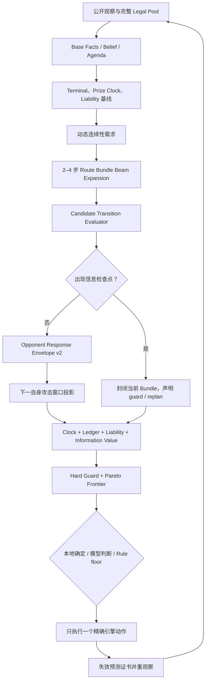

# V18CPG Route Value Graph v3：全卡组 Base Graph 升级与猛雷鼓扩展设计

> 日期：2026-07-26
> 状态：隔离 V18CPG 代码已完成；真实模型统计晋级待完成
> 适用范围：隔离的 `scripts/ai/v18_cpg/`、全部 24 套内置 18.0 LLM 卡组
> 首个专项卡组：800018509 猛雷鼓厄诡椪
> 不适用范围：Rule 策略、旧 `DeckStrategy*LLM`、旧大决策树、另一分支的完整 Agent
> 前置设计：
> - `2026-07-19-v18-llm-conditional-policy-graph-design.md`
> - `2026-07-25-v18cpg-multi-information-epoch-execution-design.md`
> - `2026-07-25-v18cpg-raging-bolt-turn-completion-design.md`
> - `2026-07-26-v18cpg-prize-clock-pivot-graph-engineering-design.md`

## 1. 结论

下一步不应继续扩大提示词、提高固定 route bias，或给猛雷鼓追加更多单局面优先级。当前架构最核心的上限是：

> 本地规划器仍把一个合法动作直接当成一条路线，而人类牌手比较的是“做完一组动作、经过对手最强可信回应、到下一次自身攻击窗口后”的完整路线结果。

因此，本轮演进将 V18CPG 从“候选约束图”升级为 **可计算的路线价值图（Route Value Graph）**：

1. Base Graph 在每个稳定信息纪元内，从完整合法动作池搜索 2～4 步的有界 `Route Bundle`。
2. 每个 Bundle 必须经过精确 `Candidate Transition`，计算动作后的公开状态、资源、攻击、奖赏时钟、场上负债和下一攻击窗口。
3. 信息动作不预测未知抽牌结果，而是形成 checkpoint；执行后重观察，再继续已有 guard 分支或紧凑重规划。
4. 对手回应从固定字符串升级为绑定攻击手、费用、目标、伤害、奖赏和证据等级的 `Opponent Response Envelope`。
5. 连续性需求不再只使用固定“3 个能量单位、2 个草面具、1 个咕咕”阈值，而根据下一目标、剩余攻击窗口、可见资源与下一回合加速能力动态计算。
6. 模型只比较 4～8 条 Pareto 非支配 Route Bundle，并返回条件策略图；不负责发明轮次数学、资源支付或引擎状态转换。
7. 每次仍只执行一个引擎动作。任何多动作预测只给当前首动作提供选择证据，执行后必须重验证。
8. 所有 24 套卡组继承同一套 Base Graph；猛雷鼓只在 Base 之上提供猫头夜鹰、零之大空洞、草面具、极雷轰、一奖桥和月月熊的类型化扩展算子。

这次升级的重点不是让模型“想得更久”，而是让模型收到的比较对象从单动作变成已经计算过后果的完整路线束。它应该主要增加几毫秒本地计算，不增加正常决策的固定网络调用次数。

## 2. 当前实现的证据与根因

### 2.1 当前已经正确的基础

现有 V18CPG 已经完成：

- ObservationGateway 唯一合法观察入口和隐藏信息隔离。
- 多信息纪元、三态等待协议和紧凑 delta 重规划。
- Rule 精确下限、响应拒绝原子性和传输 RNG 隔离。
- 回合完成、攻击后连续性、最小致死支付。
- Prize Clock、后排多奖负债、月月熊同窗口撤退反杀。
- 猫头夜鹰当前检索 lane 与未来咕咕根分离。
- 两阶段 Hard Guard、Rule veto sentinel 和执行目标闭包。
- 24/24 profile、12/12 capability module 的隔离构建和 smoke。

这些能力全部保留；Route Value Graph 是在其上增加一层可计算路线，不推倒重写。

### 2.2 当前代码中的四个结构性上限

#### 上限一：RouteSearch 实际仍是“一个动作一条路线”

`V18CPGRouteSearch.build_candidate_pool()` 遍历当前 legal actions，每个 action 生成一个 candidate：

```text
legal action
  -> candidate
  -> route_steps = [step:0]
```

`route_steps` 只有第 0 步，`dependencies` 为空，`attack_uptime_next_turn` 初始固定为 false。当前策略能靠 TurnCompletion、capability annotation 和 conditional suffix 弥补部分缺口，但本地层没有真正比较：

```text
先开零之大空洞
-> 铺咕咕/草面具
-> 进化猫头夜鹰
-> 搜互补 Trainer
-> 补齐费用
-> 最小致死攻击
```

与：

```text
现在直接攻击
-> 下回合断检索/断能量
```

哪一条完整路线更好。

#### 上限二：对手回应仍然过粗

当前 `V18CPGThreatResponseSolver` 主要依据：

- 对手场上总能量除以 3；
- 我方是否有备战区；
- 固定 `credible_worst = [gust_engine_ko, hand_reset]`。

它没有绑定：

- 哪只对手宝可梦能攻击；
- 攻击费用是否可支付；
- 能打多少；
- 能击倒哪个槽位；
- 取几奖；
- 抓人是否消耗支援者或其他额度；
- 证据是公开保证、可信还是猜测。

因此 Prize Clock 能知道“可能有抓人”，但还不能可靠比较每条候选路线后的对手最佳回应。

#### 上限三：连续性是静态阈值，不是下一攻击窗口的动态需求

猛雷鼓 profile 当前用固定参数约束：

- 最少 3 个 banked damage units；
- 当前最少 2 个草面具引擎；
- 最少 1 个未来检索根；
- 最少 1 个下一攻击手根。

这些参数能防止明显断轴，但不能区分：

- 下一个可信目标只有 140HP，2 个伤害单位已够；
- 下一个目标 280HP，需要 4 个伤害单位；
- 对手只剩 1 奖，本局不再需要下回合检索；
- 当前已经有未使用猫头夜鹰，未来根的边际价值不同；
- 牌库只剩 5 张，继续抽滤的风险超过发展价值。

固定阈值会同时产生过度建设和建设不足。

#### 上限四：InformationValue 与 ResourceLedger 还没有绑定路线结果

当前 InformationValue 使用 0.8、0.35、0.55 等常数估算信息、资源和铺场承诺；ResourceLedger 能记录配额、保护 role 和重复卡，但没有完整表达：

- 某张 Trainer 被预留给哪一个下一攻击窗口；
- 猫头夜鹰两张 Trainer 是否共同闭合路线；
- 某个备战位是本回合临时占用还是未来引擎专用；
- 当前能量既属于攻击费用，又属于未来极雷轰伤害库存；
- 一个信息动作可能打开多少条更优路线，以及失败时损失什么。

因此模型看见的是“信息动作价值较高”，而不是“这次猫头夜鹰检索能把攻击失败路线转换成 2 奖且保持下回合攻击”。

## 3. 目标、非目标与隔离边界

### 3.1 目标

- 给所有 24 套卡组提供共享的 2～4 步有界 Route Bundle 搜索。
- 精确比较路线执行后的当前攻击、奖赏时钟、资源债、场面负债和下一攻击窗口。
- 让连续搜牌、抽牌、进化、贴能、换位等动作形成决策—执行闭环。
- 提升模型选择质量，同时保持正常决策响应速度不下降。
- 让猛雷鼓真正理解猫头夜鹰轴、零之大空洞扩容、草面具持续储能和攻击手交接的因果关系。
- 保留最小致死、动态月月熊费用、奖赏轮次、错奖和 terminal rescue 的现有正确行为。
- 用版本化 Harness、执行 witness 和 paired benchmark 给出明确停止条件，避免无限调参。

### 3.2 非目标

- 不做完整世界模拟，不枚举未知抽牌的每一种卡。
- 不让模型直接执行 2～4 个动作。
- 不把 Route Bundle 变成旧式几十节点大决策树。
- 不修改 Rule 策略以配合新图。
- 不复制旧 LLM 或 Agent 代码。
- 不为某个 seed 写局面特判。
- 不以“模型接管率”或解释文本看起来合理作为验收。

### 3.3 隔离策略

开发阶段增加独立开关：

```text
route_value_graph_v3_enabled = false
```

固定迁移顺序：

1. 先在 shadow 模式对 24 套牌计算但不改变动作；
2. 再在 `--verified-local-only` 中允许公共证书接管；
3. 再接真实模型选择；
4. 通过门槛后逐套启用；
5. 未经批准不改变默认策略或当前 V18CPG 对外行为。

旧 semantic `v18cpg-2`、transport v3、旧 dominance 17/20 安全基线继续冻结回归。Route Bundle 先使用独立本地子契约版本；只有模型 wire 确实需要无法兼容的新字段时才单独升级 transport，不借本地算法升级强行修改响应 schema。

## 4. 核心概念与强类型契约

### 4.1 Route Bundle

Route Bundle 是一个信息检查点之间的有界行动段，不是整回合盲执行队列。

```json
{
  "bundle_schema_version": 1,
  "bundle_id": "bundle:...",
  "root_candidate_id": "candidate:...",
  "origin": "base_search",
  "steps": [
    {
      "step_index": 0,
      "kind": "exact_current_action",
      "candidate_id": "candidate:...",
      "action_id": "action:..."
    },
    {
      "step_index": 1,
      "kind": "projected_typed_action",
      "operator_id": "base:attach_energy",
      "requires_reobservation": true
    }
  ],
  "checkpoint": {
    "kind": "information_result",
    "after_step": 0,
    "otherwise": "replan"
  },
  "dependencies": [],
  "reservations": [],
  "invalidation_facts": [],
  "outcome": {},
  "proof": {}
}
```

硬约束：

- 每段最多 4 个动作，默认 beam depth 3。
- 遇到未知抽牌、检索、公开牌库选择、随机结果或新合法动作集合时立即结束当前段。
- `exact_current_action` 只有第 0 步；后续步骤只是经类型化转换预测的意图。
- Bundle 永远只授权当前第一个引擎动作。
- 第一个动作执行后，旧 Bundle 的预测证书失效；重观察后必须重新绑定后续候选。
- 不可逆动作必须声明额度、资源、交互 owner 和释放点。

### 4.2 Transition State

每次扩展路线时使用精简的公开转换状态：

```text
observation_hash
active/bench public topology
visible hand roles and exact own cards
turn quotas
attack readiness and damage tiers
resource ledger signature
continuity demand/supply
prize clock
liability map
information epoch
terminal state
```

禁止携带：

- 隐藏牌库顺序；
- 奖赏身份；
- 未公开的对手手牌；
- 引擎 raw object；
- 模型自由文本推测。

### 4.3 Transition Certificate

任何跨动作公共升级都必须闭合：

```text
exact legal first action
+ typed operator
+ exact payment/quota
+ exact target/destination
+ projected public state delta
+ attack/cost/damage/prize result
+ opponent-response assumption class
+ invalidation facts
+ mandatory reobservation
```

证书只证明“当前首动作值得执行并且后续存在公开可重建路线”，不证明后续动作已经合法。

### 4.4 Opponent Response Lane

```json
{
  "response_id": "response:...",
  "kind": "gust_ko",
  "attacker_slot_id": "slot:...",
  "attack_id": "attack:...",
  "target_slot_id": "slot:...",
  "payment": {
    "energy_ready": true,
    "supporter_required": true,
    "quota_ready": true
  },
  "damage": 240,
  "prizes": 2,
  "finish_tick": 1,
  "certainty": "credible",
  "evidence": [],
  "recovery_cost": {}
}
```

证据等级沿用：

- `guaranteed_public`
- `bounded_public`
- `credible`
- `speculative`

只有前两类可进入确定性证书；`credible` 进入模型风险比较；`speculative` 仅审计。

### 4.5 Route Outcome Vector v3

每条 Bundle 至少输出：

```text
win_now
loss_prevented
prizes_now
own_robust_finish_tick
opponent_robust_finish_tick
race_margin
current_attack_window_preserved
next_attack_window_ready
next_attack_damage_floor
continuity_demand_remaining
information_debt_remaining
resource_debt_current
resource_debt_next_window
liability_prizes_exposed
liability_prizes_removed
bench_capacity_after
supporter/attachment/retreat/stadium quota after
information_gain
information_regret
future_flexibility
uncertainty_class
```

这些维度先做 hard guard 和 Pareto 比较，不压缩为一个可以互相抵消错误的总分。

## 5. 全卡组 Base Graph v3



### 5.1 Base 节点顺序

固定顺序如下，Extension 不得改写：

```text
B0  Observation Firewall
B1  Immediate Win / Immediate Loss Prevention
B2  Baseline Prize Clock and Liability
B3  Dynamic Continuity Demand
B4  Route Bundle Expansion
B5  Exact Public Transition
B6  Information Checkpoint Boundary
B7  Opponent Best Credible Response
B8  Next Own Attack Window
B9  Resource Ledger / Liability / Clock Re-evaluation
B10 Pareto Frontier and Certificates
B11 Local / Model / Rule Ownership Gate
B12 Execute One Step and Reobserve
```

### 5.2 Candidate Transition Evaluator

新增共享纯函数层，职责是：

- 接收当前公开 Transition State 和一个 typed operator。
- 验证当前动作身份、配额、费用、目标和依赖。
- 只应用可由公开状态确定的变化。
- 输出下一 Transition State、checkpoint、失效事实和预测置信度。

Base 首批必须覆盖的算子：

```text
BENCH
EVOLVE
ATTACH_ENERGY
USE_PUBLIC_ABILITY
PLAY_STADIUM
RETREAT / SWITCH
GUST
RECOVER_PUBLIC_ZONE
MOVE_PUBLIC_ENERGY
MOVE_PUBLIC_DAMAGE
ATTACK
END_TURN
```

无法精确投影的卡牌效果必须：

1. 输出信息 checkpoint；
2. 停止当前段扩展；
3. 不猜测抽到什么；
4. 不因此失去该动作作为 Bundle 根的资格。

### 5.3 Route Bundle Beam Search

搜索不是穷举 UI 动作，而是按 registered operator 扩展：

```text
input:
  complete candidate pool
  transition state
  max_depth = 3
  hard_max_depth = 4
  beam_width = 16
  internal_pool_cap = 48

for each root candidate:
  apply exact transition
  if terminal or information checkpoint:
    close bundle
  else:
    enumerate dependency-compatible typed followups
    reject quota/resource overlap
    merge dominated states by public state signature
    continue until depth/cost bound

output:
  4–8 Pareto bundles, hard cap 10
```

状态合并键：

```text
observation-independent public topology signature
+ quota signature
+ attack readiness tier
+ ledger reservation signature
+ prize-clock schedule class
+ liability class
+ information epoch class
```

只有当 A 在全部关键 outcome 维度不差且至少一维更好时，才能支配 B。Rule 分数保留为独立 floor 字段，不能进入状态等价键。

### 5.4 动态连续性需求

新增 `Continuity Demand`，把固定配置转换为动态目标：

```text
next_target_damage_units
next_attacker_cost
next_attacker_root_needed
energy_engine_width_needed
current_unused_search_lane_needed
future_search_root_needed
bench_capacity_needed
recovery_needed
remaining_own_attack_windows
low_deck_risk
```

计算原则：

1. 先从 Prize Clock 决定还需要几个自身攻击窗口。
2. 再从对手场面和 credible response 决定下一目标伤害档。
3. 再计算下一攻击手费用、伤害库存与可见加速。
4. 只对仍然需要的未来窗口建立 debt。
5. `win_now` 或只剩当前终结窗口时释放不必要的未来 reservation。
6. 信息动作只 `progresses_debt`；真正拿到并使用组件后才 `reduces_debt`。

Profile 仍可提供安全上下限，但不能把固定阈值直接当成最终需求。

### 5.5 Resource Ledger v3

Ledger 从“有哪些资源”升级为“资源被哪条攻击窗口路线占用”：

```json
{
  "reservation_id": "reserve:...",
  "resource_kind": "energy_symbol",
  "resource_selector": {"symbol": "G"},
  "amount": 1,
  "owner_bundle_id": "bundle:...",
  "purpose": "next_attack_damage_bank",
  "window": "next_own_attack",
  "release_when": [],
  "recoverability": "publicly_recoverable",
  "shadow_price": 2
}
```

必须支持：

- 同一资源的多重用途检测；
- 当前攻击费用与伤害库存分离；
- 当前 route 与下一攻击窗口 reservation；
- supporter、attachment、retreat、stadium、Ability、ACE SPEC 等独占额度；
- 备战位的角色预约；
- 可回收、可能奖赏、不可再生资源；
- 路线切换时的释放与重新绑定。

### 5.6 Information Value v2

信息价值不再由固定常数决定，而使用：

```text
expected_information_value =
  Σ(信息结果类别概率 × 最佳后续 Bundle 价值)
  - 当前动作机会成本
  - 不可逆资源成本
  - 可见等待成本
  - 低牌库/手牌重置风险
```

未知抽牌不枚举卡名，使用 role bucket：

```text
attack_completion
energy_access
search_engine_root
gust_closeout
recovery
dead_or_redundant
```

公开完整牌库搜索进入合法 `visible_scope` 后，才可将 bucket 收敛到精确可选卡。

### 5.7 Opponent Response Envelope v2

回应生成顺序：

1. 枚举对手当前公开攻击手和已知可达攻击手。
2. 计算每个攻击的公开费用下限与伤害。
3. 枚举主动击倒、可信抓取、备战伤害、多奖、干扰、锁和发展。
4. 为每条回应绑定目标、奖赏、额度和证据等级。
5. 对每条我方 Bundle 重新选择对手最有利回应。
6. 再计算我方下一攻击窗口的重建成本。

禁止继续使用“有备战区就默认 credible gust”作为唯一结论；它可以作为保守 fallback，但必须带高不确定性，不能签发公共证书。

### 5.8 Pareto Frontier 与模型输入

先执行 hard guard：

1. 当前直接获胜。
2. 下一窗口输局救援。
3. 当前攻击窗口不可无故丢失。
4. 费用、额度、目标、交互和隐藏信息合法。
5. Rule veto sentinel 只有精确证书可越过。

再保留非支配 Bundle。模型输入每条只发送：

```text
bundle_id
root candidate/action
2–4 步 typed summary
checkpoint
clock delta
resource delta
continuity delta
liability delta
information value/regret
uncertainty
certificate summary
```

不发送完整展开树、重复 schema、引擎对象或所有被支配路线。

## 6. 模型与策略图的新职责

### 6.1 模型负责

- 在非支配 Route Bundle 之间比较战略取舍。
- 选择一个精确 root candidate。
- 对 Bundle 已声明的 checkpoint 生成 guard 分支。
- 在 `credible` 不确定性下选择风险姿态。
- 在当前 frontier 不完整时，用请求提供的 typed operators 提议受限路线骨架。

### 6.2 模型不负责

- 计算精确能量费用、伤害、奖赏或撤退支付。
- 猜测对手隐藏手牌。
- 发明未注册动作。
- 宣称未来预测动作已经合法。
- 用解释文本覆盖 hard guard。
- 让被支配路线仅因语言更好听而回到 frontier。

### 6.3 调用策略

维持 information epoch 机制，不设置每回合固定调用上限：

- 本地公共证书唯一决定时：零调用。
- 已安装 graph guard 命中时：零调用。
- Route Bundle 明显支配 Rule 且证书完整时：本地 verified owner。
- 4～8 条非支配路线存在高后悔差异时：一次模型请求。
- 新信息导致排序变化且无已有分支时：紧凑 delta。
- 预算不足：使用最佳已验证 Bundle 的首动作。

正常局面不会因为搜索深度增加而增加网络次数；新增成本主要是本地路线扩展。

## 7. 猛雷鼓 Extension Graph v3

### 7.1 专项目标

猛雷鼓 Extension 不再只给动作贴 `RB_*` 标签，而是给 Base 提供能精确转换的卡组算子、动态需求参数和交互策略。

它必须解决四个核心问题：

1. 猫头夜鹰与零之大空洞是持续检索引擎，不是一次性的“高分动作”。
2. 草面具厄诡椪的能量既是抽牌入口，也是未来极雷轰伤害库存。
3. 当前可以击倒，不代表应该停止所有铺场；是否继续要看剩余攻击窗口和动态连续性债务。
4. 任何建设都不能牺牲 `win_now`、当前攻击窗口或最低致死支付。

### 7.2 猛雷鼓战略状态

Extension 向 Base 提供：

```text
current_noctowl_unused_count
future_hoothoot_root_count
tera_enabler_count
area_zero_active
bench_capacity_current / projected
teal_mask_count
teal_mask_unused_ability_count
teal_mask_energized_count
banked_discard_damage_units
next_target_damage_units
raging_bolt_cost_ready
next_raging_bolt_root_ready
one_prize_bridge_ready
bloodmoon_dynamic_cost
late_game_gust_lane
```

时间层必须分开：

- 当前未使用猫头夜鹰：本回合检索 lane。
- 咕咕根：下一回合检索 lane。
- 当前草面具未使用特性：本回合储能/抽牌 lane。
- 已储能草面具：未来伤害库存。
- 下一猛雷鼓根与当前猛雷鼓攻击费用：不同 reservation。

### 7.3 猛雷鼓 typed operators

保留现有算子并补充可组合关系：

```text
RB_BUILD_NOCTOWL_ENGINE
RB_EXPAND_AREA_ZERO_CAPACITY
RB_BANK_TEAL_DANCE_ENERGY
RB_MINIMUM_LETHAL_DISCARD
RB_FREE_RETREAT_VIA_LATIAS
RB_ONE_PRIZE_SLITHER_WING_BRIDGE
RB_SINGLE_PRIZE_RAGING_BOLT_ROUTE
RB_BLOODMOON_DYNAMIC_CLOSEOUT
RB_PRESERVE_DAMAGED_TWO_PRIZE_BENCH

RB_ACQUIRE_SEARCH_ROOT
RB_EVOLVE_AND_OPEN_FAN_CALL
RB_SELECT_ROUTE_COMPLETING_TRAINER_PAIR
RB_CHAIN_ENERGY_ACCESS
RB_CHAIN_ENERGY_MOVER
RB_CHAIN_ANCIENT_ACCELERATION
RB_ESTABLISH_NEXT_RAGING_BOLT
RB_RELEASE_FUTURE_DEBT_FOR_WIN_NOW
```

每个算子必须声明：

```text
preconditions
public transition
checkpoint kind
reservations
debt progressed
debt reduced
clock effect
interaction policy
invalidation facts
```

### 7.4 猫头夜鹰 Trainer Pair Solver

Fan Call 必须枚举合法两张组合，而不是逐卡独立打分后取前二。

组合评价顺序：

1. 本回合 `win_now`。
2. 补齐当前攻击费用并达到最低致死。
3. 保持当前击倒，同时补齐下一攻击窗口。
4. 建立未来咕咕/猫头夜鹰检索 lane。
5. 建立草面具能量库存或下一猛雷鼓。
6. 修复奖赏时钟、抓人终结或月月熊收尾。
7. 低牌库与 supporter/attachment 冲突。

组合结果示例：

```json
{
  "pair_id": "pair:...",
  "cards": ["instance:a", "instance:b"],
  "roles": ["supporter_acceleration", "energy_access"],
  "completes_bundle_dependencies": [
    "current_attack_cost",
    "next_damage_bank"
  ],
  "expected_clock_delta": 2,
  "reservation_conflicts": [],
  "requires_reobservation": true
}
```

如果两张牌分别高分但争用同一 supporter、缺少弃牌费用或无法共同完成攻击，它们不得成为最佳 pair。

### 7.5 动态伤害库存

极雷轰每丢 1 个基本能量提供 70 伤害。动态需求：

```text
current_lethal_units = ceil(current_target_hp / 70)
next_target_units = ceil(credible_next_target_hp / 70)
future_units_needed =
  0                              if win_now
  next_target_units              if only one future attack window remains
  max(next_target_units, floor)  if multiple windows remain
```

再减去：

- 当前场上安全可丢基本能量；
- 下一回合公开可用的草面具特性数；
- 古代加速可见供给；
- 已保留的手贴与能量移动；
- 可公开回收的能量。

这使“140HP 下一目标”不会强求固定 3 单位，也使“280HP 下一目标”不会因达到固定 3 单位就错误停止储能。

### 7.6 零之大空洞与备战位价值

零之大空洞不是无条件高优先级。它的 Route Bundle 必须绑定至少一个后继收益：

```text
新增槽位
-> 本回合铺草面具并可发动特性
或
-> 铺咕咕并保持未来检索 lane
或
-> 建立下一猛雷鼓/一奖桥
```

若体育场只增加空槽位，没有当前可见后继组件，也不改善 robust finish tick，则标记：

```text
capacity_without_bound_followup
```

该路线可以保留为模型判断，但不能成为确定性接管证书。

### 7.7 草面具的持续储能

草面具特性是否应在攻击前使用，按 Route Bundle 结果判断：

优先使用：

- 当前攻击还差能量/伤害单位；
- 下一攻击窗口库存不足；
- 抽牌结果可能打开高价值路线，且不消耗当前唯一攻击窗口；
- 牌库、备战位和 liability 风险可接受。

可以跳过：

- 当前 `win_now`；
- 低牌库风险高；
- 草面具铺场会制造对手下一窗口终结负债；
- 特性不会改变当前或下一攻击窗口；
- 已达到动态伤害库存和下一攻击手完整下限。

因此不是固定“先用草面具”，而是“只有路线价值证明其改善当前或下一攻击窗口时才先用”。

### 7.8 五类标准 Route Bundle

#### A. 当前终结

```text
最小致死极雷轰 / 抓双奖 / 月月熊收尾
-> win_now
```

释放所有未来建设债务，不追加猫头夜鹰、草面具或体育场。

#### B. 猫头夜鹰攻击闭环

```text
进化猫头夜鹰
-> Fan Call checkpoint
-> 选择路线闭合 Trainer pair
-> 重观察
-> 补齐能量/加速
-> 最小致死攻击
```

每个信息 checkpoint 后重新绑定，不预执行未来 Trainer。

#### C. 大空洞持续引擎

```text
零之大空洞
-> 铺咕咕或草面具
-> 若产生信息/特性则 checkpoint
-> 建立未来检索与伤害库存
-> 保持当前攻击
```

只有绑定具体后继组件且不丢当前攻击窗口时才进入强优先级。

#### D. 当前击倒但下回合断轴

```text
已存在当前 KO
-> 动态连续性发现下一窗口缺口
-> 选择最短安全建设前缀
-> 重观察
-> 当前 KO 仍成立
-> 最小致死攻击
```

建设前缀必须经过 Rule veto、额度、备战负债和攻击窗口检查。

#### E. 奖赏轮次/终盘换位

```text
一奖桥 / 拉帝亚斯免费撤退 / 月月熊动态费用
-> 精确同窗口攻击
-> 奖赏时钟改善或防止下一窗口输局
```

延续现有 proof closure：首动作执行后强制重观察。

### 7.9 猛雷鼓不可绕过的 hard guards

- `win_now` 释放未来引擎 debt。
- 极雷轰只丢最低致死能量。
- 当前攻击费用 L/F 不得被非终结建设破坏。
- 猫头夜鹰点击只 `progresses_debt`，选牌并执行后才 `reduces_debt`。
- 已使用猫头夜鹰不能算未来搜索 lane。
- 大空洞无后继组件不能伪装成 continuity improvement。
- 草面具铺场若制造可抓双奖终结，必须进入 liability 比较。
- 月月熊费用按对方已取奖实时计算。
- 撤退、能量移动、支援者加速和 Trainer pair 都要逐步重观察。
- Rule veto sentinel 无精确公共证书不得越过。

## 8. 决策—执行链路

### 8.1 稳定信息纪元

```text
观察
-> 构建 Base facts
-> 构建 Route Bundles
-> 本地/模型选择 Bundle root
-> 执行一个动作
```

### 8.2 信息动作

```text
执行搜索/抽牌/公开牌库选择
-> interaction 完成
-> public observation hash 改变
-> 旧 transition projection 失效
-> 若 graph guard 覆盖则本地续跑
-> 否则重建 Bundle frontier
-> 高 regret 时紧凑 delta
```

### 8.3 普通确定性动作

普通 attach、bench、evolve、stadium 等动作即使预测确定，也必须在引擎执行后重新验证：

- 目标实例仍存在；
- 配额真实消耗；
- 触发效果是否打开新 interaction；
- legal action 集是否符合预测；
- Bundle 后继仍在 Pareto frontier。

预测一致时可以零调用继续；预测不一致时结束旧 Bundle。

## 9. 预期代码落点

新增 Base 文件：

```text
scripts/ai/v18_cpg/planning/
  V18CPGTransitionState.gd
  V18CPGTransitionRegistry.gd
  V18CPGCandidateTransitionEvaluator.gd
  V18CPGRouteBundleSearch.gd
  V18CPGRouteOutcomeEvaluator.gd
  V18CPGContinuityDemandSolver.gd
  V18CPGOpponentResponseEnvelopeV2.gd
  V18CPGParetoFrontier.gd
```

新增猛雷鼓扩展：

```text
scripts/ai/v18_cpg/planning/extensions/
  V18CPGRagingBoltRouteBundleExtension.gd
  V18CPGRagingBoltContinuityDemand.gd
  V18CPGRagingBoltTrainerPairSolver.gd
```

预期小型集成修改：

| 文件 | 改进 |
| --- | --- |
| `V18ConditionalPolicyStrategy.gd` | 在完整 candidate pool 与 prune 之间接入 Bundle pipeline；增加 shadow/owner/audit |
| `V18CPGRouteSearch.gd` | 保留 exact candidate 构造，逐步把“路线搜索”职责迁给 BundleSearch |
| `V18CPGResourceLedger.gd` | 增加跨攻击窗口 reservation、shadow price 和释放点 |
| `V18CPGInformationValueSolver.gd` | 从常数评分升级为 route-aware value |
| `V18CPGThreatResponseSolver.gd` | 保留兼容层，主结论迁入 ResponseEnvelopeV2 |
| `V18CPGPrizeClockSolver.gd` | 消费精确候选转换和回应 lane，不自行猜后继 |
| `V18CPGPostAttackContinuitySolver.gd` | 输出 supply，由 ContinuityDemand 计算动态 debt |
| `V18CPGTurnCompletionSolver.gd` | 消费最优 Bundle 的安全前缀，不再仅按单候选优先级 |
| `V18CPGHardGuard.gd` | 增加 Bundle 首动作、clock、ledger 与 transition 证书校验 |
| `V18CPGDecisionClient.gd` | 发送紧凑 Bundle frontier，不扩大固定 schema 文本 |
| `V18CPGContracts.gd` | 注册本地 Bundle/Transition/Outcome/Audit 子契约 |
| `800018509.json` | 删除可由动态 demand 推导的固定强制值，只保留安全边界和角色映射 |

不修改：

- Rule 目录；
- 旧 LLM；
- Agent；
- 旧 strategy id 与 UI 映射；
- 旧 dominance fixture 的安全语义。

## 10. TDD 详细实施计划

### Phase 0：冻结基线和红灯语料

先保存：

- 当前 24 套 no-model Rule 完整日志等价结果；
- 当前 enabled fake smoke；
- 当前 Base Graph v2 专项测试；
- 猛雷鼓 turn-completion 28/28；
- 当前 30 局 Rule 17/30、Graph v2 16/30 的非晋级基线；
- 当前本地规划 p50/p95、prompt bytes 和 visible wait。

新增但先红：

```text
tests/v18_llm_policy_graph/fixtures/route_value_graph_base_v1.json
tests/v18_llm_policy_graph/fixtures/raging_bolt_route_bundle_v1.json
tests/v18_llm_policy_graph/test_v18cpg_transition_evaluator.gd
tests/v18_llm_policy_graph/test_v18cpg_route_bundle_search.gd
tests/v18_llm_policy_graph/test_v18cpg_opponent_response_v2.gd
tests/v18_llm_policy_graph/test_v18cpg_dynamic_continuity_demand.gd
tests/v18_llm_policy_graph/test_v18cpg_route_value_execution_witness.gd
tests/v18_llm_policy_graph/test_v18cpg_route_value_latency.gd
```

### Phase 1：冻结本地契约

先实现 schema 和纯数据校验，不接生产选择：

- Transition State；
- typed operator；
- Route Bundle；
- Outcome Vector v3；
- Response Lane；
-跨窗口 reservation；
- bundle lifecycle 与 invalidation。

红绿测试：

- sparse/full canonicalization；
- stable bundle id；
- hidden sentinel；
- stale observation；
- quota/resource overlap；
- terminal 后无后继；
- checkpoint 后禁止预测未知结果。

### Phase 2：Candidate Transition

按风险从低到高实现：

1. bench/evolve/attach/stadium；
2. retreat/switch/gust；
3. public energy move/recovery；
4. damage move；
5. attack/end turn；
6. 信息动作 checkpoint。

每类必须有：

- 正例；
- 费用少 1；
- 配额已用；
- 目标失效；
- 状态版本过期；
- 真实引擎 execution witness。

### Phase 3：Route Bundle Search

先只在 fixture 中运行：

- 深度 1 必须与现有 exact candidate pool 对齐；
- 深度 2～4 构建依赖链；
- checkpoint 正确截断；
- dominance 合并不删除 Rule root；
- Rule-low 公共救援在 prune 前保留；
- 无证书预测不得成为 verified owner。

然后开启 24 套 shadow：

- 记录 Bundle，但动作仍由现有 Graph v2 决定；
- 对比预测后继与真实下一 observation；
- transition prediction mismatch 必须先清零，再允许接管。

### Phase 4：Threat、Clock、Ledger、InformationValue

依次替换：

1. Response Envelope v2；
2. candidate-after Prize Clock；
3. Dynamic Continuity Demand；
4. Resource Ledger v3；
5. route-aware Information Value；
6. Pareto frontier。

每次只替换一个组件，并保存同一 fixture 的 before/after。禁止同时改多个模块后仅凭胜率猜原因。

### Phase 5：Base Graph 生产接入

接入顺序：

1. shadow；
2. hard guard only；
3. verified-local 公共证书；
4. model compact Bundle frontier；
5. delta revision；
6. deadline fallback；
7. 24 套统一启用开关。

每一步验证所有 owner：

```text
policy_graph
model_selected_local_route
model_synthesized_route
module_verified_upgrade
local_gate
deadline_fallback
schema_fallback
rules_fallback
```

被 Base hard guard 拒绝的 stable action id 不得被任何 V18 owner 恢复；`--no-model` 仍保持 Rule 原样。

### Phase 6：猛雷鼓 Extension

顺序固定：

1. 动态伤害库存；
2. 当前猫头夜鹰与未来咕咕 lane；
3. Trainer Pair Solver；
4. 零之大空洞绑定后继；
5. 草面具储能/抽牌 Route Bundle；
6. 下一猛雷鼓根与攻击费用 reservation；
7. 一奖桥；
8. 月月熊动态 closeout；
9. 与 Prize Clock/Hard Guard/最小致死整合。

每完成一步先跑专项 fixture，再跑全部 Base，避免猛雷鼓扩展削弱共享不变量。

### Phase 7：模型与响应速度

- 请求只发 4～8 条非支配 Bundle。
- 对比当前 single-candidate frontier 与 Bundle frontier 的字节数。
- 保持 system prompt 不重复完整 schema。
- delta 仅发送改变的 Bundle/outcome，但仍自包含当前状态。
- branch hit 与 verified-local 路径零等待。
- 使用现有 6500～10500ms 渐进预算，不因 v3 另设超时。

### Phase 8：24 套继承与推广

24 个 profile 必须：

- 自动拥有 Base Bundle Search、Transition、Threat、Clock、Ledger 和 Pareto；
- 无需卡组 wrapper；
- 缺少专属算子时明确 `not_applicable`；
- 至少有一个多动作 Bundle fixture；
- 至少有一个 opponent response fixture；
- 至少有一个跨窗口 continuity fixture；
- 保持 exact Rule profile 绑定。

## 11. Harness 与测试矩阵

### 11.1 Base 24 类场景

| 类别 | 核心断言 |
| --- | --- |
| 当前终结 | win_now 支配所有建设 |
| 下一窗口输局 | 只接受终结或真实救援 |
| attach→attack | 费用、配额、攻击均闭合 |
| evolve→ability | 能力产生信息时 checkpoint |
| stadium→bench | 扩容必须绑定后继 |
| bench→evolve | 进化时间与目标身份正确 |
| retreat→attack | 只授权撤退，后续重观察 |
| move energy→attack | 能量来源/目标/费用闭合 |
| recovery→attack | 公开弃牌回收后重绑定 |
| gust→attack | 目标、HP、奖赏精确 |
| damage move→KO | 生存和击倒阈值同时变化 |
| draw/search | 不预测未知卡名 |
| supporter conflict | 两路线不能双用支援者 |
| attachment conflict | 当前与下一窗口 reservation 不双花 |
| bench conflict | 最后槽位按路线用途比较 |
| low deck | 信息价值可变负 |
| active liability | 当前负债进入回应 |
| bench gust liability | 对手选择最大可信奖赏 |
| one-prize bridge | 可信与强制错奖分离 |
| attack uptime | 当前 KO 后下一攻击手真实可达 |
| Rule veto | 无证书不能越过 sentinel |
| stale transition | observation 变化后证书失效 |
| Pareto diversity | 不同战略形态均能保留 |
| no-model isolation | 完整动作日志等于 Rule |

### 11.2 猛雷鼓 20 类场景

| ID | 场景 | 断言 |
| --- | --- | --- |
| RB01 | 30HP 目标 | 极雷轰只丢 1 能 |
| RB02 | 140HP 下一目标 | 动态库存需求为 2，不强求 3 |
| RB03 | 280HP 下一目标 | 固定 3 不足，继续储能 |
| RB04 | 当前 win_now | 释放猫头夜鹰/草面具建设 debt |
| RB05 | 猫头夜鹰可用、未形成 KO | 优先路线闭合 pair |
| RB06 | 猫头夜鹰已使用、无咕咕 | 未来搜索 debt 仍存在 |
| RB07 | 未使用猫头夜鹰、已有咕咕 | 当前与未来 lane 同时正确 |
| RB08 | Pair 单卡高分但额度冲突 | 组合被拒绝 |
| RB09 | Pair 完成加速+能量入口 | 本回合继续执行 |
| RB10 | 大空洞无后继 | 不生成强 continuity 证书 |
| RB11 | 大空洞→草面具 | 新槽位和特性形成可执行链 |
| RB12 | 大空洞→咕咕 | 未来检索 lane 改善 |
| RB13 | 草面具改善下一伤害库存 | 攻击前使用并重观察 |
| RB14 | 草面具只制造终结负债 | 路线被 liability 压制 |
| RB15 | 已 KO 但下回合断轴 | 选择最短安全建设前缀 |
| RB16 | 建设会丢当前攻击 | 拒绝建设，保留 tick 0 |
| RB17 | 一奖桥、抓人仍可信 | 不生成强错奖证书 |
| RB18 | 一奖桥、抓人公开核销 | Prize Clock 延后并可验证 |
| RB19 | 月月熊动态一能收尾 | 撤退后重观察并攻击 |
| RB20 | 月月熊差 1 能或 1HP | 证书失效 |

### 11.3 Metamorphic 反例

每个强证书至少有一个只改一项的反例：

- 费用少 1；
- 目标 HP 多 1；
- 配额从 open 变 spent；
- 备战位从 free 变 full；
- supporter pair 中一张从 Trainer 变不可用；
- 当前未使用 Ability 变已使用；
- 对手抓人从公开核销变可信可用；
- 牌库从 7 变 6 触发 critical threshold；
- 剩余奖赏从 2 变 1 释放未来 debt；
- 下一目标从 210HP 变 211HP，伤害库存增加 1 单位；
- observation version 改变；
- 当前攻击窗口关闭。

### 11.4 Fake Model 对抗

必须拒绝：

- 选择被支配且已从 frontier 删除的 Bundle；
- 修改 Bundle outcome；
- 把 `credible` 当公共证书；
- 跳过 checkpoint；
- 一次请求执行多个引擎动作；
- 使用旧 Bundle 的后继 candidate id；
- 选择 Trainer pair 后跳过卡牌交互；
- 同时占用 supporter/attachment；
- 在 win_now 时选择建设；
- 用自然语言添加未注册算子。

## 12. 性能预算

### 12.1 本地预算

| 层 | p95 目标 |
| --- | ---: |
| Transition State + exact transitions | ≤ 2ms |
| Route Bundle beam search | ≤ 5ms |
| Opponent Response Envelope v2 | ≤ 3ms |
| Clock + Ledger + Pareto | ≤ 3ms |
| 新增总量 | ≤ 10ms |
| observation + 全部 solver + search 总量 | 继续 ≤ 15ms；超出必须 profile 并优化 |

实现策略：

- 状态签名缓存；
- 同 route prefix 共享转换；
- 信息 checkpoint 提前截断；
- dominance 合并；
- per-profile typed operator allowlist；
- 不复制完整 observation；
- 不在本地搜索中分配引擎对象；
- 不访问网络。

### 12.2 网络预算

- 模型 frontier 仍最多 10，目标 4～8。
- system prompt bytes 不因 Bundle 重复 schema。
- user payload p95 增长不超过 15%。
- completion token 仍服从 profile 420/180 和节点上限。
- opening visible wait p50/p95 不回退。
- 同局面调用次数不增加；必要 delta 只由新 information epoch 触发。
- late-game 长考继续使用统一渐进预算，不额外叠加。

## 13. 审计字段

新增：

```text
route_value_graph_version
bundle_schema_version
bundle_id
bundle_depth
bundle_origin
transition_state_hash
transition_prediction_class
transition_prediction_match
response_envelope_hash
selected_response_id
continuity_demand_hash
continuity_supply_hash
pareto_frontier_size
dominated_bundle_count
bundle_branch_hit
bundle_invalidated_reason
bundle_local_ms
transition_ms
response_ms
pareto_ms
```

猛雷鼓增加：

```text
noctowl_current_lane
hoothoot_future_lane
trainer_pair_id
trainer_pair_dependencies_closed
area_zero_bound_followup
teal_dance_current_value
banked_damage_units_before/after
dynamic_damage_units_required
premature_attack_prevented
optional_churn_stopped
```

## 14. 验收与停止条件

### 14.1 架构正确性

- Base 24/24 场景通过。
- 猛雷鼓 20/20 场景通过。
- 所有 metamorphic 反例通过。
- transition execution witness 预测与真实引擎状态一致。
- hidden sentinel 0 泄漏。
- stale Bundle 0 执行。
- 资源/额度双花 0。
- `--no-model` 24 套完整 Rule 日志等价。
- response rejection 继续原子。

### 14.2 决策收益

共享：

```text
route_completion_rate
transition_prediction_accuracy
next_attack_window_uptime
current_attack_window_preservation
prize_clock_prediction_error
avoidable_liability_rate
resource_reservation_violation
information_action_consumption_rate
counterfactual_regret_vs_rule
```

猛雷鼓：

- 最小致死过量支付率 = 0。
- 公开可完成的月月熊收尾漏选 = 0。
- 猫头夜鹰 pair 依赖闭合率 ≥ 95%。
- 猫头夜鹰信息后同回合继续执行率 ≥ 95%。
- 无后继大空洞强证书误报 = 0。
- 当前未终结且下一窗口库存不足时，草面具有价值使用率显著高于 Graph v2。
- 已达到动态库存或 win_now 时，可选 churn 显著下降。
- 公开可证的“当前 KO + 下一窗口不断轴”场景正确率 100%。

### 14.3 性能

- 新增本地计算 p95 ≤ 10ms。
- 总本地规划 p95 目标 ≤ 15ms。
- prompt payload p95 增长 ≤ 15%。
- opening visible wait p50/p95 不劣于 Graph v2。
- branch hit、verified-local、Rule floor 均无新增网络等待。

### 14.4 统计晋级

分三层，禁止混淆：

1. **确定性决策集**：Base + 猛雷鼓 Harness 全绿，证明指定状态决策优于或不差于 Rule。
2. **pilot**：猛雷鼓至少 100 局同 seed、先后手平衡；相对 Rule 点估计不低于 0，且决策级指标显著改善。
3. **promotion**：至少 3 批、合计 ≥ 300 局；95% paired bootstrap 下界高于 0，或通过预声明非劣界并在猫头夜鹰、续航、奖赏效率指标上显著改善。

若 Harness、执行 witness、性能和 300 局门槛全部完成，则停止继续调 Base，进入其他卡组 Extension 扩展。不得为追回单个负 seed 破坏共享不变量。

## 15. 风险与反思

### 15.1 Route Bundle 会不会变成新的大决策树

不会，前提是坚持：

- 每段 2～4 步；
- 信息动作立即 checkpoint；
- 执行只授权首动作；
- 4～8 条 Pareto frontier；
- 未知结果按 role bucket，不展开卡名；
- 当前回合 DAG，不做开放式长期搜索。

### 15.2 本地转换不完整会不会限制模型

会。因此：

- 精确可转换路线进入 Bundle；
- 不可转换动作仍保留单步 candidate；
- 模型可使用 typed synthesis；
- 缺口记为 `transition_unsupported`，归入语义/算子待办；
- 不允许为了保持候选数量而伪造后果。

### 15.3 对手模型会不会过度保守

Response Envelope 必须区分证据等级。`credible` 可影响风险，但不能签强证书；`speculative` 不得压死公开强路线。模型看到的是多条回应及不确定性，不是固定“对手总有老大”。

### 15.4 动态连续性会不会让 AI 只顾铺场

不会，因为需求从 Prize Clock 反推：

- win_now 释放未来 debt；
- 当前攻击窗口是硬约束；
- 只建立仍需要的未来攻击窗口资源；
- 任何建设都比较自己的 finish tick；
- 无实际后继的大空洞和无收益草面具不会获得强证书。

### 15.5 为什么先升级 Base，再精做猛雷鼓

如果先写猛雷鼓大分支，猫头夜鹰、草面具和大空洞会再次成为 profile 中的硬编码优先级。先完成 Transition、Bundle、Threat、Ledger 和 Pareto 后，猛雷鼓只需描述真实能力，沙奈朵、多龙和其余卡组也能共享相同的跨动作价值计算。

## 16. 冻结决策

- 下一步架构名称为 Route Value Graph v3。
- Base 对全部 24 套 V18CPG 卡组生效，Extension 不得绕过 Base。
- 搜索单位是信息检查点之间 2～4 步 Route Bundle。
- 每次只执行一个精确引擎动作。
- 对手回应必须绑定攻击手、费用、目标、伤害、奖赏和证据等级。
- 连续性需求由 Prize Clock 和下一攻击窗口动态推导，固定参数只做安全边界。
- 猫头夜鹰 Trainer 必须按 pair 的路线闭合价值求解。
- 零之大空洞必须绑定具体后继组件。
- 草面具储能必须同时考虑当前攻击、未来伤害库存、抽牌价值和 liability。
- 不增加固定模型调用次数；继续按 information epoch 与 expected regret 调用。
- 当前 Graph v2 默认行为在新版本完成门槛前不变。
- Rule、旧 LLM、Agent、旧 strategy id 和旧安全基线不修改。
- TDD、真实引擎 witness、性能门槛和 paired benchmark 全部完成后才允许推广。

完成这轮演进后，V18CPG 的决策单位将从：

```text
这一步做什么？
```

升级为：

```text
这一步属于哪一条可执行路线？
路线做完后，我是否保留当前攻击、下一攻击窗口和奖赏轮次？
对手最强可信回应是什么？
新信息出现后，已有图能否继续，还是需要紧凑重规划？
```

Base Graph 负责把这些问题计算清楚；猛雷鼓 Extension 负责说明猫头夜鹰、草面具、零之大空洞、极雷轰、一奖桥和月月熊怎样改变这些共同结果。
# Implementation status (2026-07-26)

Implemented in the isolated `scripts/ai/v18_cpg/` runtime:

- Base v3 Transition State/Registry/Evaluator, Route Bundle search and outcome
  vector, dynamic continuity demand, opponent response envelope v2, Resource
  Ledger v3 window ownership, and Pareto frontier;
- shared inheritance through all 24 V18CPG profiles without changing Rule
  scores or the outer `v18cpg-2` policy wire contract;
- Raging Bolt dynamic damage bank, current Noctowl/future Hoothoot lanes,
  Trainer Pair closure, Area Zero bound follow-up, and Teal Dance route value;
- sparse model transport with a real-engine attachment witness, stale-quota
  negative, 24-deck no-model equality, local p95 and payload-growth gates.

All 24 profiles now compute v3 in shadow mode. The live switch remains
`ai/route_value_graph_v3_enabled=false`, so Graph v2 still owns model transport
and execution until the real-model paired promotion gate is complete.

Implementation completion does not equal statistical promotion. Fake-model and
no-model paired runs validate isolation/atomicity only. A real DeepSeek paired
sample and its confidence gate remain required before claiming v3 is
statistically stronger than Rule.

Verified implementation evidence:

- Base v3 contract suite: 13 groups;
- Raging Bolt extension suite: 20/20;
- real-engine Transition witness: 2/2 including stale-quota rejection;
- local Route Value Graph p95: below 10ms; measured compact prompt growth below
  15%;
- Graph v2 contracts: 18 groups; Prize Clock graph and Raging Bolt 28/28
  completion fixtures preserved;
- 24/24 no-model smoke: 26 exact Rule-floor games;
- explicit live-switch fake-client smoke: 24/24 decks and 604 accepted calls.

The historical dominance diagnostic remains the intentional 17/20 safety
baseline; D03-D05 were not re-enabled.
